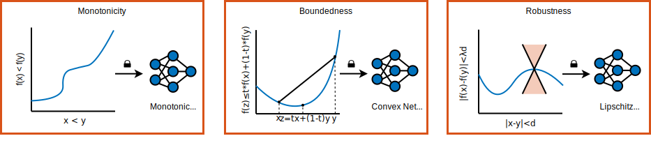

# AI Verification: Constrained Deep Learning 

Constrained deep learning is an advanced approach to training deep neural networks by incorporating domain-specific constraints into the learning process. By integrating these constraints into the construction and training of neural networks, you can guarantee desirable behaviour in safety-critical scenarios where such guarantees are paramount. 

This project aims to develop and evaluate deep learning models that adhere to predefined constraints, which could be in the form of physical laws, logical rules, or any other domain-specific knowledge. In the context of AI verification, constrained deep learning provides guarantees that certain desirable properties are present in the trained neural network by design. These desirable properties could include monotonicity, boundedness, and robustness amongst others.

<figure>

    

</figure>

By bringing together the concepts of monotonicity, convexity, and Lipschitz continuity, this repository serves as a comprehensive resource for embedding essential constraints into deep learning models, addressing the complex needs of safety-critical systems and fostering the convergence of theoretical principles with practical AI verification applications. 

You can learn more about monotonicity and Lipschitz continuity in the context of aerospace applications in the "Formal Methods Use for Learning Assurance" report from EASA and Collins Aerospace [1]. 

## Get Started

Download or clone this repository to your machine and open it in MATLAB&reg;. Add the conslearn directory and subfolders to the search path. Go to the location of the repository and run the command: `addpath(genpath("conslearn"))`.

### Requirements
- [MATLAB](http://www.mathworks.com) R2024a or later
- [Deep Learning Toolbox&trade;](https://www.mathworks.com/products/deep-learning.html)
- [Parallel Computing Toolbox&trade;](https://uk.mathworks.com/products/parallel-computing.html) (recommended)
- [Optimization Toolbox&trade;](https://www.mathworks.com/products/optimization.html)
- [Reinforcement Learning Toolbox&trade;](https://www.mathworks.com/products/reinforcement-learning.html)
- [Image Processing Toolbox&trade;](https://www.mathworks.com/products/image-processing.html)
- [Deep Learning Toolbox Verification Library](https://uk.mathworks.com/products/deep-learning-verification-library.html)

## Examples
The repository contains several introductory, interactive examples as well as longer, real-world use case applications of constrained deep learning in the context of AI verification. In the same directory as the markdown files, you can find the Live Script (MLX) file that you can open in MATLAB and run interactively to work through the example.

### Introductory Examples (Short)
Below are links for markdown versions of MATLAB Live Scripts that you can view in GitHub&reg;. 
- [Fully Input Convex Neural Networks in 1-Dimension](examples/convex/introductory/PoC_Ex1_1DFICNN.md)
- [Fully Input Convex Neural Networks in n-Dimensions](examples/convex/introductory/PoC_Ex2_nDFICNN.md)
- [Partially Input Convex Neural Networks in n-Dimensions](examples/convex/introductory/PoC_Ex3_nDPICNN.md)
- [Fully Input Monotonic Neural Networks in 1-Dimension](examples/monotonic/introductory/PoC_Ex1_1DFMNN.md)
- [Fully Input Monotonic Neural Networks in n-Dimensions](examples/monotonic/introductory/PoC_Ex2_nDFMNN.md)
- [Lipschitz Continuous Neural Networks in 1-Dimension](examples/lipschitz/introductory/PoC_Ex1_1DLNN.md)

These examples make use of [custom training loops](https://uk.mathworks.com/help/deeplearning/deep-learning-custom-training-loops.html) and the [`arrayDatastore`](https://uk.mathworks.com/help/matlab/ref/matlab.io.datastore.arraydatastore.html) object. To learn more, click the links. 

### Workflow Examples (Long)
- [Dynamical System Modeling Using Convex Neural ODE](examples/convex/neuralODE/TrainConvexNeuralODENetworkWithEulerODESolverExample.md) 
This example works through the modeling of a dynamical system using a neural ODE, where the underlying dynamics is captured by a fully input convex neural network and the ODE solver uses a convex update method, for example, the Euler method. The example shows how the network is expressive enough to capture nonlinear dynamics and also provides boundedness guarantees on the solution trajectories owing to the convex constraint of the underlying network and ODE solver.

- [Train Fully Convex Neural Networks for CIFAR-10 Image Classification](examples/convex/classificationCIFAR10/TrainICNNOnCIFAR10Example.md) 
This example shows the expressive capabilities of fully convex networks by obtaining high training accuracy on image classification on the natural image dataset, CIFAR-10.

- [Remaining Useful Life Estimation Using Monotonic Neural Networks](examples/monotonic/RULEstimateUsingMonotonicNetworks/RULEstimationUsingMonotonicNetworksExample.md) 
This example shows how to guarantee monotonic decreasing prediction on a remaining useful life (RUL) tasks by combining partially and fully monotonic networks. This example looks at predicting the RUL for turbofan engine degradation.

- [Train Image Classification Lipschitz Constrained Networks and Measure Robustness to Adversarial Examples](examples/lipschitz/classificationDigits/LipschitzClassificationNetworksRobustToAdversarialExamples.md) 
This example shows how Lipschitz continuous constrained networks improve the robustness of neural networks against adversarial attack. In this example, you use formal verification methods to compute the number of robust images in the test set against adversarial perturbation for several networks with decreasing upper bound Lipschitz constants. You find a smaller Lipschitz constant gives a more robust classification network.

## Functions

This repository introduces the following functions that are used throughout the examples:
- [`buildConstrainedNetwork`](conslearn/buildConstrainedNetwork.m) - Build a network with specific constraints induced on the architecture and initialization of the weights.
- [`trainConstrainedNetwork`](conslearn/trainConstrainedNetwork.m) - Train a constrained network and maintain the constraint during training.
- [`lipschitzUpperBound`](conslearn/lipschitzUpperBound.m) - Compute an upper bound on the Lipschitz constant for a Lipschitz neural network.
- [`convexNetworkOutputBounds`](conslearn/convexNetworkOutputBounds.m) - Compute guaranteed upper and lower bounds on hypercubic grids for convex networks.

## Tests

This repository also contains tests for the software in the conslearn package. 

As discussed in [1] (see 3.4.1.5), in certain situations, small violations in the constraints may be admissible. For example, a small violation in monotonicity may be admissible if the non-monotonic behaviour is kept below a pre-defined threshold. In the system tests, you will see examples of tests that incorporate an admissibility constant. This can account for violations owing to floating point error for instance.

## Technical Articles

This repository focuses on the development and evaluation of deep learning models that adhere to constraints crucial for safety-critical applications, such as predictive maintenance for industrial machinery and equipment. Specifically, it focuses on enforcing monotonicity, convexity, and Lipschitz continuity within neural networks to ensure predictable and controlled behavior. 

By emphasizing constraints like monotonicity, constrained neural networks ensure that predictions of the Remaining Useful Life (RUL) of components behave intuitively: as a machine's condition deteriorates, the estimated RUL should monotonically decrease. This is crucial in applications like aerospace or manufacturing, where an accurate and reliable estimation of RUL can prevent failures and save costs. 

Alongside monotonicity, Lipschitz continuity is also enforced to guarantee model robustness and controlled behavior. This is essential in environments where safety and precision are paramount such as control systems in autonomous vehicles or precision equipment in healthcare. 

Convexity is especially beneficial for control systems as it inherently provides boundedness properties. For instance, by ensuring that the output of a neural network lies within a convex hull, it is possible to guarantee that the control commands remain within a safe and predefined operational space, preventing erratic or unsafe system behaviors. This boundedness property, derived from the convex nature of the model's output space, is critical for maintaining the integrity and safety of control systems under various conditions.

These technical articles explain key concepts of AI verification in the context of constrained deep learning. They include discussions on how to achieve the specified constraints in neural networks at construction and training time, as well as deriving and proving useful properties of constrained networks in AI verification applications. It is not necessary to go through these articles in order to explore this repository, however, you can find references and more in depth discussion here.

- [AI Verification: Monotonicity](documentation/AI-Verification-Monotonicity.md) - Discussion on fully and partially monotonic neural networks and proveable trends. This article introduces monotonic network architectures and restrictions on weights to guarantee monotonic behaviour.
- [AI Verification: Convexity](documentation/AI-Verification-Convexity.md) - Discussion on fully and partially convex neural networks and proveable guarantees of boundedness over hypercubic grids. This article contains proofs on how to prove boundedness properties of a convex neural network on hypercubic grids by analyzing the network and its derivative at the vertices.
- [AI Verification: Lipschitz Continuity](documentation/AI-Verification-Lipschitz.md) - Discussion on Lipschitz continuous neural networks and proveable guarantees of robustness. This article introduce Lipschitz continuity and how to compute an upper bound on the Lipschitz constant for a set of network architectures.

## References
- [1] EASA and Collins Aerospace, Formal Methods use for Learning Assurance (ForMuLA), April 2023, https://www.easa.europa.eu/en/newsroom-and-events/news/easa-and-collins-aerospace-release-joint-innovation-partnership-contract,  https://www.easa.europa.eu/en/downloads/137878/en
- [2] Amos, Brandon, et al. Input Convex Neural Networks. arXiv:1609.07152, arXiv, 14 June 2017. arXiv.org, https://doi.org/10.48550/arXiv.1609.07152.
- [3] Gouk, Henry, et al. “Regularisation of Neural Networks by Enforcing Lipschitz Continuity.” Machine Learning, vol. 110, no. 2, Feb. 2021, pp. 393–416. DOI.org (Crossref), https://doi.org/10.1007/s10994-020-05929-w
- [4] Kitouni, Ouail, et al. Expressive Monotonic Neural Networks. arXiv:2307.07512, arXiv, 14 July 2023. arXiv.org, http://arxiv.org/abs/2307.07512.

Copyright 2024, The MathWorks, Inc.
