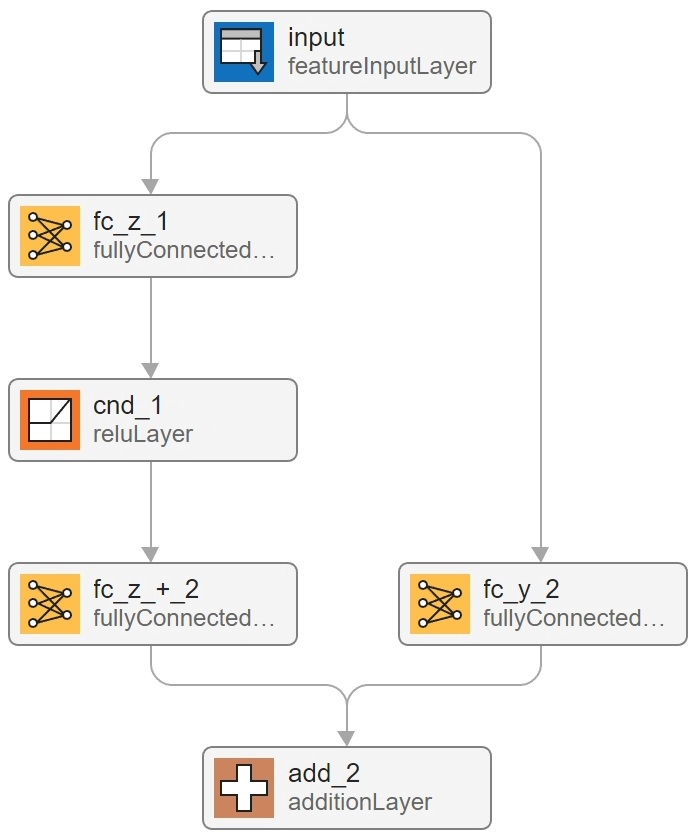

# AI Verification: Convexity

Convexity is a fundamental property in mathematics that applies to sets,
functions, and optimization problems. When visualized, convexity captures the
notion of "curving outward" or not having any "dips". Convexity can play a
crucial role in formally guaranteeing properties of deep neural networks, for
example, boundedness and robustness. This article shows how to use convex neural
networks to force properties such as boundedness into deep neural networks at
construction, and then how to verify these properties by direct application of
convex theory. This GitHub repository applies these techniques to practical use
cases to demonstrate the applicability to AI verification.

**Introduction**

At its core, convexity describes the shape of a curve or a set. In geometry, a
set in a Euclidean space is convex if, for any two points within the set, the
line segment that connects them is also entirely within the set. Visually, you
can think of a convex set as a shape that bulges outward with no indentations or
"caves." A simple example of a convex set is a circle or a rectangle.

<figure>

    
    <figcaption>Figure 1: LHS shows an example of a convex set. RHS shows an
    example of a non-convex set.</figcaption>

</figure>

More formally, a set $S$ in a real vector space is convex if for every pair of
points $x,y\in{S}$ and for every $\lambda\in[0,1]$, the point $(1−\lambda){x}+
\lambda{y}\in{S}$. This mathematical definition captures the idea that you can
"blend" two points in the set using a weighted average and remain within the
set.

A function $f:\mathbb{R}^n\rightarrow\mathbb{R}$ is convex on $S\subset
\mathbb{R}^n$ provided $S$ is a convex set, and for any $\lambda\in[0,1]$, the
following holds:

$$f((1−\lambda)x+\lambda{y})\leq(1−\lambda)f(x)+\lambda{f(y)}$$

This means that the line segment connecting any two points on the graph of the
function lies above or on the graph.

For example, take the set $S$ to be the interval $[−1,1]\subset\mathbb{R}$.
Then, since $S$ is convex, $f(x)=x^2$ is convex on $S$. Figure 2 shows this
geometry graphically with the curve always beneath the chord joining any two
points in the interval.

<figure>

    
    <figcaption>Figure 2: Example of a convex function in 1D.</figcaption>

</figure>

An example of a non-convex function is $f(x)=x^3$. Here, the chord would always
low beneath the curve for any two points with $x<0$.

**Input Convex Neural Network (ICNN)**

ICNNs are a specialized type of neural network architecture where the model is
designed to ensure that the output is a convex function with respect to (some
subset of) the input. This is achieved by imposing certain constraints on the
structure of the network and the choice of activation functions. ICNNs are
particularly useful in applications where the relationship between the inputs
and outputs are known to be convex, and exploiting this knowledge can lead to
more efficient learning and optimization. Examples include certain types of
regression problems, energy-based models, and some control and optimization
tasks where the goal is to learn a convex mapping from states to actions or
decisions. However, the application can extend beyond problems known to have
convex relationships, and, amongst others, has been proven to be very successful
in image classification tasks on popular benchmarks – see [1].

By leveraging the convexity of the input-output mappings, ICNNs can provide
guarantees on the boundedness and robustness of the learned function, which is
highly desirable in many safety-critical scenarios. Additionally, the convexity
can make the training process more stable and can simplify the optimization
landscape, potentially leading to better convergence properties.

This article considers two types of input convex neural network based on work in
[1]:

- Fully Input Convex Neural Networks (FICNNs)
- Partially Input Convex Neural Networks (PICNNs)

**Fully Input Convex Neural Network (FICNN)**

Each output of a FICNN is a convex function with respect to its inputs. This
means that if you take any two inputs to the network and any convex combination
of them, then the resulting outputs will respect the convexity inequality.

The recurrence equation defined in Eq. 2 in [1] gives a fully input convex
neural network '$`k`$-layer' architecture and is transcribed here for brevity:

$$z_{i+1}=g_i(W_i^{(z)}z_i+W_i^{(y)}+b_i)$$

Here, the network input is denoted $y$, $z_0,W_0^{(z)}=0$, and $g_i$ is an
activation function. You can view a ‘2-layer’ FICNN architecture in Figure 3.

<figure>

    
    <figcaption>Figure 3: Example network architecture of a 2-layer FICNN.</figcaption>

</figure>

To guarantee convexity of the network, FICNNs require activation functions $g_i$
that are convex and non-decreasing. For example, see the convex, non-decreasing
ReLU layer “pnd\_1” in Fig 3. Another common choice of activation function is
the softplus function. Additionally, the weights of all fully-connected layers,
except those directly connected to the input, must be constrained to be
non-negative to preserve the convexity property. In the figure above, the weight
matrix for the fully connected layer “fc\_z\_+\_2” is constrained to be positive
(as indicated by the “\_+\_” in the layer name). Note that in this
implementation, the final activation function, $g_k$, is not applied. This still
guarantees convexity but removes the restriction that outputs of the network
must be non-negative.

**Partially Input Convex Neural Network (PICNN)**

Each output of a PICNN is a convex function with respect to a specified subset
of its inputs. This means that if you take any two convex specified inputs to
the network and any convex combination of them, the resulting outputs will
respect the convexity inequality for any slice through the non-convex input
space.

PICNN architectures incorporate the freedom of non-convex inputs with the
constraints to guarantee convexity in the specified subset via the recurrent
expression in Eq.3 of [1]. Again, this is transcribed for brevity.

- $u_{i+1}=\tilde{g}_i(\tilde{W}_iu_i+\tilde{b}_i)$
- $z_{i+1}=g_i(W_i^{(z)}(z_i\odot\max([W_i^{(zu)}u_i+b_i^{(z)}],0))+
  W_i^{(y)}(y\odot(W_i^{(yu)}u_i+b_i^{(y)}))+W_i^{(u)}u_i+b_i)$

Here, $\tilde{g}_i$ is any activation function, $u_0=x$ where $x$ are the set of
non-convex inputs, and $y$ are the subset of convex inputs. The activations
$g_i$ are as for the FICNN case and the only positivity constraint on weights is
that $W_i^{(z)}\geq{0}$. With this definition, consider $u_i$ as the ‘state’ and
$z_i$ as the ‘output’. Using this recurrence, a '2-layer’ PICNN architecture can
be viewed in Figure 4.

<figure>

    
    <figcaption>Figure 4: Example network architecture of a 2-layer PICNN.</figcaption>

</figure>

To guarantee convexity of the network, PICNNs require activation functions in
the $z$ ‘output’ evolution to be convex and non-decreasing (see layer “pnd\_0”
in Fig 4), but allows freedom for activation functions evolving the state, such
as $tanh$  activation layers (see layer “nca\_0” in Fig 4). As with FICNNs, the
weights in certain parts of the network are constrained to be non-negative to
maintain the partial convexity property. In the figure above, the weight
matrices for the fully connected layer “fc\_z\_+\_1” is constrained to be
positive (as indicated by the “\_+\_” in the layer name). All other fully
connected weight matrices in Fig 4 are unconstrained, giving freedom to fit any
purely feedforward network – see proposition 2 [1]. Note again that in our
implementation, the final activation function, $g_k$, is not applied. This still
guarantees partial convexity but removes the restriction that outputs of the
network must be non-negative.

**Boundedness Guarantees of ICNNs**

Guaranteeing boundedness for convex functions involves ensuring that the
function's values do not grow without bound within its domain. A continuous,
convex function defined on a closed and bounded (compact) set $S$ is guaranteed
to achieve a maximum and minimum value on that set due to extreme value theorem.
This minimum value serves as a lower bound and the maximum value serves as an
upper bound for that convex function on the set.

Finding the minimum and maximum values of a convex function depends on the
properties of the function and the domain on which it is defined. The approach
in this article is to examine the behaviour of the convex function at the
interval bounds values of the set $S$, and determine which convex optimization
(if any) routine to deploy. The following section starts by determining
boundedness properties for 1D convex functions before analyzing general
n-dimensional convex functions. This section assumes that the convex functions
are continuous, but not necessarily everywhere differentiable, which reflects
the class of FICNNs and PICNNs discussed above.

**One-Dimensional ICNN**

Recall that a function $f:\mathbb{R}\rightarrow\mathbb{R}$ is convex on
$S\subset\mathbb{R}$ provided $S$ is a convex set and if for all $x,y\in{S}$ and
for any $\lambda\in[0,1]$, the following inequality holds,
$f((1−\lambda)x+\lambda y)\leq(1−\lambda)f(x)+ \lambda f(y)$. Intervals are
convex sets in $\mathbb{R}$ and it immediately follows from the definition of
convexity that for $S=[a,b]$, the upper bound on the interval is,

$$f(x) \leq max(f(a),f(b))$$

To find the minimum of $f$ on the interval, you could use a optimization
routine, such as projected gradient descent, interior-point methods, or barrier
methods. However, you can use the properties of convex functions to accelerate
the search in certain scenarios.

1. $f(a) \gt f(b) $

If $f(a) \gt f(b)$, then either the minimum is at $x=b$ or the minimum lies
strictly in the interior of the interval, $x\in(a,b)$. To assess whether the
minimum is at $x=b$, look at the derivative, $\nabla f(x)$, at the interval
bounds. If $f$ is not differentiable at the interval bounds, for example the
network has ReLU activation functions that defines a set of non-differentiable
points in $\mathbb{R}$, evaluate both the left and right derivate of $f$ at the
interval bounds instead. Then examine the sign of the directional derivatives at
the interval bounds, directed to the interior of the interval:
$\mathrm{sgn}(\nabla f(a), -\nabla f(b))=(\pm,\pm)$. Note that the sign of 0 is
taken as positive in this discussion.

If $f$ is differentiable at the interval bounds, then there are two possible
sign combinations since $ \nabla f(a) \leq m \lt 0 $ where $m$ is the gradient
of the chord.

- $\mathrm{sgn}(\nabla f(a), -\nabla f(b))=(−,+)$, then the minimum must lie at
  $x=b$, i.e., $f(x)\geq{f(b)}$.
- $\mathrm{sgn}(\nabla f(a), -\nabla f(b))=(-,−)$, then the minimum must lie in
  the interior of the interval, $x\in(a,b)$.

If $f$ is not differentiable at the interval bounds, then there are still two
possible sign combinations since, at $x=a$, convexity means that $\nabla
f(a-\epsilon) \lt \nabla f(a+\epsilon) \leq m \lt 0$.

<figure>

    
    <figcaption>Figure 5: Left and right directional derivatives on an example
     1D convex function that may be non-differentiable at the interval bounds.
     The left and right derivatives at the interval bounds are shown by the solid
     and dashed arrows respectively. The figure shows that at x=a, the left and
     right derivative is always negative and less than m, where m is the gradient
     of the straight line joining the points (a,f(a)) and (b,f(b)). At x=b, the
     left and right (inward) derivatives are less than -m, but could be of
     either sign.</figcaption>

</figure>

Figure 5 summarizes this argument. The red solid line represents a
differentiable convex function, while the red dashed lines denote a convex
function not differentiable at the interval limits, $a,b$. The solid directed
yellow arrows denote the left directional derivative of $f$ at the interval
bounds, directed into the interval $[a,b]$, and the dashed directed yellow
arrows denote the right directional derivative of $f$ at the interval bounds,
directed into the interval $[a,b]$. The blue straight line connecting the two
interval bounds points always lies above the function $f$ on the interval, as
$f$ convex, and has gradient $m \lt 0$. Note that $f$ need not be differentiable
at points inside the interval and this argument still holds since it only
depends on $f$ being continuous and convex.

2. $f(a) \lt f(b)$

An analogous argument follows in the case that $f(a) \lt f(b) $. In this case,
the only possible sign combinations of the derivative at the interval bounds
are:

- $\mathrm{sgn}(\nabla f(a), -\nabla f(b))=(+,-)$, then the minimum must lie at
  $x=a$, i.e., $f(x) \geq f(a)$.
- $\mathrm{sgn}(\nabla f(a), -\nabla f(b))=(-,−)$, then the minimum must lie in
  the interior of the interval, $x \in (a,b)$.

If $f$ is not differentiable at the interval bounds, then there are still two
possible sign combinations since, at $x=b$, convexity means that $-\nabla
f(b+\epsilon) \lt -\nabla f(b-\epsilon) \leq -m \lt 0$.

3. $f(a)=f(b)$

In the case that $f(a)=f(b)$, the function must either be constant and the
minimum is $f(a)=f(b)$. Or the minimum again lies at the interior. If
$\mathrm{sgn}(\nabla f(a))=+$, then $\nabla f(a) = 0$ else this violates
convexity since $f(a)=f(b)$. Similar is true for $-\mathrm{sgn}(\nabla f(b))=+$.
In this case, all sign combinations are possible owing to possible
non-differentiability of $f$ at the interval bounds:

- $\mathrm{sgn}(\nabla f(a), -\nabla f(b))=(+,+)$, then the minimum must lie at
  $x=a$ and equivalently $x=b$, i.e., $f(x)=f(a)=f(b)$.

- $\mathrm{sgn}(\nabla f(a), -\nabla f(b))=(-,+)$. If $-\mathrm{sgn}(\nabla
  f(b))=+$, then $\nabla{f(b)}=0$. By convexity, it must be true that $f(x)$ is
  constant on the interval, hence $f(x)=f(a)=f(b)$.

- $\mathrm{sgn}(\nabla f(a), -\nabla f(b))=(+,-)$. If $\mathrm{sgn}(\nabla
  f(a))=+$, then $\nabla f(a)=0$. Again by convexity, it must be true that
  $f(x)$ is constant on the interval, hence $f(x)=f(a)=f(b)$.

- $\mathrm{sgn}(\nabla f(a), -\nabla f(b))=(-,−)$, then the minimum must lie in
  the interior of the interval, $x\in(a,b)$.

To summarize, by evaluating the convex function values at the interval bounds,
$f(a),f(b)$, and derivative at the interval bounds, $\nabla f(a),\nabla f(b)$,
the function minimum only needs to be computed via convex optimization routines
if $\mathrm{sgn}(\nabla f(a), -\nabla f(b))=(-,−)$. Since all local minima of a
convex function are global minima, there is at most one convex optimization
solve required for 1-dimensional continuous, convex functions.

This idea can be extended to many intervals. Take a 1-dimensional ICNN. Consider
subdividing the operational design domain into a union of intervals $I_i$, where
$I_i=[a_i,a_{i+1}]$ and $a_i \lt a_{i+1}$. A tight lower and upper bound on each
interval can be computed with a single forward pass through the network of all
interval bounds values in the union of intervals, a single backward pass through
the network to compute derivatives at the interval bounds values, and one final
convex optimization on the interval containing the global minimum. Furthermore,
since bounds are computed at forward and backward passes through the network,
you can compute a  'boundedness metric' during training that compute the upper
and lower bounds, so assessment of the boundedness of the network over the
entire operation design domain during training can be understood.

Note: In MATLAB, the derivative of $\mathrm{relu}(x)$ at $x=0$ is taken to be
the left derivative, i.e., $\frac{d}{\text{dx}}\mathrm{relu}(x)|_{x=0}=0$ and
$\mathrm{sgn}(0)=+$.

**Multi-Dimensional ICNN**

The previous discussion focused on 1-dimensional convex functions, however, this
idea extends to n-dimensional convex functions, $f:\mathbb{R}^n \rightarrow
\mathbb{R}$. Note that a vector valued convex function is convex in each output,
so it is sufficient to keep the target as $\mathbb{R}$. In the discussion in
this section, take the convex set to be the n-dimensinal hypercube, $H_n$, with
vertices, $V_n={(\pm 1,\pm 1, \dots,\pm 1)}$. General convex hulls will be
discussed later.

An important property of convex functions in n-dimensions is that every
1-dimension restriction also defines a convex function. This is easily seen from
the definition. Define $g:\mathbb{R}\rightarrow\mathbb{R}$ as $g(t)
=f(t\hat{n})$ where $\hat{n}$ is some unit vector in $\mathbb{R}^n$. Then, by
definition of convexity of $f$, letting $x=t\hat{n}$ and $y=t'\hat{n}$, it
follows that,

$$g((1−\lambda)t+\lambda t')\leq(1−\lambda)g(t)+ \lambda g(t')$$

Note that the restriction to 1-dimensional convex function will be used several
times in the following discussion.

To determine an upper bound of $f$ on the hypercube, note that any point in
$H_n$ can be expressed as a convex combination of its vertices, i.e., for $z \in
H_n$, it follows that $z=\sum_i \lambda_i v_i$ where $\sum_i \lambda_i=1$ and
$v_i \in V_n$. Therefore, using the definition of convexity in the first
inequality and that $\lambda_i \leq 1$ in the second equality,

$$f(z)=f(\sum_i \lambda_i v_i) \leq \sum \lambda_i f(v_i) \leq \underset{v \in
V_n}{\text{max }}  f(v)$$

Consider now the lower bound of $f$ over the hypercube. Here we take the
approach of looking for cases where there is a guarantee that the minimum lies
at a vertex of the hypercube and when this guarantee cannot be met, falling back
to solving the convex optimization over this hypercubic domain. For the
n-dimensional approach, we will split the discussion into differentiable and
non-differentiable $f$, and consider these separately.

**Multi-Dimensional Differentiable Convex Functions**

Consider the derivatives evaluated at each vertex of the hypercube. For each
$\nabla f(v)$, $v \in V_n$, take the directional derivatives, pointing inward
along a hypercubic edge. Without loss of generality, recall $V_n
=\{(±1,±1,…,±1)\in\mathbb{R}^n\}$ and therefore the hypercube is aligned along
the standard basis vectors $e_i$. The $\text{i}^{\text{th}}$-directional
derivative, pointing inward, is defined as,

$$−\mathrm{sgn}(v_i)e_i\cdot \nabla f(v) e_i=−\mathrm{sgn}(v_i) \nabla_i f(v)$$

where $\mathrm{sgn}(v_i)$ denotes the sign of $\text{i}^{\text{th}}$ component
of the vertex $v$, and the minus ensures the directional derivative is inward
along an edge. Figure 6 summarizes this construction on a cube.

<figure>

    
    <figcaption>Figure 6: Directional derivatives as described in the text drawn
     on sample vertices of a 3-dimensional hypercube, i.e. a cube.</figcaption>

</figure>

Analogous to the 1-dimensional case, analyze the signatures of the derivatives
at the vertices. The notation $(\pm,...,\pm)_v $ denotes the overall sign of
$−\mathrm{sgn}(v_i)\nabla_i f(v)$ at $v$ for each $i$, and is used in the rest
of this article.

**Lemma**:

If $\exists w \in V_n$ such that $(+,+,…,+)_w$, then this vertex must attain the
minimum value of *f* over the hypercube.

**Proof**:

For any point $z \in H_n$, construct the line containing $w$ and $z$, given by
$L=\{w+t\hat{n}|t \in \mathbb{R}\}$, where $\hat{n}$ is a unit vector in
direction $z-w$. Since the directional derivatives at $w$ pointing inwards are
all positive, and $f$ is differentiable, the derivative along the line at $w$,
pointing inwards, is given by,

$$\hat{n} \cdot \nabla f(w)=\sum_i -|n_i|\cdot \mathrm{sgn}(w_i) \cdot \nabla_i
f(w)=\sum_i |n_i| \cdot (-\mathrm{sgn}(w_i) \cdot \nabla_i f(w)) \geq
0$$

is positive, as $\hat{n}=- |n_i| \cdot \mathrm{sgn}(w_i) \cdot e_i $.
The properties proved previously can then by applied to this 1-dimensional
restriction, i.e., if the gradient of $f$ as the interval bounds of an interval
is positive, then $f$ has a minimum value at this interval bounds. Hence, a
vertex with inward directional derivative signature $(+,+,…,+)$ is a lower bound
for $f$ over the hypercube. ◼

If there are multiple vertices sharing this signature, then since every vertex
on a hypercube is connected to any other vertex by an edge, the function must be
constant along edges joining these vertices. This was shown in the 1-dimensional
case when $f(a)=f(b)$ and directional derivatives into the interval were both
positive signature. Therefore, the function value must be equal at vertices
sharing these signatures so it is sufficient to select any.

If no vertex has signature $(+,+,…,+)$, solve for the minimum using a convex
optimization routine over this hypercube. Since all local minima are global
minima, there is at least one hypercube requiring this solution. If the function
has a flat section at its minima, there may be other hypercubes in the
operational design domain, also without a vertex with all positive signature.
Note that empirically, this seldom happens for convex neural networks as it
requires fine tuning of the parameters to create such a landscape.

**Multi-Dimensional Non-Differentiable Convex Function**

If a convex function is ***not*** differentiable at a vertex that has signature
$(+,+,…,+)$, the argument in the previous section breaks down, since
differentiability is necessary to assert that the derivative is a linear
combination of directional derivatives. For example, to see this issue, consider
the 2-dimensional convex landscape of an inverted square-based pyramid, shown in
Figure 7.

<figure>

    
    <figcaption>Figure 7: Directional derivatives as described in the text drawn on sample vertices of a square, projected onto the inverted square-based pyramid.</figcaption>

</figure>

As depicted in figure 7, the vertices $w$ of the square (hypercube of dimension
two, $V_2 = \{\pm 1,\pm 1\}$), have directional derivatives of zero and thus
signature $(+,+)$. But the derivative along any direction bisecting these
directional derivatives, into the interior of the square, has a negative
gradient. This is because the vertex is at the intersection of two planes and is
a non-differentiable point, so the derivative through this point is path
dependent. This is a well-known observation but this breaks the assertion that
this vertex if the minimum of $f$ over this square region. From this example, it
is clear the minimum lies at the apex at $(0,0)$.

To ameliorate this issue, in the case that the convex function is
non-differentiable at a vertex, fall back to solving the convex minimization
over this hypercube. For convex neural network architectures described in this
article, the only operation that can introduce points of non-differentiability
are $\mathrm{relu}$ operations. In practice, this means that a vertex may be a
non-differentiable point if the network has pre-activations to $\mathrm{relu}$
layers that have exact zeros. In practice, this is seldom the case. The
probability of this occurring can be further reduced by offsetting any hypercube
or hypercubic grid origin by a small random perturbation. It is assumed during
training, for efficiency of computing bounds during training, that the convex
neural network is differentiable everywhere. For final post-training analysis,
this implementation checks the $\mathrm{relu}$ pre-activations for any exact
zeros for all vertices. If there are any zeros in these pre-activations, lower
bounds for hypercubes that contain that vertex are recomputed using an
minimization routine. As a demonstration that these bounds are correct, in the
examples, we also run the minimization optimization routine on every hypercube
to show that bounds agree.

As a final comment, for general convex hulls, the argument for the upper bound
value of the function over the convex hull trivially extends, defined as the
largest function value over the set of points defining the hull. The lower bound
should be determined using an optimization routine, constrained to the set of
point in the convex hull.

**References**

- [1] Amos, Brandon, et al. Input Convex Neural Networks. arXiv:1609.07152,
  arXiv, 14 June 2017. arXiv.org, <https://doi.org/10.48550/arXiv.1609.07152>.
- [2] Ławryńczuk, Maciej. “Input Convex Neural Networks in Nonlinear Predictive
  Control: A Multi-Model Approach.” Neurocomputing, vol. 513, Nov. 2022, pp.
  273–93. ScienceDirect, <https://doi.org/10.1016/j.neucom.2022.09.108>.
