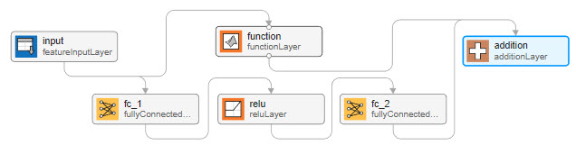

**AI Verification: Monotonicity**

Neural network verification is a critical field that focuses on formally proving properties about the behavior of neural networks. Given the increasing deployment of neural networks in safety-critical applications, such as autonomous vehicles, medical diagnosis, and finance, ensuring that these systems operate reliably and within defined bounds is paramount. One aspect of neural network behavior that can be leveraged during verification is monotonicity.

Monotonicity, in the context of functions, refers to the property where the function preserves the order of its inputs. A function is said to be monotonically increasing if, for all inputs *x* and *y*, whenever $x \leq y$ then $f(x) \leq f(y)$. Conversely, a function is monotonically decreasing if $x \leq y$ implies $f(x) \geq f(y)$. In the realm of neural networks, monotonicity can be considered with respect to inputs and outputs of the network or its constituent functions, such as activation functions or layers.

**Monotonicity in Neural Networks**

For neural networks, monotonicity can be a desirable property for various reasons:

- **Interpretability**: Monotonic neural networks are often more interpretable, as the relationship between input features and output predictions is more straightforward.
- **Robustness**: Monotonicity can contribute to robustness against certain types of adversarial attacks or input perturbations.
- **Safety**: In safety-critical domains, knowing that increasing a certain input will not decrease the output can be a crucial aspect of system safety, for instance in remaining useful life (RUL) applications.

Verifying monotonicity within neural networks is a challenging task, especially when dealing with general networks that were not designed with monotonicity in mind. The complexity arises from the intricate interplay between layers and the non-linear activation functions commonly used in neural network architectures. The verification of monotonicity in general neural networks faces several challenges:

- **Non-linear Activation Functions**: Many neural networks use non-linear activation functions such as ReLU, sigmoid, or tanh. While ReLU is piecewise linear and can maintain monotonicity in certain configurations, sigmoid and tanh are inherently non-monotonic.
- **Interconnected Layers**: The effects of inputs on outputs are often not direct due to the presence of residual connections. Each layer can transform the data in complex ways, making it difficult to trace the influence of a single input on the final output.
- **High Dimensionality**: Neural networks can have a high number of parameters and operate in high-dimensional input spaces. This dimensionality makes the verification process computationally intensive.
- **Lack of Closed-Form Solutions**: Unlike simpler models, neural networks typically do not offer closed-form solutions that allow for easy analysis of input-output relationships.

**Constructing Monotonic Networks**

To circumvent these challenges, an alternative approach is to construct neural networks that are guaranteed to be monotonic by design. This approach typically involves:

- **Monotonic Activation Functions**: Using activation functions that are inherently monotonic, such as ReLU or its variants like Leaky ReLU, ensures that each neuron's output monotonically depends on its input.
- **Constrained Weights**: Ensuring that all weights in the network are non-negative can guarantee monotonicity. You can achieve this by using techniques like weight clipping or transforming weights during training.
- **Architectural Considerations**: Designing network architectures that facilitate monotonic behavior. For example, architectures that avoid certain types of skip connections or layer types that could introduce non-monotonic behavior.

The approach taken in this repository is to utilize a combination of these three aspects and is based on the construction outlined in [1]. As [1] discusses the derivation in the context of row vector representations of network inputs, we derive the result for column vector inputs here, as MATLAB utilizes a column vector representation of network inputs.

Consider a scalar network $f:\mathbb{R}^n \rightarrow \mathbb{R}$ where $f(x) = g(x) + \lambda \sum_{k \in S} x_k$, $S$ denotes the set of monotonically dependent input indices and $g:\mathbb{R}^n \rightarrow \mathbb{R}$ is a Lipschitz continuous network, i.e., $\forall x,y \in \mathbb{R}^n$, $|g(x)-g(y)| \leq \lambda ||x-y||_p$. For monotonic decreasing, $f(x) = g(x) - \lambda \sum_{k \in S} x_k$.

Take $p=\infty$. The matrix $\infty$-norm is the maximum absolute sum of each row, i.e., $||A||_\infty = max_i \sum_j |a_{ij}| $. Therefore, for multi-layer perceptron networks $g$ (as discussed in [1]), an upper bound on $\lambda = \prod_i ||W^{(i)}||_\infty$ where $W^{(i)}$ is the weight matrix of the $i$-th fully connected layer. It follows from Lipschitz continuity that $|| \nabla g ||_\infty \leq \lambda$ where, since $\nabla g$ is also taken column vector, $|| \nabla g ||_\infty = max_k |\partial g/\partial x_k| \leq \lambda$. Hence the choice of $\infty$-norm decouples the magnitudes of the directional derivatives in the monotonic features for column vector inputs and column vector gradients, or in other words, each partial derivative is free to take any value in the interval $[-\lambda, \lambda]$.

From the definition of $f$, $\partial f/\partial x_k = \partial g/\partial x_k + \lambda \geq 0$ for $k \in S$ and hence the network $f$ is monotonic in $x_k$ for $k \in S$ by construction. The decoupling of the magnitudes of the directional derivatives means that the partial derivatives of $f$ can be as large as $2\lambda$ in each monotonic direction.

Note that for different choices of p-norm, the derivation above still yields a monotonic function $f$, however there may be couplings between the magnitudes of the partial derivatives (shown for p=2 in [1]). By default, the implementation in this repository sets $p=\infty$ for monotonic networks but other values are explored as these may yield better fits.

A simple monotonic architecture is shown in Figure 1. 

<figure>

    
    <figcaption>Figure 1: Monotonic neural network with a two layer multi-layer perceptron backbone network, and a residual connection adding the scaled sum of inputs to the backbone network output.</figcaption>

</figure>

Here, the backbone network is a two-layer multi-layer perceptron architecture. The weights are constrained such that $\lambda$ is known and fixed. The residual connection adds the inputs, summed over channel then scaled by $\lambda$, to the output.

When training the model, the backbone network weights are constrained to guarantee the Lipschitz constant of that backbone network is no larger than some fixed $\lambda$, and this fixed $\lambda$ scales the sum of the inputs as described above to guarantee monotonicity. The choice of $\lambda$ is a hyperparameter that is set prior to training at network construction time.

The main challenge with expressive monotonic networks is to balance the inherent trade-off between monotonicity and expressiveness. Ensuring monotonicity can sometimes restrict the functional forms that the network can learn, potentially impacting the overall model performance on complex tasks.

**Verification Techniques for Monotonic Constrained Networks**

For networks constructed to be monotonic, verification becomes more straightforward and comes down to architectural and weight inspection, i.e., provided the network architecture is of a specified monotonic topology, and that the weights in the network are appropriately related - see [1] - then the network is monotonic.

In summary, while verifying monotonicity in general neural networks is complex due to non-linearities and high dimensionality, constructing networks with inherent monotonic properties simplifies verification. By using monotonic activation functions and ensuring non-negative weights, you can design networks that are guaranteed to be monotonic, thus facilitating the verification process and making the network more suitable for applications where monotonic behavior is essential.

**References**

- [1] Kitouni, Ouail, et al. Expressive Monotonic Neural Networks. arXiv:2307.07512, arXiv, 14 July 2023. arXiv.org, http://arxiv.org/abs/2307.07512.
