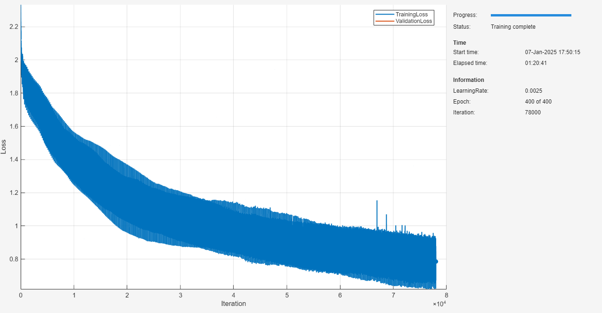
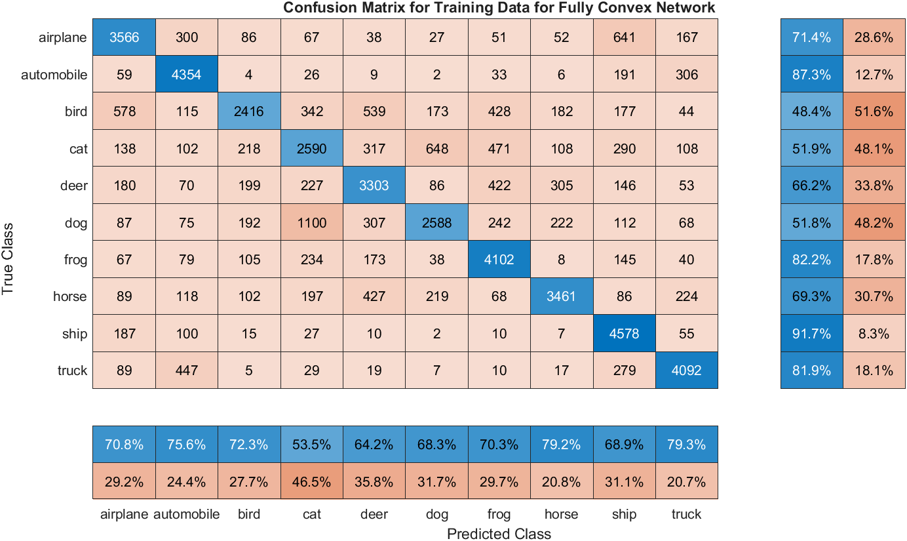

# <span style="color:rgb(213,80,0)">Train Fully Convex Neural Network for Image Classification</span>

This example shows how to create a fully input convex convolutional neural network and train it on CIFAR\-10 data \[1\].

# Prepare Data

Download the CIFAR\-10 data set \[2\]. The data set contains 60,000 images. Each image is 32\-by\-32 pixels in size and has three color channels (RGB). The size of the data set is 175 MB. Depending on your internet connection, the download process can take time.

```matlab
datadir = "."; 
downloadCIFARData(datadir);
```

Load the CIFAR\-10 training and test images as 4\-D arrays. The training set contains 50,000 images and the test set contains 10,000 images. Use the CIFAR\-10 test images for network validation.

```matlab
[XTrain,TTrain,XTest,TTest] = loadCIFARData(datadir);
```

You can display a random sample of the training images using the following code.

<pre>
figure;
idx = randperm(size(XTrain,4),20);
im = imtile(XTrain(:,:,:,idx),ThumbnailSize=[96,96]);
imshow(im)
</pre>

# Define FICCNN Network Architecture

Use the <samp>buildConvexCNN</samp> function to create a fully input convex convolutional neural network suitable for this data set.

-  The CIFAR\-10 images are 32\-by\-32 pixels, and belong to one of ten classes. Therefore, create a fully convex network specifying the <samp>inputSize=[32 32 3]</samp> and the <samp>numClasses=10</samp>. 
-  For each convolutional layer, specify the filter size in <samp>filterSize</samp>, the number of filters in <samp>numFilters</samp>, and the stride size in <samp>stride</samp>. 
```matlab
inputSize = [32 32 3];
numClasses = 10;
filterSize = [3; 3; 3; 3; 3; 1; 1];
numFilters = [96; 96; 192; 192; 192; 192; 10];
stride = [1; 2; 1; 2; 1; 1; 1];
```

Seed the network initialization for reproducibility. 

```matlab
rng(0);
ficnnet = buildConvexCNN(inputSize, numClasses, filterSize, numFilters, Stride=stride)
```

```matlabTextOutput
ficnnet = 
  dlnetwork with properties:

         Layers: [24x1 nnet.cnn.layer.Layer]
    Connections: [23x2 table]
     Learnables: [30x3 table]
          State: [14x3 table]
     InputNames: {'input'}
    OutputNames: {'fc_+_end'}
    Initialized: 1

  View summary with summary.

```

```matlab
plot(ficnnet);
```

<figure>
  <p align="center">
    
  </p>
</figure>

# Specify Training Options

Train for a specified number of epochs with a mini\-batch size of 256. To attain high training accuracy, you may need to train for a larger number of epochs, for example <samp>numEpochs=400</samp>, which could take several hours.

```matlab
numEpochs = 400; 
miniBatchSize = 256;
initialLearnRate = 0.0025;
decay = eps;
lossMetric = "crossentropy";
l2Regularization = 1e-4;
```

Create a <samp>minibatchqueue</samp> object that processes and manages mini\-batches of images during training. For each mini\-batch:

-  Use the custom mini\-batch preprocessing function <samp>preprocessMiniBatch</samp> (defined at the end of this example) to convert the labels to one\-hot encoded variables. 
-  Format the image data with the dimension labels <samp>"SSCB"</samp> (spatial, spatial, channel, batch). By default, the <samp>minibatchqueue</samp> object converts the data to <samp>dlarray</samp> objects with underlying type <samp>single</samp>. 
-  Discard partial mini\-batches. 
-  Train on a GPU if one is available. By default, the <samp>minibatchqueue</samp> object converts each output to a <samp>gpuArray</samp> if a GPU is available. Using a GPU requires Parallel Computing Toolbox™ and a supported GPU device. For information on supported devices, see [GPU Support by Release](docid:distcomp_ug#mw_57e04559-0b60-42d5-ad55-e77ec5f5865f). 
```matlab
xds = arrayDatastore(XTrain,IterationDimension=4);
tds = arrayDatastore(TTrain,IterationDimension=1);
cds = combine(xds,tds);

mbqTrain = minibatchqueue(cds,...
    MiniBatchSize=miniBatchSize,...
    MiniBatchFcn=@preprocessMiniBatch,...
    MiniBatchFormat=["SSCB" ""], ...
    PartialMiniBatch="discard");
```
# Train Network

Use the <samp>trainConstrainedNetwork</samp> to train the fully input convex network, using the training options in the previous section. Note that the "<samp>crossentropy</samp>" loss in the <samp>trainConstrainedNetwork</samp> applies a softmax operation to the convex network outputs first, before computing the cross\-entropy. This is because adding a <samp>softmaxLayer</samp> operation to the network does not preserve convexity, so the softmax is incorporated into the network loss instead.


Note the training can take several minutes to several hours to complete, depending on the choice of <samp>numEpochs</samp>.

```matlab
trained_ficnnet = trainConstrainedNetwork("fully-convex",ficnnet,mbqTrain,...
    MaxEpochs=numEpochs,...
    InitialLearnRate=initialLearnRate,...
    Decay=decay,...
    LossMetric=lossMetric,...
    ShuffleMinibatches=false,...
    TrainingMonitorLogScale=false);
```

<figure>
  <p align="center">
    
  </p>
</figure>

# Evaluate Trained Network

Calculate the final accuracy of the network on the training set and test set. To make predictions with multiple observations, use the <samp>minibatchpredict</samp> function. First create a <samp>minibatchqueue</samp> for the test data set.

```matlab
xds = arrayDatastore(XTest,IterationDimension=4);
tds = arrayDatastore(TTest,IterationDimension=1);
cds = combine(xds,tds);
mbqTest = minibatchqueue(cds,...
    MiniBatchSize=miniBatchSize,...
    MiniBatchFcn=@preprocessMiniBatch,...
    MiniBatchFormat=["SSCB" ""], ...
    PartialMiniBatch="discard");
```

Next, use the <samp>minibatchpredict</samp> function to compute the network outputs. To convert the prediction scores to labels, use the <samp>scores2label</samp> function as well as apply the  <samp>softmax</samp> function to the output of the convex network. The <samp>minibatchpredict</samp> function automatically uses a GPU if one is available. Using a GPU requires a Parallel Computing Toolbox™ license and a supported GPU device. For information on supported devices, see [GPU Computing Requirements](docid:distcomp_ug.mw_57e04559-0b60-42d5-ad55-e77ec5f5865f). Otherwise, the function uses the CPU.


As the <samp>PartialMiniBatch</samp> is set to "<samp>discard</samp>", and so the final minibatch may be incomplete. Therefore, discard the same values from <samp>TTrain</samp> to enable computation of accuracy.

```matlab
scores = minibatchpredict(trained_ficnnet,mbqTrain);
YTrainPred = scores2label(softmax(scores),categories(TTrain));
trainError = mean(YTrainPred' ~= TTrain(1:size(scores,2)));
disp("Training accuracy: " + (1-trainError)*100 + "%")
```

```matlabTextOutput
Training accuracy: 70.2123%
```

Compute the accuracy on the test set.

```matlab
scores = minibatchpredict(trained_ficnnet,mbqTest);
YTestPred = scores2label(softmax(scores),categories(TTest));
testError = mean(YTestPred' ~= TTest(1:size(scores,2)));
disp("Test accuracy: " + (1-testError)*100 + "%")
```

```matlabTextOutput
Test accuracy: 66.266%
```

The networks output has been constrained to be convex in every pixel in every colour. Even with this level of restriction, the network is able to fit reasonably well to the training data. You can see poor accuracy on the test data set but, as discussed at the start of the example, it is not anticipated that such a fully input convex network comprising of fully connected operations should generalize well to natural image classification.


Plot the confusion matrix for the training set. Display the precision and recall for each class by using column and row summaries.

```matlab
figure(Units="normalized",Position=[0.2 0.2 0.4 0.4]);
cm = confusionchart(TTrain(1:numel(YTrainPred)),YTrainPred');
cm.Title = "Confusion Matrix for Training Data for Fully Convex Network";
cm.ColumnSummary = "column-normalized";
cm.RowSummary = "row-normalized";
```

<figure>
  <p align="center">
    
  </p>
</figure>

To summarise, the fully input convex network is able to fit to the training data set, which is labelled natural images. The training can take a considerable amount of time owing to the weight projection to the constrained set after each gradient update, which slows down training convergence. Nevertheless, this example illustrates the flexibility and expressivity convex neural networks have to correctly classifying natural images.

# Supporting Functions 
## Mini\-Batch Preprocessing Function 

The <samp>preprocessMiniBatch</samp> function preprocesses a mini\-batch of predictions and labels using the following steps:

1.  Preprocess the images using the <samp>preprocessMiniBatchPredictors</samp> function.
2. Extract the label data from the incoming cell array and concatenate into a categorical array along the second dimension.
3. One\-hot encode the categorical labels into numeric arrays. Encoding in the first dimension produces an encoded array that matches the shape of the network output.
```matlab
function [X,T] = preprocessMiniBatch(dataX,dataT)

% Preprocess predictors.
X = preprocessMiniBatchPredictors(dataX);

% Extract label data from cell and concatenate.
T = cat(2,dataT{1:end});

% One-hot encode labels.
T = onehotencode(T,1);

end
```
## Mini\-Batch Predictors Preprocessing Function 

The <samp>preprocessMiniBatchPredictors</samp> function preprocesses a mini\-batch of predictors by extracting the image data from the input cell array and concatenating it into a numeric array. For grayscale input, concatenating over the fourth dimension adds a third dimension to each image, to use as a singleton channel dimension. You divide by 255 to normalize the pixels to <samp>[0,1]</samp> range.

```matlab
function X = preprocessMiniBatchPredictors(dataX)
X = (single(cat(4,dataX{1:end}))/255); % Normalizes to [0, 1]
X = 2*X - 1; % Normalizes to [-1, 1].
end
```

# References 
\[1\] Amos, Brandon, et al. "Input Convex Neural Networks." (2017). https://doi.org/10.48550/arXiv.1609.07152.

\[2\] Krizhevsky, Alex. "Learning multiple layers of features from tiny images." (2009). https://www.cs.toronto.edu/~kriz/learning-features-2009-TR.pdf

*Copyright 2024-2025 The MathWorks, Inc.*