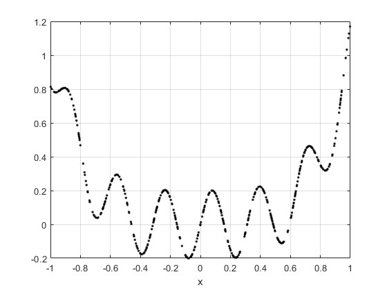
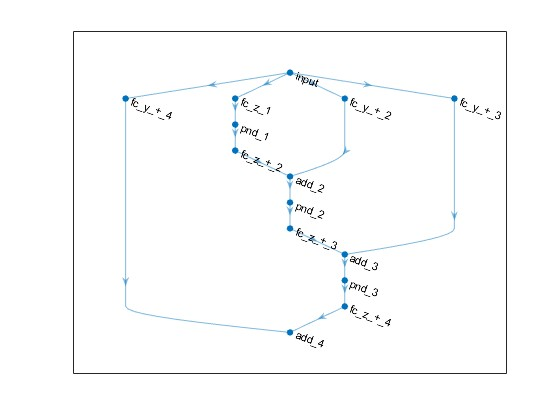
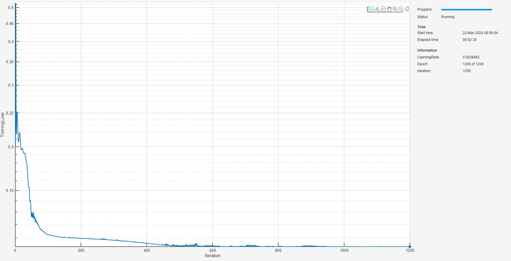
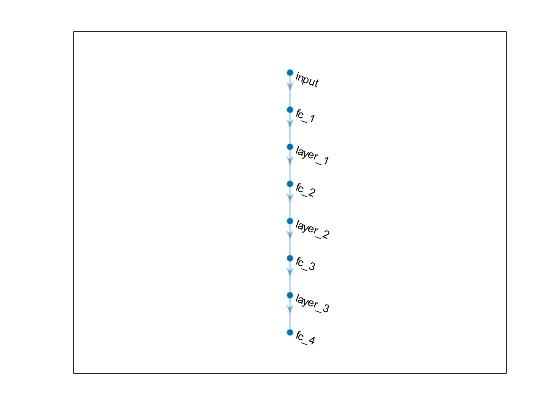
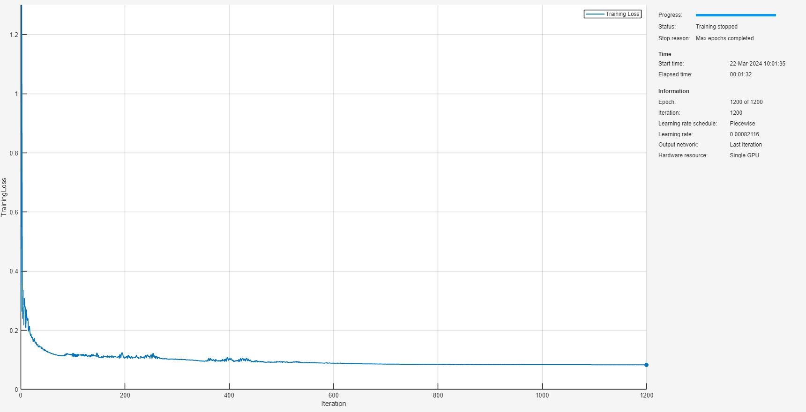
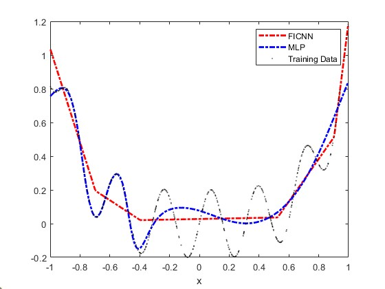
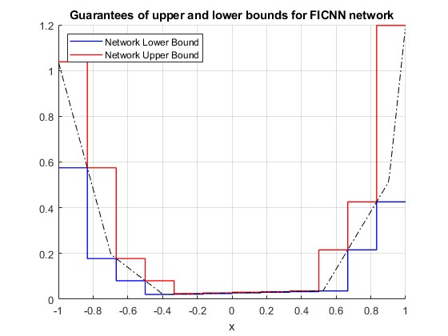
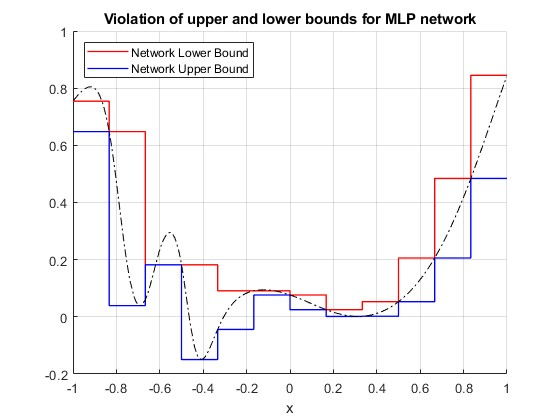

# <span style="color:rgb(213,80,0)">Proof of Concept: 1\-D Fully Input Convex Neural Networks</span>

This script provides an illustration of constrained deep learning for 1\-dimensional convex networks, along with the boundedness guarantees discussed for 1\-dimensional convex functions. This example shows these steps:

1.  Generate a dataset with some sinusoidal additive noise contaminating a convex function signal.
2. Prepare the dataset for custom training loop.
3. Create a fully input convex neural network (FICNN) architecture.
4. Train the FICNN using a custom training loop and apply projected gradient descent to guarantee convexity.
5. Train a comparable MLP network without architectural or weight constraints.
6. Compare the two networks and show convexity is violated in the unconstrained network.
7. Compute guaranteed bounds of the FICNN over the interval and test the validity of these bounds with network inference on this domain.
8. Show these bounds are violated for the unconstrained MLP.
# Generate Data

First, take the convex function <samp>y=x^4</samp> and uniformly randomly sample this over the interval <samp>[-1,1]</samp>. Add sinusoidal noise to create a dataset. You can change the number of random samples if you want to experiment.

```matlab
numSamples = 512;
rng(0);
xTrain = -2*rand(numSamples,1)+1; % [-1 1]
xTrain = sort(xTrain);
tTrain = xTrain.^4 + 0.2*sin(20*xTrain);
```

Visualize the data.

```matlab
figure
plot(xTrain,tTrain,"k.")
grid on
xlabel("x")
```

<figure>
<p align="center">
    
</p>
</figure>

# Prepare Data

To prepare the data for custom training loops, add the input and response to a <samp>minibatchqueue</samp>. You can do this by creating <samp>arrayDatastore</samp> objects and combining these into a single datastore using the <samp>combine</samp> function. Form the <samp>minibatchqueue</samp> with this combined datastore object.

```matlab
xds = arrayDatastore(xTrain);
tds = arrayDatastore(tTrain);
cds = combine(xds,tds);

mbqTrain = minibatchqueue(cds,2, ...
    "MiniBatchSize",numSamples, ...
    "OutputAsDlarray",[1 1], ...
    "MiniBatchFormat",["BC","BC"]);
```
# Create FICNN

As discussed in [AI Verification: Convex](../../../documentation/AI-Verification-Convexity.md), fully input convex neural networks adhere to a specific class of neural network architectures with constraints applied to weights. In this proof of concept example, you build a simple FICNN using fully connected layers and ReLU activation functions. For more information on the architectural construction, see [AI Verification: Convex](../../../documentation/AI-Verification-Convexity.md).

```matlab
inputSize = 1;
numHiddenUnits = [16 8 4 1];
ficnnet = buildConstrainedNetwork("fully-convex",inputSize,numHiddenUnits, ...
    PositiveNonDecreasingActivation="relu")
```

```matlabTextOutput
ficnnet = 
  dlnetwork with properties:

         Layers: [14x1 nnet.cnn.layer.Layer]
    Connections: [16x2 table]
     Learnables: [14x3 table]
          State: [0x3 table]
     InputNames: {'input'}
    OutputNames: {'add_4'}
    Initialized: 1

  View summary with summary.

```

You can view the network architecture in <samp>deepNetworkDesigner</samp> by setting the <samp>viewNetworkDND</samp> flag to <samp>true</samp>. Otherwise, plot the network graph.

```matlab
viewNetworkDND = false;
if viewNetworkDND
    deepNetworkDesigner(ficnnet) %#ok<UNRCH>
else
    figure;
    plot(ficnnet)
end
```

<figure>
<p align="center">
    
</p>
</figure>

# Train FICNN

First, create a custom training options struct. For the <samp>trainConvexNetwork</samp> function, you can specify 4 hyperparameters: <samp>maxEpochs</samp>, <samp>initialLearnRate</samp>, <samp>decay</samp>, and <samp>lossMetric</samp>.

```matlab
maxEpochs = 1200;
initialLearnRate = 0.05;
decay = 0.01;
lossMetric = "mae";
```

Train the network with these options.

```matlab
trained_ficnnet = trainConstrainedNetwork("fully-convex",ficnnet,mbqTrain, ...
   MaxEpochs=maxEpochs, ...
   InitialLearnRate=initialLearnRate, ...
   Decay=decay, ...
   LossMetric=lossMetric);
```

<figure>
<p align="center">
    
</p>
</figure>

Evaluate the accuracy on the true underlying convex function from an independent random sampling from the interval <samp>[-1,1]</samp>.

```matlab
rng(1);
xTest = -2*rand(numSamples,1)+1; % [-1 1]
tTest = xTest.^4;
lossAgainstUnderlyingSignal = computeLoss(trained_ficnnet,xTest,tTest,lossMetric)
```

```matlabTextOutput
lossAgainstUnderlyingSignal =

  gpuArray single

    0.0338
```
# Train Unconstrained MLP

Create a multi\-layer perception as a comparison, with the same depth as the FICNN defined previously. Increase the number of activations to give the network capacity to fit and roughly compensate for the lack of skip connections in terms of learnable parameter count.

```matlab
mlpHiddenUnits = numHiddenUnits;
layers = featureInputLayer(inputSize,Normalization="none");

for ii=1:numel(mlpHiddenUnits)-1
  
    layers = [layers ...
        fullyConnectedLayer(mlpHiddenUnits(ii)*2) ...
        tanhLayer];
end

% Add a final fully connected layer
layers = [layers ...
    fullyConnectedLayer(mlpHiddenUnits(end))];
```

Initialize the network.

```matlab
rng(0);
mlpnet = dlnetwork(layers);
```

Again, you can view the network architecture in <samp>deepNetworkDesigner</samp> by setting the <samp>viewNetworkDND</samp> flag to <samp>true</samp>. Otherwise, plot the network graph.

```matlab
viewNetworkDND = false;
if viewNetworkDND
    deepNetworkDesigner(mlpnet) %#ok<UNRCH>
else
    figure;
    plot(mlpnet)
end
```

<figure>
<p align="center">
    
</p>
</figure>

Specify the training options and then train the network using the <samp>trainnet</samp> function.

```matlab
options = trainingOptions("adam", ...
    Plots="training-progress", ...
    MaxEpochs=maxEpochs, ...
    InitialLearnRate=initialLearnRate, ...
    MiniBatchSize=numSamples, ...
    LearnRateSchedule="piecewise", ...
    LearnRateDropFactor=0.9, ...
    LearnRateDropPeriod=30, ...
    Shuffle="never");
trained_mlpnet = trainnet(mbqTrain,mlpnet,lossMetric,options);
```

```matlabTextOutput
    Iteration    Epoch    TimeElapsed    LearnRate    TrainingLoss
    _________    _____    ___________    _________    ____________
            1        1       00:00:00         0.05         0.26302
           50       50       00:00:07        0.045         0.12781
          100      100       00:00:11      0.03645         0.12262
          150      150       00:00:14     0.032805         0.10849
          200      200       00:00:18     0.026572          0.1102
          250      250       00:00:22     0.021523         0.11806
          300      300       00:00:25     0.019371         0.10301
          350      350       00:00:29     0.015691        0.096023
          400      400       00:00:32     0.012709         0.10675
          450      450       00:00:36     0.011438        0.097555
          500      500       00:00:39    0.0092651        0.094147
          550      550       00:00:43    0.0075047        0.090284
          600      600       00:00:46    0.0067543        0.088997
          650      650       00:00:50    0.0054709        0.086944
          700      700       00:00:53    0.0044315        0.085979
          750      750       00:00:57    0.0039883        0.085362
          800      800       00:01:00    0.0032305         0.08497
          850      850       00:01:04    0.0026167         0.08464
          900      900       00:01:07    0.0023551        0.084311
          950      950       00:01:11    0.0019076        0.084135
         1000     1000       00:01:15    0.0015452        0.083962
         1050     1050       00:01:19    0.0013906        0.083793
         1100     1100       00:01:22    0.0011264         0.08367
         1150     1150       00:01:26    0.0009124         0.08356
         1200     1200       00:01:29   0.00082116        0.083461
Training stopped: Max epochs completed
```

<figure>
<p align="center">
    
</p>
</figure>

Evaluate the accuracy on an independent random sampling from the interval <samp>[-1,1]</samp>. Observe that the loss against the underlying monotonic signal here is higher as the network has fitted to the sinusoidal contamination.

```matlab
lossAgainstUnderlyingSignal = computeLoss(trained_mlpnet,xTest,tTest,lossMetric)
```

```matlabTextOutput
lossAgainstUnderlyingSignal = 0.0699
```
# Network Comparison

Compare the shape of the solution by sampling the training data and plotting this for both networks.

```matlab
ficnnPred = predict(trained_ficnnet,xTrain);
mlpPred = predict(trained_mlpnet,xTrain);

figure;
plot(xTrain,ficnnPred,"r-.",LineWidth=2)
hold on
plot(xTrain,mlpPred,"b-.",LineWidth=2)
plot(xTrain,tTrain,"k.",MarkerSize=0.1)
xlabel("x")
legend("FICNN","MLP","Training Data")
```

<figure>
<p align="center">
    
</p>
</figure>

It is visually evident that the MLP solution is not convex over the interval but the FICNN is convex, owing to its convex construction and constrained learning.

# Guaranteed Bounds for FICNN

As discussed in [AI Verification: Convex](../../../documentation/AI-Verification-Convexity.md), fully input convex neural networks allows you to efficiently compute bounds over intervals by only evaluating the function, and its derivative, at the boundary. These boundedness guarantees play an important role in guaranteeing behavior on continuous regions of input space. Moreover, you only need to sample a small, finite number of test points. You can use more test points to tighten the bounds in different regions as needed.

```matlab
numIntervals = 12;
intervalSet = linspace(-1,1,numIntervals+1);
```

Collect the set of vertices into a cell array for use in the <samp>computeICNNBoundsOverNDGrid</samp> function. As this is 1\-D, pass the interval as a cell into the function.

```matlab
V = {intervalSet};
```

Compute the network value at the vertices and also guaranteed output bounds over the subintervals specified by the set of vertices.


To refine the lower bound, set the name\-value argument <samp>RefineLowerBounds=true</samp>. As described in [AI Verification: Convex](../../../documentation/AI-Verification-Convexity.md), this performs convex optimization over the intervals for which a minimum cannot be determined using the derivative conditions. If this option is set to false, <samp>NaN</samp> values are returned in the grid locations where the conditions on the derivatives of the network at the grid vertices are not sufficient to determine the minimum, as discussed in [AI Verification: Convex](../../../documentation/AI-Verification-Convexity.md).


Note that <samp>RefineLowerBounds=true</samp> requires Optimization Toolbox. If you do not have this toolbox, then the <samp>netMin</samp> variable will have <samp>NaN</samp> values in the positions of the intervals the minimum cannot be determined and the plots below will not show a lower bound over this interval.

```matlab
[netMin,netMax] = convexNetworkOutputBounds(trained_ficnnet,V,RefineLowerBounds=true);
```

Plot the bounds.

```matlab
v = reshape([V{1}(1:end-1); V{1}(2:end)], 1, []);
yMax = reshape([netMax{1}'; netMax{1}'], 1, []);
yMin = reshape([netMin{1}'; netMin{1}'], 1, []);

figure
grid on
hold on
plot(v, yMin, "b-", "LineWidth", 1);
plot(v, yMax, "r-", "LineWidth", 1);
plot(xTrain,ficnnPred,"k-.")
hold off
xlabel("x")
legend("Network Lower Bound","Network Upper Bound",Location="northwest")
title("Guarantees of upper and lower bounds for FICNN network");
```

<figure>
<p align="center">
    
</p>
</figure>

# Violated Bounds for MLP

Repeat the analysis above for the MLP. Since this has not been trained with enforced convexity, the bounding guarantees do not hold and you observe violations of the bounds over the same interval.

```matlab
[netMin,netMax,netPred] = convexNetworkOutputBounds(trained_mlpnet,V,RefineLowerBounds=true);
```

Plot the bounds.

```matlab
v = reshape([V{1}(1:end-1); V{1}(2:end)], 1, []);
yMax = reshape([netMax{1}'; netMax{1}'], 1, []);
yMin = reshape([netMin{1}'; netMin{1}'], 1, []);

figure; % Create a new figure
hold on;
plot(v, yMax, "r-", "LineWidth", 1);
plot(v, yMin, "b-", "LineWidth", 1);
plot(xTrain,mlpPred,"k-.")
hold off
xlabel("x");
legend("Network Lower Bound","Network Upper Bound",Location="northwest")
title("Violation of upper and lower bounds for MLP network");
grid on;
```

<figure>
<p align="center">
    
</p>
</figure>

# Helper Functions
```matlab
function loss = computeLoss(net,X,T,lossMetric)
Y = predict(net,X);
switch lossMetric
    case "mse"
        loss = mse(Y,T);
    case "mae"
        loss = mean(abs(Y-T));
end
end
```

*Copyright 2024 The MathWorks, Inc.*

