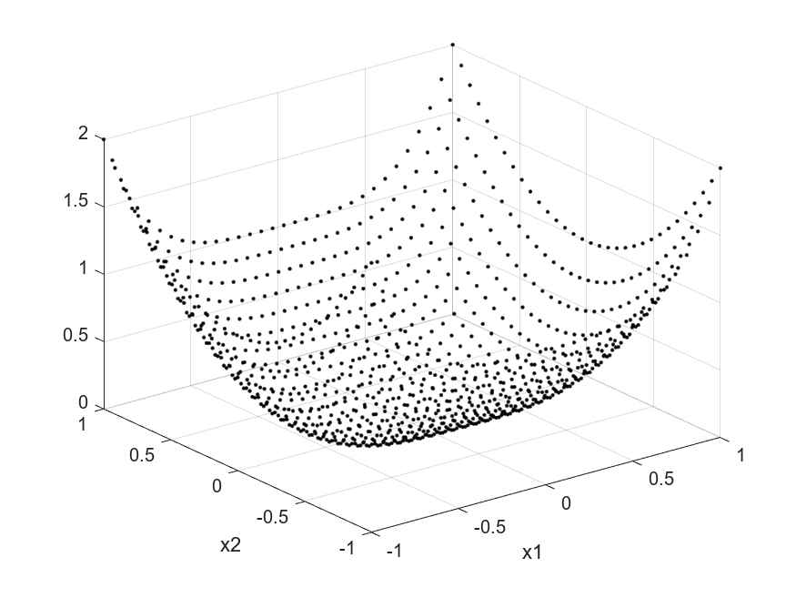
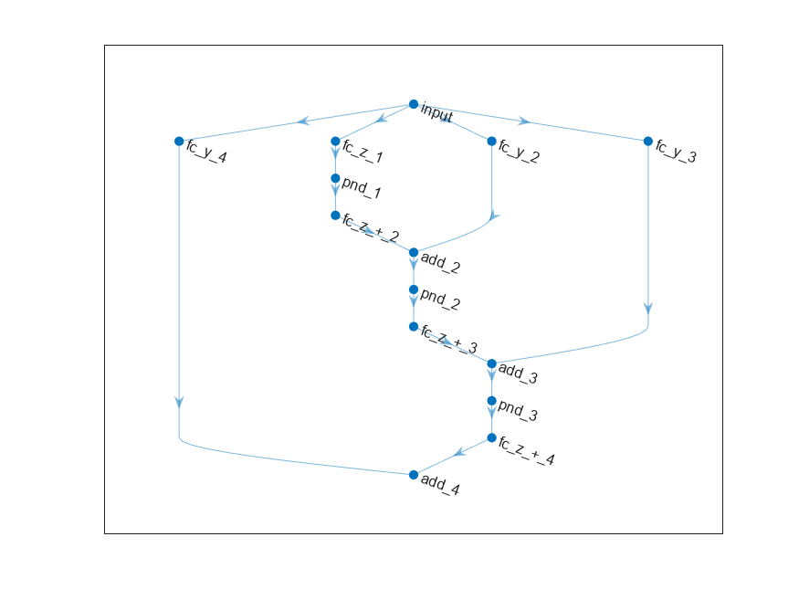
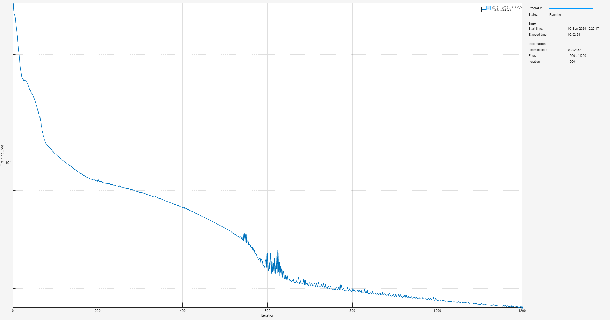
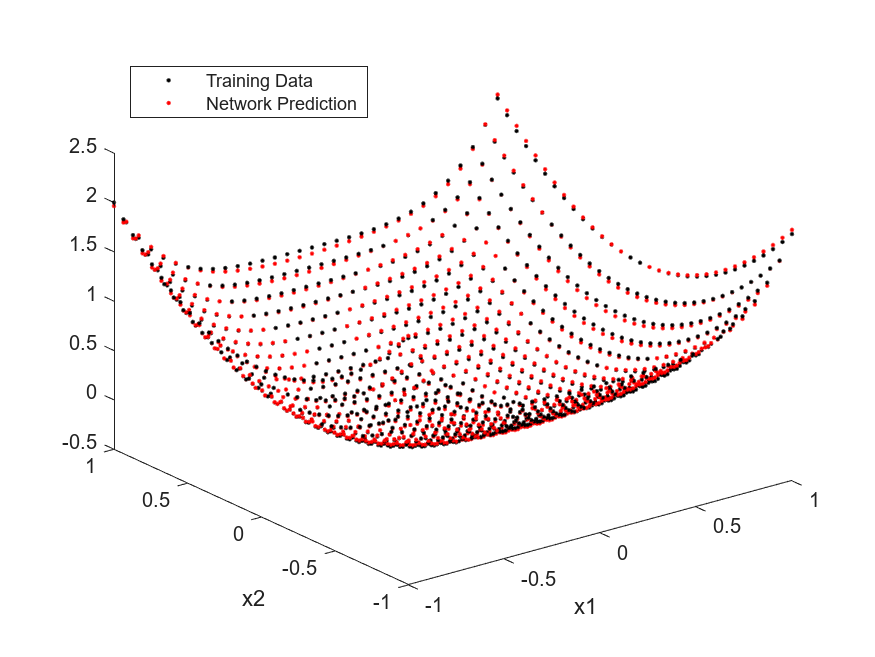
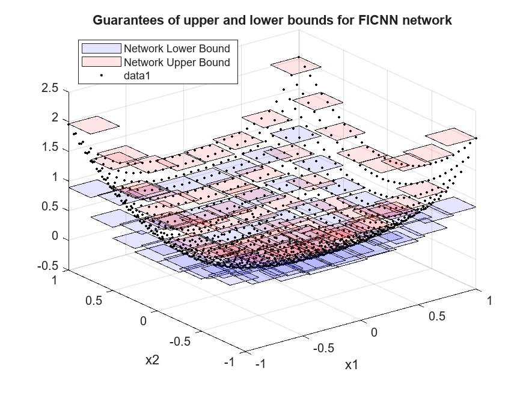

# <span style="color:rgb(213,80,0)">Proof of Concept: n\-D Fully Input Convex Neural Networks</span>

This script is an extension of the 1\-dimensional proof of concept example, [PoC\_Ex1\_1DFICNN](./PoC_Ex1_1DFICNN.md), to the n\-dimensional case. This examples explores 2\-dimensions to support effective visualizations, but the concepts are analogous in higher dimensions. This example shows these steps:

1.  Generate a dataset using a 2\-dimensional convex function, <samp>f(x1,x2)=x1^4+x2^2</samp>.
2. Prepare the dataset for custom training loop.
3. Create a 2\-input fully input convex neural network (FICNN) architecture.
4. Train the FICNN using a custom training loop and apply projected gradient descent to guarantee convexity.
5. Compute guaranteed bounds of the FICNN over the interval and test the validity of these bounds with network inference on this domain.
# Generate Data

First, take the convex function <samp>f(x1,x2)=x1^4+x2^2</samp> and uniformly randomly sample this over the square region: <samp>[-1,1]x[-1,1]</samp>. You can change the number of random samples if you want to experiment.

```matlab
numSamples = 1024;
rng(0); 
[x1Train,x2Train] = meshgrid(linspace(-1,1,round(sqrt(numSamples))));
xTrain = [x1Train(:),x2Train(:)];
tTrain = xTrain(:,1).^4 + xTrain(:,2).^2;
```

Visualize the data.

```matlab
figure;
plot3(xTrain(:,1),xTrain(:,2),tTrain,"k.")
grid on
xlabel("x1")
ylabel("x2")
```

<figure>
    <p align="center">
        
    </p>
</figure>

# Prepare Data

To prepare the data for custom training loops, add the input and response to a <samp>minibatchqueue</samp> object. You can do this by creating <samp>arrayDatastore</samp> objects and combining these into a single datastore using the <samp>combine</samp> function. Form the <samp>minibatchqueue</samp> with this combined datastore object.

```matlab
xds = arrayDatastore(xTrain);
tds = arrayDatastore(tTrain);
cds = combine(xds,tds);
mbqTrain = minibatchqueue(cds,2,...
    "MiniBatchSize",numSamples,...
    "OutputAsDlarray",[1 1],...
    "OutputEnvironment","auto",...
    "MiniBatchFormat",["BC","BC"]);
```
# Create 2\-D FICNN

In this proof of concept example, build a 2\-dimensional FICNN using fully connected layers and <samp>softplus</samp> activation functions. For more information on the architecture construction, see [AI Verification: Convex](../../../documentation/AI-Verification-Convexity.md).

```matlab
inputSize = 2;
numHiddenUnits = [16 8 4 1];
ficnnet = buildConstrainedNetwork("fully-convex",inputSize,numHiddenUnits,...
    ConvexNonDecreasingActivation="softplus")
```

```matlabTextOutput
ficnnet = 
  dlnetwork with properties:

         Layers: [14x1 nnet.cnn.layer.Layer]
    Connections: [16x2 table]
     Learnables: [14x3 table]
          State: [0x3 table]
     InputNames: {'input'}
    OutputNames: {'add_4'}
    Initialized: 1

  View summary with summary.

```

You can view the network architecture in <samp>deepNetworkDesigner</samp> by setting the <samp>viewNetworkDND</samp> flag to <samp>true</samp>. Otherwise, plot the network graph.

```matlab
viewNetworkDND = false;
if viewNetworkDND
    deepNetworkDesigner(ficnnet) %#ok<UNRCH>
else
    figure;
    plot(ficnnet)
end
```

<figure>
    <p align="center">
        

# Train FICNN

First, create a custom training options struct. For the <samp>trainConvexNetwork</samp> function, you can specify 4 hyperparameters: <samp>maxEpochs</samp>, <samp>initialLearnRate</samp>, <samp>decay,</samp> and <samp>lossMetric</samp>.

```matlab
maxEpochs = 1200;
initialLearnRate = 0.02;
decay = 0.005;
lossMetric = "mae";
```

Train the network with these options.

```matlab
trained_ficnnet = trainConstrainedNetwork("fully-convex",ficnnet,mbqTrain,...
   MaxEpochs=maxEpochs,...
   InitialLearnRate=initialLearnRate,...
   Decay=decay,...
   LossMetric=lossMetric);
```

<figure>
    <p align="center">
        
    </p>
</figure>

Evaluate the accuracy on the training set.

```matlab
loss = computeLoss(trained_ficnnet,xTrain,tTrain,lossMetric)
```

```matlabTextOutput
loss =

  gpuArray single

    0.0156
```

Plot the network predictions with the training data.

```matlab
yPred = predict(trained_ficnnet,xTrain);

figure;
plot3(xTrain(:,1),xTrain(:,2),tTrain,"k.")
hold on
plot3(xTrain(:,1),xTrain(:,2),yPred,"r.")
xlabel("x1")
ylabel("x2")
legend("Training Data","Network Prediction",Location="northwest")
```

<figure>
    <p align="center">
        
    </p>
</figure>

# Guaranteed Bounds for 2\-D FICNN

As discussed in [AI Verification: Convex](../../../documentation/AI-Verification-Convexity.md), fully input convex neural networks allows you to efficiently compute bounds over intervals by only evaluating the function, and its derivative, at the boundary. These boundedness guarantees play an important role in guaranteeing behavior on continuous regions of input space. Moreover, you only need to sample a small, finite number of test points. You can use more test points to tighten the bounds in different regions as needed.

```matlab
granularity = 8;
intervalSet = linspace(-1,1,granularity+1);
V = cell(inputSize,1);
[V{:}] = ndgrid(intervalSet);
```

Compute the network value at the vertices and also guaranteed output bounds over the grid specified by the set of vertices. Note, as discussed in [AI Verification: Convex](../../../documentation/AI-Verification-Convexity.md), that since the network is constructed using softplus activations, the network is everywhere differentiable and there is no need to check for points of non\-differentiability that might cause issue in the boundedness analysis.


To refine the lower bound, set <samp>RefineLowerBounds=true</samp>. Note that <samp>RefineLowerBounds=true</samp> requires Optimization Toolbox. If you do not have this toolbox, the <samp>netMin</samp> variable will have <samp>NaN</samp> values in the positions of the intervals the minimum cannot be determined and the plots below will not show a lower bound over these subregions.

```matlab
[netMin,netMax] = convexNetworkOutputBounds(trained_ficnnet,V,RefineLowerBounds=true);
```

Plot the bounds.

```matlab
plot2DBounds(V,netMin,netMax);
```

Add sample training points.

```matlab
hold on
plot3(xTrain(:,1),xTrain(:,2),yPred,"k.")
hold off
```

<figure>
    <p align="center">
        
    </p>
</figure>

# Helper Functions
```matlab
function loss = computeLoss(net,X,T,lossMetric)
Y = predict(net,X);
switch lossMetric
    case "mse"
        loss = mse(Y,T);
    case "mae"
        loss = mean(abs(Y-T));
end
end

function plot2DBounds(V,netMin,netMax)
% Use the im2col function to extract sliding windows
block_size = [2, 2]; % Size of the sliding window
x1ColMatrix = im2col(V{1}, block_size, "sliding");
x2ColMatrix = im2col(V{2}, block_size, "sliding");

% Vector expand the min and max network values
zMinCol = netMin{1}(:)';
zMaxCol = netMax{1}(:)';

figure;
hold on
for ii = 1:numel(zMinCol)
x1_vals = x1ColMatrix(:,ii)';
x2_vals = x2ColMatrix(:,ii)';
zmin_vals = zMinCol(ii)*ones(size(x1_vals));
zmax_vals = zMaxCol(ii)*ones(size(x1_vals));

% Plot the min and max polygons
fill3(x1_vals([1 2 4 3]), x2_vals([1 2 4 3]), zmin_vals, "b", FaceAlpha=0.1);
fill3(x1_vals([1 2 4 3]), x2_vals([1 2 4 3]), zmax_vals, "r", FaceAlpha=0.1);
end
% Set the labels and title
xlabel("x1"); % Label for the x-axis
ylabel("x2"); % Label for the y-axis
title("Guarantees of upper and lower bounds for FICNN network");
legend("Network Lower Bound","Network Upper Bound",Location="northwest")
grid on; % Turn on the grid for easier visualization
view(3); % Set the view to 3D
end
```

*Copyright 2024 The MathWorks, Inc.*

