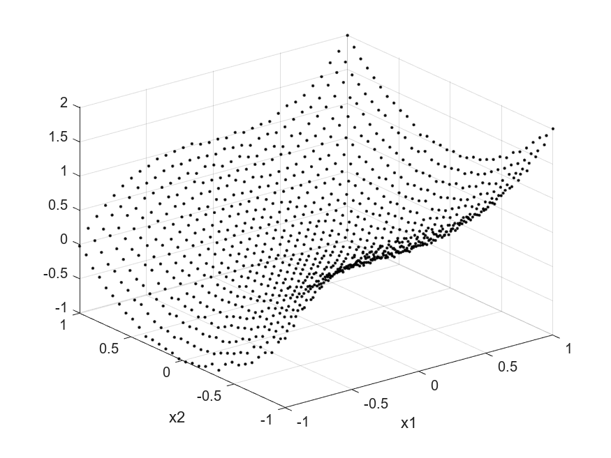
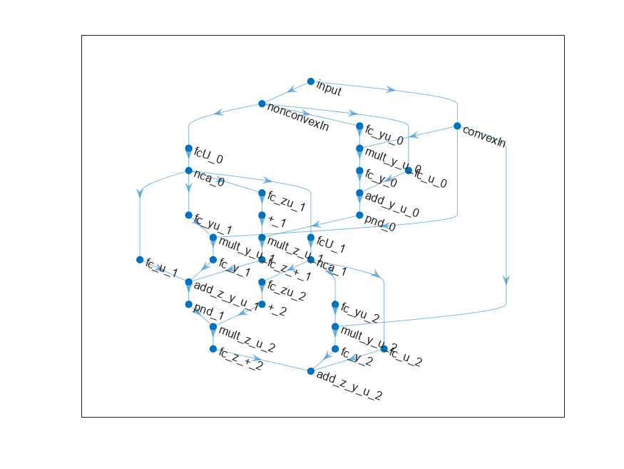
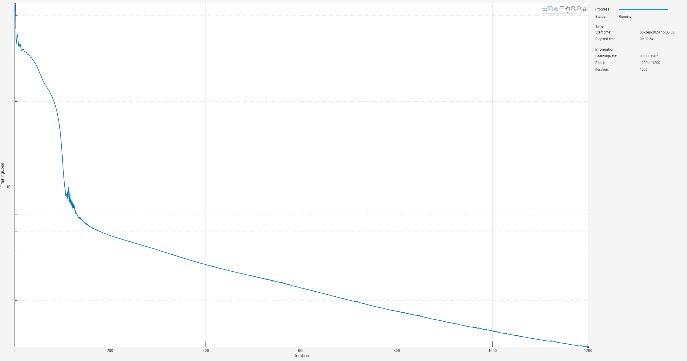
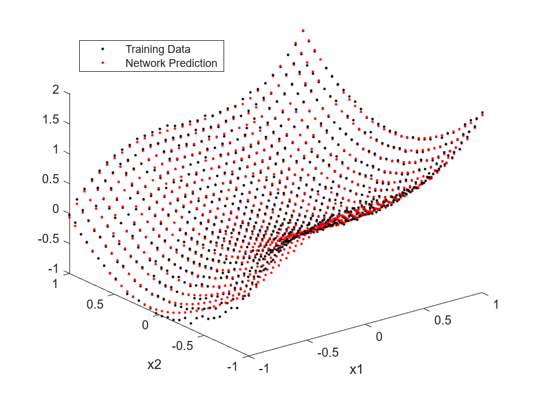
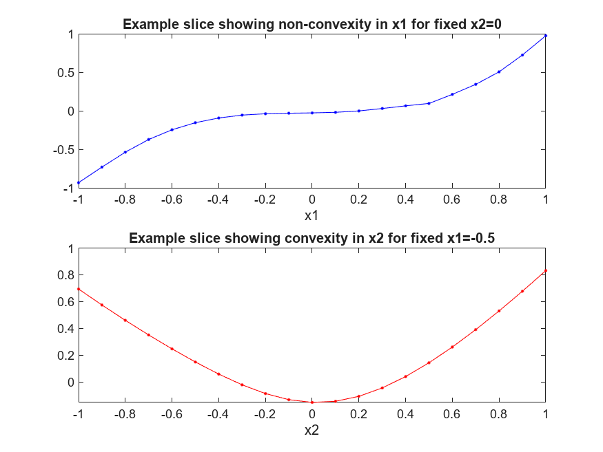
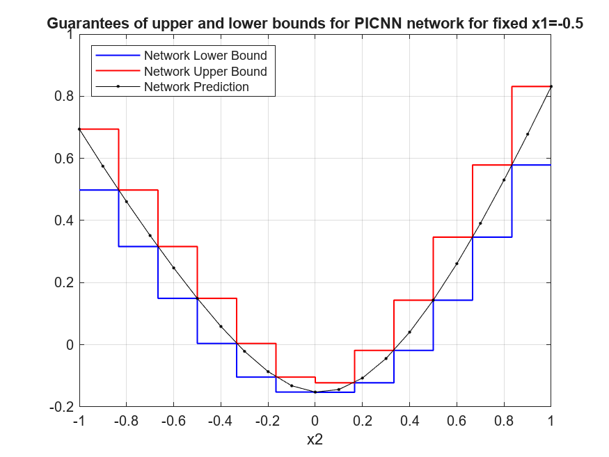

# <span style="color:rgb(213,80,0)">Proof of Concept: n\-D Partially Input Convex Neural Networks</span>

This script provides an example of a partially input convex neural network (PICNN), and follows on from the 1\-dimensional and n\-dimensional proof of concept examples for fully input convex neural network FICNN. For more information, see [<samp>PoC_Ex1_1DFICNN</samp>](./PoC_Ex1_1DFICNN.md) and [<samp>PoC_Ex2_nDFICNN</samp>](./PoC_Ex2_nDFICNN.md). This examples explores this in 2\-dimensions to support effective visualizations but the concepts are analogous in higher dimensions. This example shows these steps:

1.  Generate a dataset using a 2\-dimensional function, <samp>f(x1,x2)=x1^3+x2^2</samp>, not\-convex in the first input but convex in the second input, and add some random Gaussian noise.
2. Prepare the dataset for custom training loop.
3. Create a 2\-input partially input convex neural network (PICNN) architecture.
4. Train the PICNN using a custom training loop and apply projected gradient descent to guarantee convexity in the second input.
5. Compute guaranteed bounds of the PICNN over 1\-dimensional restrictions through the convex dimension.
# Generate Data

First, take the partially convex function <samp>f(x1,x2)=x1^3+x2^2</samp> and uniformly randomly sample this over the interval <samp>[-1,1]x[-1,1]</samp>. Add Gaussian random noise to create a dataset. You can change the number of random samples if you want to experiment.

```matlab
numSamples = 1024;
rng(0);
[x1Train,x2Train] = meshgrid(linspace(-1,1,round(sqrt(numSamples))));
xTrain = [x1Train(:),x2Train(:)];
tTrain = xTrain(:,1).^3 + xTrain(:,2).^2 + 0.02*randn(size(xTrain,1),1);
```

Visualize the data.

```matlab
figure;
plot3(xTrain(:,1),xTrain(:,2),tTrain,"k.")
grid on
xlabel("x1")
ylabel("x2")
```

<figure>
    <p align="center">
        
    </p>
</figure>


Observe the overall underlying convex behavior in <samp>x2</samp> given <samp>x1</samp>, and non\-convex behavior in <samp>x1</samp> given <samp>x2</samp>. 

# Prepare Data

To prepare the data for custom training loops, add the input and response to a <samp>minibatchqueue</samp>. You can do this by creating <samp>arrayDatastore</samp> objects and combining these into a single datastore using the <samp>combine</samp> function. Form the <samp>minibatchqueue</samp> with this combined datastore object.

```matlab
xds = arrayDatastore(xTrain);
tds = arrayDatastore(tTrain);
cds = combine(xds,tds);

mbqTrain = minibatchqueue(cds,2,...
    "MiniBatchSize",numSamples,...
    "OutputAsDlarray",[1 1],...
    "OutputEnvironment","auto",...
    "MiniBatchFormat",["BC","BC"]);
```
# Create 2\-D PICNN

In this proof of concept example, build a 2\-dimensional PICNN using fully connected layers and <samp>softplus</samp> activation functions. Specify <samp>tanh</samp> activation functions for the non\-convex evolution of the 'state' variable (using the <samp>NonConvexActivation</samp> name\-value argument). For more information, see [AI Verification: Convex](../../../documentation/AI-Verification-Convexity.md). Create a function and specify that the convexity is in the <samp>x2</samp> channel using the <samp>ConvexChannels</samp> name\-value argument.

```matlab
inputSize = 2;
numHiddenUnits = [32 8 1];
picnnet = buildConstrainedNetwork("partially-convex",inputSize,numHiddenUnits,...
    ConvexNonDecreasingActivation="softplus",...
    Activation="tanh",...
    ConvexChannelIdx=2)
```

```matlabTextOutput
picnnet = 
  dlnetwork with properties:

         Layers: [32x1 nnet.cnn.layer.Layer]
    Connections: [41x2 table]
     Learnables: [30x3 table]
          State: [0x3 table]
     InputNames: {'input'}
    OutputNames: {'add_z_y_u_2'}
    Initialized: 1

  View summary with summary.

```

You can view the network architecture in <samp>deepNetworkDesigner</samp> by setting the <samp>viewNetworkDND</samp> flag to <samp>true</samp>. Otherwise, plot the network graph.

```matlab
viewNetworkDND = false;
if viewNetworkDND
    deepNetworkDesigner(picnnet) %#ok<UNRCH>
else
    figure;
    plot(picnnet)
end
```

<figure>
    <p align="center">
        
    </p>
</figure>

# Train PICNN

First, create a custom training options struct. For the <samp>trainConvexNetwork</samp> function, you can specify 4 hyperparameters: <samp>maxEpochs</samp>, <samp>initialLearnRate</samp>, <samp>decay</samp>, and <samp>lossMetric</samp>.

```matlab
maxEpochs = 1200;
initialLearnRate = 0.05;
decay = 0.05;
lossMetric = "mae";
```

Train the network with these options.

```matlab
trained_picnnet = trainConstrainedNetwork("partially-convex",picnnet,mbqTrain,...
   MaxEpochs=maxEpochs,...
   InitialLearnRate=initialLearnRate,...
   Decay=decay,...
   LossMetric=lossMetric);
```

<figure>
    <p align="center">
        
    </p>
</figure>

Evaluate the accuracy on the training set.

```matlab
loss = computeLoss(trained_picnnet,xTrain,tTrain,lossMetric)
```

```matlabTextOutput
loss =

  gpuArray single

    0.0275
```

Plot the network predictions with the training data.

```matlab
yPred = predict(trained_picnnet,xTrain);

figure;
plot3(xTrain(:,1),xTrain(:,2),tTrain,"k.")
hold on
plot3(xTrain(:,1),xTrain(:,2),yPred,"r.")
xlabel("x1")
ylabel("x2")
legend("Training Data","Network Prediction",Location="northwest")
```

<figure>
    <p align="center">
        
    </p>
</figure>

# Guaranteed Bounds for 2\-D PICNN in 1\-D Restrictions

As discussed in [AI Verification: Convex](../../../documentation/AI-Verification-Convexity.md), partially input convex neural networks are convex in a subspace of inputs. Therefore, fixing the non\-convex inputs, bounds can be computed at these slices in the convex input space.


First, visualize the non\-convexity in <samp>x1</samp> given <samp>x2=0</samp> and convexity in <samp>x2</samp> given <samp>x1=0</samp>. You can change these values using the sliders.

```matlab
xSample = (-1:0.1:1)';
x1 = -0.5;
x2 = 0;
zPredForFixedx2 = predict(trained_picnnet,[xSample 0*xSample+x2]);
zPredForFixedx1 = predict(trained_picnnet,[0*xSample+x1 xSample]);

figure;
subplot(2,1,1)
plot(xSample,zPredForFixedx2,".-b")
title("Example slice showing non-convexity in x1 for fixed x2=" + x2)
xlabel("x1")
subplot(2,1,2)
plot(xSample,zPredForFixedx1,".-r")
title("Example slice showing convexity in x2 for fixed x1=" + x1)
xlabel("x2")
```

<figure>
    <p align="center">
        
    </p>
</figure>

As in the 1\-dimensional convex case, compute bounds for 1\-dimensional restrictions for fixed <samp>x1</samp>.

```matlab
granularity = 12;
intervalSet = linspace(-1,1,granularity+1);
V = cell(inputSize,1);
[V{:}] = ndgrid(intervalSet);
```

Fix the <samp>x1</samp> values in the grid.

```matlab
V{1} = x1*ones(size(V{1}));
```

Compute the network value at the vertices and also guaranteed output bounds over the grid specified by the set of vertices. Note, as discussed in [AI Verification: Convex](../../../documentation/AI-Verification-Convexity.md), that since the network is constructed using softplus activations, the network is everywhere differentiable and there is no need to check for points of non\-differentiability that might cause issue in the boundedness analysis.


As discussed in [<samp>PoC_Ex1_1DFICNN</samp>](./PoC_Ex1_1DFICNN.md) and [<samp>PoC_Ex2_nDFICNN</samp>](./PoC_Ex2_nDFICNN.md), to refine the lower bound, set <samp>RefineLowerBounds=true</samp>. Note that <samp>RefineLowerBounds=true</samp> requires Optimization Toolbox. If you do not have this toolbox, the <samp>netMin</samp> variable will have <samp>NaN</samp> values in the positions of the intervals the minimum cannot be determined and the plots below will not show a lower bound over these subregions.

```matlab
[netMin,netMax] = convexNetworkOutputBounds(trained_picnnet,V,RefineLowerBounds=true);
```

Plot the bounds. Since we are taking a 1\-dimensional slice in <samp>x1</samp>, pick any row to plot as they are all equivalent.

```matlab
v = reshape([V{2}(1,1:end-1); V{2}(1,2:end)], 1, []);
yMax = reshape([netMax{1}(1,:); netMax{1}(1,:)], 1, []);
yMin = reshape([netMin{1}(1,:); netMin{1}(1,:)], 1, []);

figure; % Create a new figure
plot(v, yMin, "b-", "LineWidth", 1);
hold on
plot(v, yMax, "r-", "LineWidth", 1);
plot(xSample,zPredForFixedx1,".-k");
grid on
xlabel("x2");
legend("Network Lower Bound","Network Upper Bound","Network Prediction",Location="northwest");
title("Guarantees of upper and lower bounds for PICNN network for fixed x1=" + x1);
```

<figure>
    <p align="center">
        
    </p>
</figure>

# Helper Functions
```matlab
function loss = computeLoss(net,X,T,lossMetric)
Y = predict(net,X);
switch lossMetric
    case "mse"
        loss = mse(Y,T);
    case "mae"
        loss = mean(abs(Y-T));
end
end
```

*Copyright 2024 The MathWorks, Inc.*

