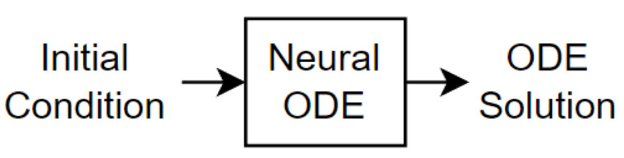
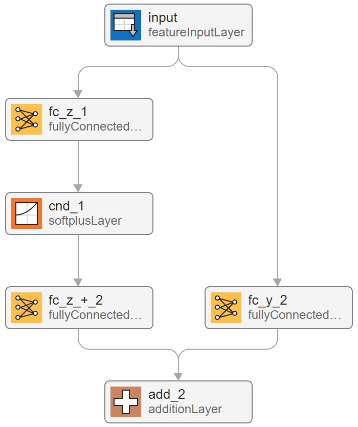
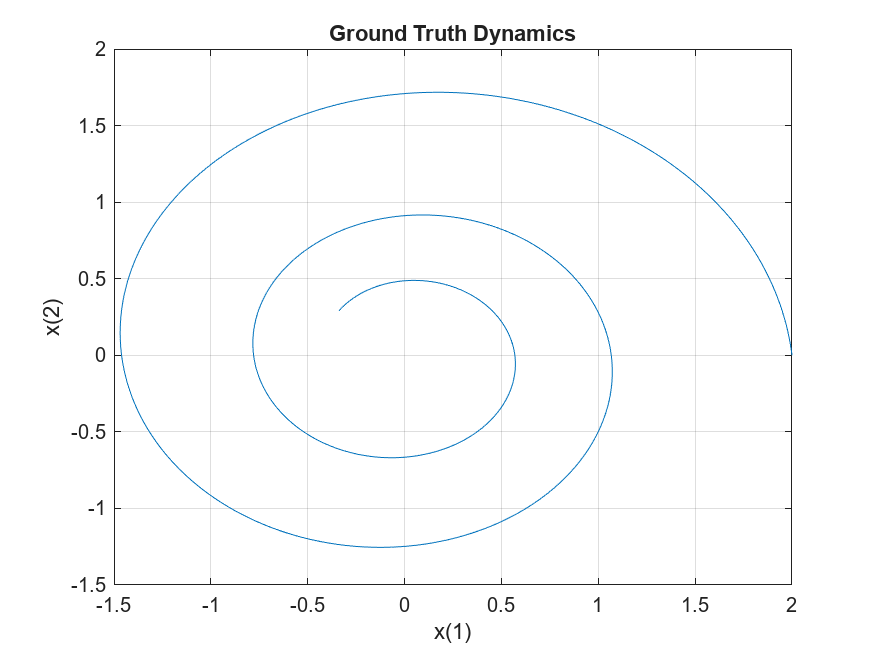
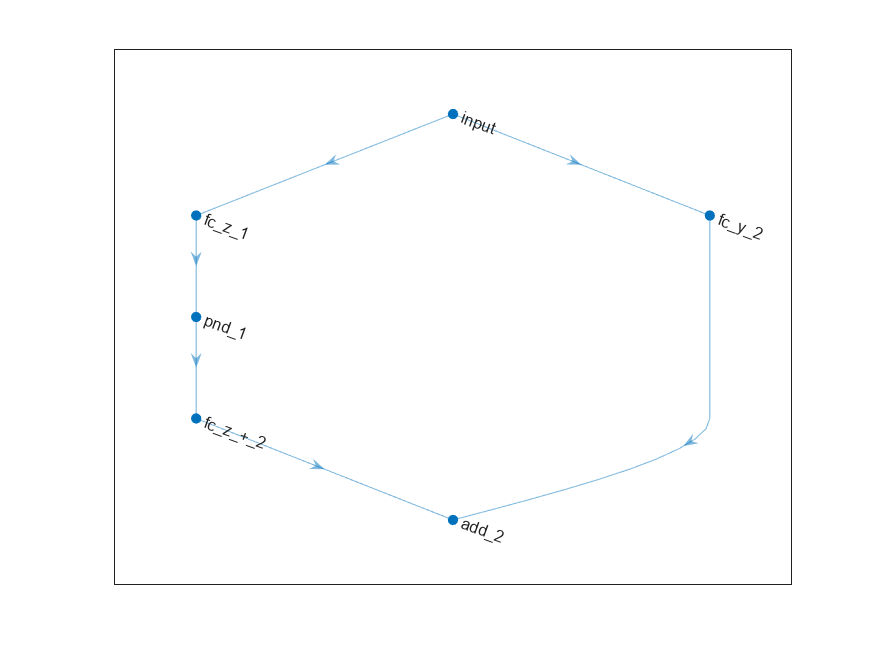
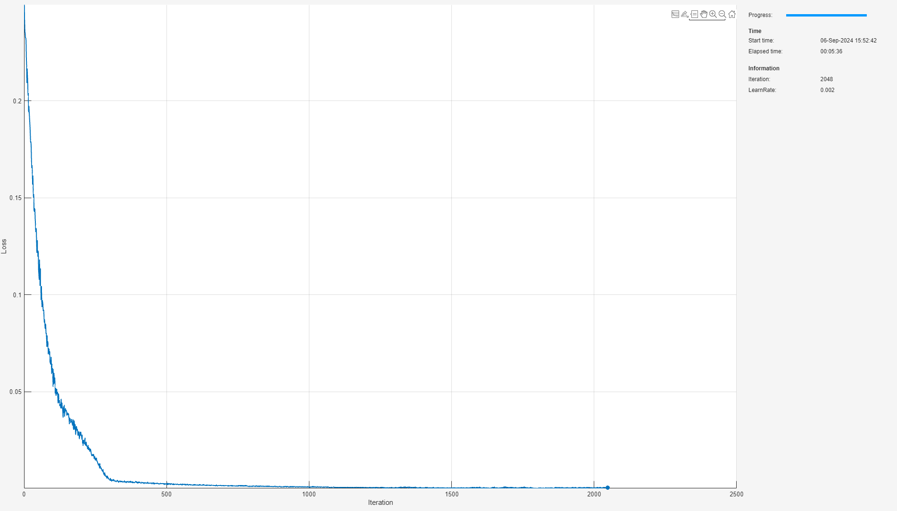
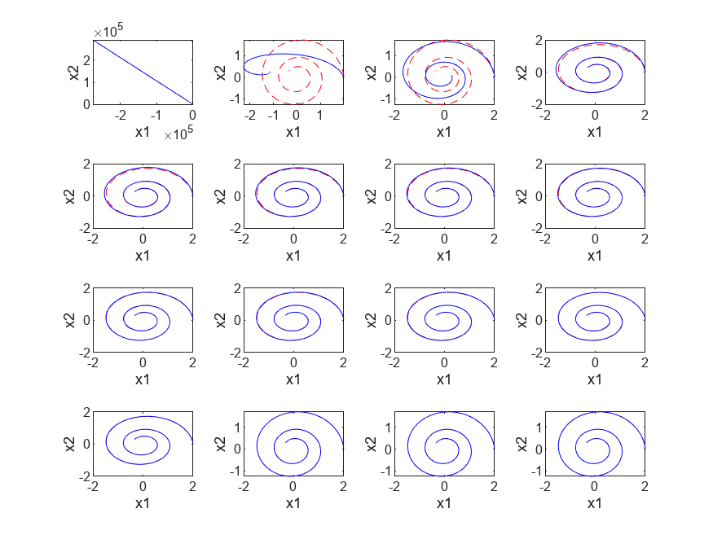
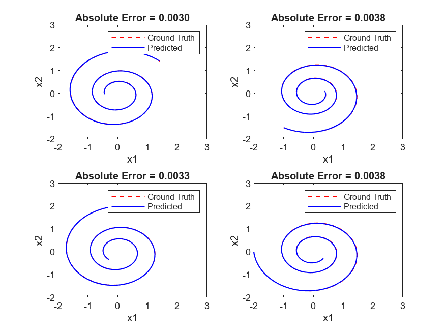
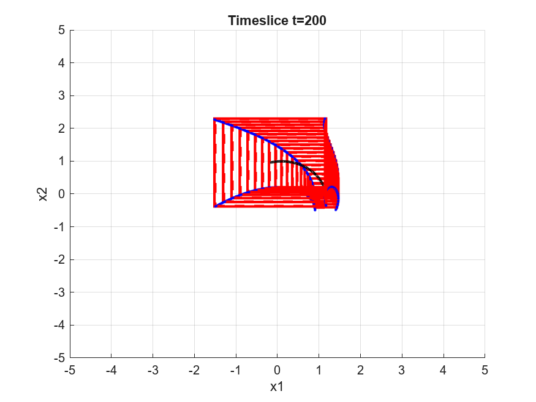

# <span style="color:rgb(213,80,0)">Dynamical System Modeling Using Convex Neural ODE and Euler Method</span>

This example is based on [Dynamical System Modeling Using Neural ODE](https://uk.mathworks.com/help/deeplearning/ug/dynamical-system-modeling-using-neural-ode.html) and applies convex constraints on both the neural network underpinning the dynamics of the physical system, as well as the ODE solver function. This gives provable guarantees over the dynamics of the solution space by analyzing boundedness properties afforded by convex constraints.


Neural ODEs \[1\] are deep learning operations defined by the solution of an ODE. More specifically, neural ODE is an operation that can be used in any architecture and, given an input, defines its output as the numerical solution of the ODE

 $$ y^{\prime } =f(t,y,\theta ) $$ 

for the time horizon $(t_0 ,t_1 )$ and the initial condition $y(t_0 )=y_0$ . The right\-hand side $f(t,y,\theta )$ of the ODE depends on a set of trainable parameters $\theta$ , which the model learns during the training process. In this example, $f(t,y,\theta )$ is modeled with a model function containing fully connected operations and nonlinear activations. The initial condition $y_0$ is either the input of the entire architecture, as in the case of this example, or is the output of a previous operation.


This example shows how to train a neural network with neural ODEs to learn the dynamics $x$ of a given physical system, described by the following ODE:


 $x^{\prime } =Ax$ , 


where $A$ is a 2\-by\-2 matrix.


The neural network of this example takes as input an initial condition and computes the ODE solution through the learned neural ODE model.

<figure>
    <p align="center">
        
    </p>
</figure>

The neural ODE operation, given an initial condition, outputs the solution of an ODE model. In this example, specify a fully input convex neural network (FICNN) block of '2\-layer' depth, i.e., with a fully connected layer, a softplus layer, a second fully connected layer that is then combined with the input via a residual fully connected operation, as the ODE model.

<figure>
    <p align="center">
        
    </p>
</figure>

In this example, the ODE that defines the model is solved numerically using the Euler method. Unlike the higher order Runge\-Kutta (4,5) pair of Dormand and Prince \[2\], Euler method for solving ODEs is a first order, linear procedure and so preserves convexity. That is, an Euler update procedure with a convex network governing the dynamics of the physical system preserves overall convexity of the input, $y(t)$ , with respect to the output, $y(t+1)$ , i.e., $y(t+1)=g(y(t))$ where $g:{\mathbb{R}}^2 \to {\mathbb{R}}^2$ is fully input convex in each output.


In this example, you use <samp>forwardEuler</samp>, an implementation of a forward Euler method for <samp>dlarray</samp> that behaves similar to <samp>dlode45</samp>. For more information, see [<samp>forwardEuler</samp>](./forwardEuler.m).

# Synthesize Data of Target Dynamics

Define the target dynamics as a linear ODE model $x^{\prime } =Ax$ , with <samp>x0</samp> as its initial condition, and compute its numerical solution <samp>xTrain</samp> with <samp>ode45</samp> in the time interval <samp>[0 15]</samp>. It is fine to use <samp>ode45</samp> here as this is simply synthesizing the data of target dynamics. To compute an accurate ground truth data, set the relative tolerance of the <samp>ode45</samp> numerical solver to ${10}^{-7}$ .

```matlab
x0 = [2; 0];
A = [-0.1 -1; 1 -0.1];
trueModel = @(t,y) A*y;

numTimeSteps = 2000;
T = 15;
odeOptions = odeset(RelTol=1.e-7);
t = linspace(0, T, numTimeSteps);
[~, xTrain] = ode45(trueModel, t, x0, odeOptions);
xTrain = xTrain';
```

Visualize the training data in a plot.

```matlab
figure
plot(xTrain(1,:),xTrain(2,:))
title("Ground Truth Dynamics")
xlabel("x(1)")
ylabel("x(2)")
grid on
```

<figure>
    <p align="center">
        
    </p>
</figure>

# Define and Initialize Model Parameters

The model function consists of a single call to <samp>forwardEuler</samp> to solve the ODE defined by the approximated dynamics $f(t,y,\theta )$ for 40 time steps.

```matlab
neuralOdeTimesteps = 40;
dt = t(2);
timesteps = (0:neuralOdeTimesteps)*dt;
```

Construct a 2\-dimensional FICNN using fully connected layers and <samp>softplus</samp> activation functions. For more information on the architectural construction, see [AI Verification: Convex](../../../documentation/AI-Verification-Convexity.md), or, for a proof\-of\-concept example, see [<samp>PoC_Ex2_nDFICNN</samp>](../ProofOfConcept/PoC_Ex2_nDFICNN.md). The first fully connected operation takes as input a vector of size <samp>stateSize</samp> and increases its length to <samp>hiddenSize</samp>. Conversely, the subsequent fully connected operation takes as input a vector of length <samp>hiddenSize</samp> and decreases its length to <samp>stateSize</samp>. The residual connection applies a fully connected operation that takes <samp>stateSize</samp> to <samp>stateSize.</samp>

```matlab
stateSize = size(xTrain,1);
hiddenSize = 20;
numHiddenUnits = [hiddenSize stateSize];

neuralOdeFICNN = buildConstrainedNetwork("fully-convex",stateSize,numHiddenUnits,...
    ConvexNonDecreasingActivation="softplus")
```

```matlabTextOutput
neuralOdeFICNN = 
  dlnetwork with properties:

         Layers: [6x1 nnet.cnn.layer.Layer]
    Connections: [6x2 table]
     Learnables: [6x3 table]
          State: [0x3 table]
     InputNames: {'input'}
    OutputNames: {'add_2'}
    Initialized: 1

  View summary with summary.

```

```matlab
plot(neuralOdeFICNN)
```

<figure>
    <p align="center">
        
    </p>
</figure>

## Define Model Function

Create the function <samp>model</samp>, listed in the [Model Function](#H_937701EC) section of the example, which computes the outputs of the deep learning model. The function <samp>model</samp> takes as input the convex network and the input data. The function outputs the solution of the neural ODE.

## Define Model Loss Function

Create the function <samp>modelLoss</samp>, listed in the [Model Loss Function](#H_04DCA2D2) section of the example, which takes as input the model parameters, a mini\-batch of input data with corresponding targets, and returns the loss and the gradients of the loss with respect to the learnable parameters.

# Specify Training Options

Specify options for Adam optimization.

```matlab
gradDecay = 0.9;
sqGradDecay = 0.999;
learnRate = 0.002;
```

Train for 2048 iterations with a mini\-batch\-size of 256.

```matlab
numIter = 2048;
miniBatchSize = 256;
```

Every 128 iterations, solve the learned dynamics and display them against the ground truth in a phase diagram to show the training path.

```matlab
plotFrequency = 128;
```
# Train Model Using Custom Training Loop

Initialize the <samp>averageGrad</samp> and <samp>averageSqGrad</samp> parameters for the Adam solver.

```matlab
averageGrad = [];
averageSqGrad = [];
```

Initialize the <samp>TrainingProgressMonitor</samp> object. Because the timer starts when you create the monitor object, make sure that you create the object close to the training loop.

```matlab
monitor = trainingProgressMonitor(Metrics="Loss",Info=["Iteration","LearnRate"],XLabel="Iteration");
```

Train the network using a custom training loop.


For each iteration:

-  Construct a mini\-batch of data from the synthesized data with the <samp>createMiniBatch</samp> function, listed in the [Create Mini\-Batches Function](#H_4CFE5D75) section of the example. 
-  Evaluate the model loss and gradients and loss using the <samp>dlfeval</samp> function and the <samp>modelLoss</samp> function, listed in the [Model Loss Function](#H_04DCA2D2) section of the example. 
-  Update the model parameters using the <samp>adamupdate</samp> function. 
-  Update the training progress plot. 
```matlab
numTrainingTimesteps = numTimeSteps;
trainingTimesteps = 1:numTrainingTimesteps;
plottingTimesteps = 2:numTimeSteps;

iteration = 0;

while iteration < numIter && ~monitor.Stop
    iteration = iteration + 1;

    % Create batch
    [X, targets] = createMiniBatch(numTrainingTimesteps, neuralOdeTimesteps, miniBatchSize, xTrain);

    % Evaluate network and compute loss and gradients
    [loss,gradients] = dlfeval(@modelLoss,timesteps,X,neuralOdeFICNN,targets);

    % Gradient update
    [neuralOdeFICNN,averageGrad,averageSqGrad] = adamupdate(neuralOdeFICNN,gradients,averageGrad,averageSqGrad,iteration,learnRate,gradDecay,sqGradDecay);

    % Proximal update
    neuralOdeFICNN = conslearn.convex.makeNetworkConvex(neuralOdeFICNN);

    % Plot loss
    recordMetrics(monitor,iteration,Loss=loss);

    % Set up tiled layout
    if iteration == 1
        figure;
        tiledlayout(4,4);
    end

    % Plot predicted vs. real dynamics
    if ( mod(iteration,plotFrequency) == 0  || iteration == 1 ) && iteration < numIter
        % Use forwardEuler to compute the solution
        y = forwardEuler(neuralOdeFICNN,t,dlarray(x0,"CB"));

        nexttile
        plot(xTrain(1,plottingTimesteps),xTrain(2,plottingTimesteps),"r--")
        hold on
        plot(y(1,:),y(2,:),"b-")
        hold off
        xlabel("x1")
        ylabel("x2")
        drawnow
    end
    updateInfo(monitor,Iteration=iteration,LearnRate=learnRate);
    monitor.Progress = 100*iteration/numIter;
end
```

<figure>
    <p align="center">
        
    </p>
</figure>

<figure>
    <p align="center">
        
    </p>
</figure>

# Evaluate Model

Use the model to compute approximated solutions with different initial conditions. Define four new initial conditions different from the one used for training the model.

```matlab
tPred = t;

x0Pred1 = sqrt([2;2]);
x0Pred2 = [-1;-1.5];
x0Pred3 = [0;2];
x0Pred4 = [-2;0];
```

Numerically solve the ODE true dynamics with <samp>ode45</samp> for the four new initial conditions.

```matlab
F = ode(Solver="ode45",ODEFcn=trueModel);

F.InitialValue = x0Pred1;
xTrue1 = solve(F, tPred);

F.InitialValue = x0Pred2;
xTrue2 = solve(F, tPred);

F.InitialValue = x0Pred3;
xTrue3 = solve(F, tPred);

F.InitialValue = x0Pred4;
xTrue4 = solve(F, tPred);
```

Numerically solve the ODE with the learned neural ODE dynamics.

```matlab
xPred1 = forwardEuler(neuralOdeFICNN,tPred,dlarray(x0Pred1,"CB"));
xPred2 = forwardEuler(neuralOdeFICNN,tPred,dlarray(x0Pred2,"CB"));
xPred3 = forwardEuler(neuralOdeFICNN,tPred,dlarray(x0Pred3,"CB"));
xPred4 = forwardEuler(neuralOdeFICNN,tPred,dlarray(x0Pred4,"CB"));
```
# Visualize Predictions

Visualize the predicted solutions for different initial conditions against the ground truth solutions with the function <samp>plotTrueAndPredictedSolutions</samp>, listed in the [Plot True and Predicted Solutions Function](#H_875B67E5) section of the example. The fully input convex network and Euler update does sufficiently well to capture the underlying dynamics of the system and model the ODE solution.

```matlab
figure
subplot(2,2,1)
plotTrueAndPredictedSolutions(xTrue1, xPred1);
subplot(2,2,2)
plotTrueAndPredictedSolutions(xTrue2, xPred2);
subplot(2,2,3)
plotTrueAndPredictedSolutions(xTrue3, xPred3);
subplot(2,2,4)
plotTrueAndPredictedSolutions(xTrue4, xPred4);
```

<figure>
    <p align="center">
        
    </p>
</figure>

# Formal Boundedness Guarantees

As discussed in [AI Verification: Convex](../../../documentation/AI-Verification-Convexity.md), the fully input convex neural networks allows us to efficiently compute bounds over hypercubes by only evaluating the function, and its derivative, at the boundary. These boundedness guarantees play an important role in guaranteeing behavior on continuous regions of input space. Moreover, you only need to sample a small, finite number of test points. You can use more test points to tighten the bounds in different regions as needed.


In this application example, the neural ODE generates trajectories. The convexity property gives formal guarantees on the evolution of continuous regions of initial conditions, since the output of the ODE serves as an input for the subsequent time step. This is explored by selecting an input hypercuboid, i.e., a rectangle, and evaluating the bounds of the solutions guaranteed by convexity.


First, pick rectangular region in the <samp>x1</samp> and <samp>x2</samp> direction for initial conditions.

```matlab
x1Lower = 0.9;
x1Upper = 1.4; % This should be larger than x1Lower
x2Lower = -0.5;
x2Upper = -0.1; % This should be larger than x2Lower
```

Then pick a time\-step.

```matlab
tstep = 0.01;
```

Next, select the total number of time steps to evolve the solutions.

```matlab
tMax = 200;
```

Create the rectangular region and evolve the bounds in time. Combine the Euler update for a single time step with the convex network, into a single network object, to reuse the compute bounds functions as seen in the proof of concept examples.

```matlab
neuralOdeFICNNEuler = combineEulerWithConvexNetwork(neuralOdeFICNN,tstep);
V = cell(stateSize,1);
[V{:}] = ndgrid([x1Lower x1Upper],[x2Lower x2Upper]);
```

Compute the bounds and plot the evolution of the boundary region. These bounds are guaranteed for any initial condition within the the rectangular region. Evolution of the vertices of the rectangular region are plotted as an illustration (blue lines). The true sample trajectories of the midpoint initial conditions in the region is also plotted (black line).

```matlab
figure
grid on
hold on
xlabel("x1")
ylabel("x2")
xlim([-5 5])
ylim([-5 5])
refreshFrequency = 10;

% Get the network predictions at the vertices
[~,~,Z] = convexNetworkOutputBounds(neuralOdeFICNNEuler,V,RefineLowerBounds=true);

% Centre point of initial bounding region
dlxPoint = dlarray([mean(V{1},[1 2]);mean(V{2},[1 2])],'CB');
for tt = 1:tMax
    % Compute and refine bounds
    [netMin,netMax,Zt] = convexNetworkOutputBounds(neuralOdeFICNNEuler,V,RefineLowerBounds=true);

    % Compute evolution of central point
    dlxPoint2 = predict(neuralOdeFICNNEuler,dlxPoint);

    % Create a rectangle at tt+1
    Vt = V;
    Vt{1}(1,:) = netMin{1};
    Vt{1}(2,:) = netMax{1};
    Vt{2}(:,1) = netMin{2};
    Vt{2}(:,2) = netMax{2};

    if mod(tt,refreshFrequency) == 0
        createRectangle(V,'--')
        createRectangle(Vt,'-')
        title("Timeslice t=" + tt)
        drawnow
    end

    % Plot the path of the boundaries
    plot([Z{1}(1,1) Zt{1}(1,1)],[Z{2}(1,1) Zt{2}(1,1)],'b.-')
    plot([Z{1}(1,2) Zt{1}(1,2)],[Z{2}(1,2) Zt{2}(1,2)],'b.-')
    plot([Z{1}(2,1) Zt{1}(2,1)],[Z{2}(2,1) Zt{2}(2,1)],'b.-')
    plot([Z{1}(2,2) Zt{1}(2,2)],[Z{2}(2,2) Zt{2}(2,2)],'b.-')

    % Plot the true sample trajectories of the midpoint
    xPoint = extractdata(dlxPoint);
    xPoint2 = extractdata(dlxPoint2);
    plot([xPoint(1) xPoint2(1)],[xPoint(2) xPoint2(2)],'k-.',LineWidth=2)
    
    % Reset for next iteration
    V = Vt;
    Z = Zt;
    dlxPoint = dlxPoint2;
end
```

<figure>
    <p align="center">
        
    </p>
</figure>

From the figure, you observe that the true trajectory (black line) is always within the red bounding box at any point in time. This guarantees the bounded behaviour of all trajectories for a given region of initial conditions, time step sizes and total time evolution.

# Helper Functions
<a name="H_937701EC"></a>

## Model Function

The <samp>model</samp> function, which defines the neural network used to make predictions, is composed of a single neural ODE call. For each observation, this function takes a vector of length <samp>stateSize</samp>, which is used as initial condition for solving numerically the ODE with the function [<samp>odeModel</samp>](#H_7AE5BB14), which represents the learnable right\-hand side $f(t,y,\theta )$ of the ODE to be solved, as right hand side and a vector of time points <samp>tspan</samp> defining the time at which the numerical solution is output. The function uses the vector <samp>tspan</samp> for each observation, regardless of the initial condition, since the learned system is autonomous. That is, the <samp>odeModel</samp> function does not explicitly depend on time.

```matlab
function X = model(tspan,X0,neuralOdeFICNN)
X = forwardEuler(neuralOdeFICNN,tspan,dlarray(X0,"CB"));
end
```
<a name="H_04DCA2D2"></a>

## Model Loss Function

This function takes as inputs a vector <samp>tspan</samp>, a set of initial conditions <samp>X0</samp>, the learnable parameters <samp>neuralOdeParameters</samp>, and target sequences <samp>targets</samp>. It computes the predictions with the <samp>model</samp> function, and compares them with the given targets sequences. Finally, it computes the loss and the gradient of the loss with respect to the learnable parameters of the neural ODE.

```matlab
function [loss,gradients] = modelLoss(tspan,X0,neuralOdeFICNN,targets)
% Compute predictions.
X = model(tspan,X0,neuralOdeFICNN);
% Compute L1 loss.
loss = l1loss(X,targets,NormalizationFactor="all-elements");
% Compute gradients.
gradients = dlgradient(loss,neuralOdeFICNN.Learnables);
end
```
<a name="H_4CFE5D75"></a>

## Create Mini\-Batches Function

The <samp>createMiniBatch</samp> function creates a batch of observations of the target dynamics. It takes as input the total number of time steps of the ground truth data <samp>numTimesteps</samp>, the number of consecutive time steps to be returned for each observation <samp>numTimesPerObs</samp>, the number of observations <samp>miniBatchSize</samp>, and the ground truth data <samp>X</samp>.

```matlab
function [x0, targets] = createMiniBatch(numTimesteps,numTimesPerObs,miniBatchSize,X)

% Create batches of trajectories.
s = randperm(numTimesteps - numTimesPerObs, miniBatchSize);

x0 = dlarray(X(:, s));
targets = zeros([size(X,1) miniBatchSize numTimesPerObs]);

for i = 1:miniBatchSize
    targets(:, i, 1:numTimesPerObs) = X(:, s(i) + 1:(s(i) + numTimesPerObs));
end

end
```
<a name="H_875B67E5"></a>

## Plot True and Predicted Solutions Function

The <samp>plotTrueAndPredictedSolutions</samp> function takes as input the true solution <samp>xTrue</samp>, the approximated solution <samp>xPred</samp> computed with the learned neural ODE model, and the corresponding initial condition <samp>x0Str</samp>. It computes the error between the true and predicted solutions and plots it in a phase diagram.

```matlab
function plotTrueAndPredictedSolutions(xTrue,xPred)

xPred = squeeze(extractdata(xPred));

err = mean(abs(xTrue.Solution(:,2:end) - xPred), "all");

plot(xTrue.Solution(1,:),xTrue.Solution(2,:),"r--",xPred(1,:),xPred(2,:),"b-",LineWidth=1)

title("Absolute Error = " + num2str(err,"%.4f"))
xlabel("x1")
ylabel("x2")

xlim([-2 3])
ylim([-2 3])

legend("Ground Truth","Predicted")

end
```
<a name="H_875B67E5"></a>

## Combine the Euler update with the Convex Network

The <samp>combineEulerWithConvexNetwork</samp> function incorporate the <samp>forwardEuler</samp> update step for 1 timeslice into the output of the network.

```matlab
function neuralOdeFICNNEuler = combineEulerWithConvexNetwork(neuralOdeFICNN,tstep)
eulerLayer = functionLayer(@(X0,X) X0+tstep*X,Name='euler',NumInputs=2,NumOutputs=1,Formattable=true,Acceleratable=true);
net = dlnetwork(layerGraph(neuralOdeFICNN), Initialize=false);
net = addLayers(net,eulerLayer);
net = connectLayers(net,neuralOdeFICNN.InputNames{1},'euler/in1');
net = connectLayers(net,neuralOdeFICNN.OutputNames{1},'euler/in2');
neuralOdeFICNNEuler = initialize(net);
end
```
## Create Rectangle Plots

The <samp>createRectangle</samp> function creates and plots a red rectangle using the vertices <samp>V</samp> of the rectangle and a line style specified by <samp>ls</samp>.

```matlab
function createRectangle(V,ls)
width = V{1}(2,1) - V{1}(1,1);
height = V{2}(1,2) - V{2}(1,1);
x1_lower = V{1}(1,1);
x2_lower = V{2}(1,1);
position = [x1_lower, x2_lower, width, height];
% Plot the rectangle
rectangle('Position', position, 'EdgeColor', 'red', 'LineWidth', 2, 'LineStyle', ls);
end
```

\[1\] Chen, Ricky T. Q., Yulia Rubanova, Jesse Bettencourt, and David Duvenaud. “Neural Ordinary Differential Equations.” Preprint, submitted December 13, 2019. https://arxiv.org/abs/1806.07366.


\[2\] Shampine, Lawrence F., and Mark W. Reichelt. “The MATLAB ODE Suite.” SIAM Journal on Scientific Computing 18, no. 1 (January 1997): 1–22. https://doi.org/10.1137/S1064827594276424.


*Copyright 2024 The MathWorks, Inc.*

