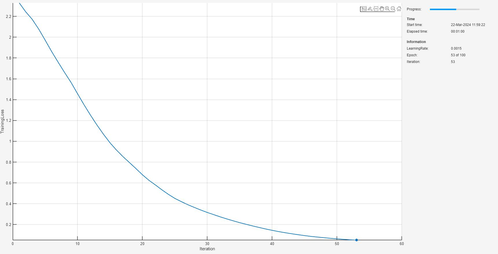

# <span style="color:rgb(213,80,0)">Train Image Classification Lipschitz Constrained Networks and Measure Robustness to Adversarial Examples</span>

Neural networks can be susceptible to a phenomenon known as *adversarial examples* \[1\], where very small changes to an input can cause the network predictions to significantly change. For example, making small changes to the pixels in an image can cause the image to be misclassified. These changes are often imperceptible to humans.

<figure>
<p align="center">
    
</p>
</figure>


A network is *adversarially robust* if the output of the network does not change significantly when the input is perturbed. For classification tasks, adversarial robustness means that the output of the fully connected layer with the highest value does not change, and therefore the predicted class does not change \[2\].


This example shows how to train a Lipschitz continuous neural network to classify digits with for several choices of Lipschitz upper bounds and choice of p\-norm. You will see that as the Lipschitz constant decreases, the robustness of the network, computed as the number of properties the network can verify, increases. This example shows how to:

1.  Train a Lipschitz constrained MLP for image classification using a custom training loop.
2. Investigate network robustness by performing adversarial attacks and testing accuracy.
3. Compute network robustness by using the <samp>verifyNetworkRobustness</samp> function that uses abstract interpretation to verify robustness against perturbations of a given size.
4. Compare the results across the different Lipschitz constants.

This example requires the Deep Learning Toolbox™ Verification Library support package. If this support package is not installed, use the **Add\-On Explorer**. To open the **Add\-On Explorer**, go to the MATLAB® Toolstrip and click **Add\-Ons** > **Get Add\-Ons**.

# Load and Explore Image Data

Load the digit sample data as an image datastore. <samp>imageDatastore</samp> automatically labels the images based on folder names and stores the data as an <samp>ImageDatastore</samp> object. An image datastore enables you to store large image data, including data that does not fit in memory, and efficiently read batches of images during training of a convolutional neural network.

```matlab
digitDatasetPath = fullfile(matlabroot,'toolbox','nnet','nndemos', ...
    'nndatasets','DigitDataset');
imds = imageDatastore(digitDatasetPath, ...
    'IncludeSubfolders',true,'LabelSource','foldernames');
```

Display some of the images in the datastore.

```matlab
figure;
rng(0);
perm = randperm(10000,20);
for i = 1:20
    subplot(4,5,i);
    imshow(imds.Files{perm(i)});
end
```

<figure>
<p align="center">
    
</p>
</figure>

You must specify the size of the images in the input layer of the neural network. Check the size of the first image in <samp>digitData</samp>. Each image is 28\-by\-28\-by\-1 pixels.

```matlab
img = readimage(imds,1);
size(img)
```

```matlabTextOutput
ans = 1x2    
    28    28

```
# Specify Training and Validation Sets

Divide the data into training and validation data sets, so that each category in the training set contains 750 images, and the validation set contains the remaining images from each label. <samp>splitEachLabel</samp> splits the datastore <samp>digitData</samp> into two new datastores, <samp>trainDigitData</samp> and <samp>valDigitData</samp>.

```matlab
numTrainFiles = 750;
rng(0);
[imdsTrain,imdsTest] = splitEachLabel(imds,numTrainFiles,"randomized");
```

Create an <samp>arrayDatastore</samp> object for the images and the labels, and then use the <samp>combine</samp> function to make a single datastore containing all the training data.

```matlab
XTrain = readall(imdsTrain);
TTrain = imdsTrain.Labels;
XTest = readall(imdsTest);
TTest = imdsTest.Labels;

xds = arrayDatastore(cat(4,XTrain{:}),IterationDimension=4);
tds = arrayDatastore(TTrain,IterationDimension=1);

dsTrain = combine(xds,tds);
```

Create a <samp>minibatchqueue</samp> object that processes and manages mini\-batches of images during training. For each mini\-batch:

-  Use the custom mini\-batch preprocessing function <samp>preprocessMiniBatch</samp> (defined at the end of this example) to convert the labels to one\-hot encoded variables. 
-  Format the image data with the dimension labels <samp>"SSCB"</samp> (spatial, spatial, channel, batch). 
-  Train on a GPU if one is available. By default, the <samp>minibatchqueue</samp> object converts each output to a <samp>gpuArray</samp> if a GPU is available. Using a GPU requires Parallel Computing Toolbox™ and a supported GPU device. For information on supported devices, see [GPU Support by Release](docid:distcomp_ug#mw_57e04559-0b60-42d5-ad55-e77ec5f5865f).  

As the network is small, you can train on the whole dataset at each epoch to decrease training times.

```matlab
miniBatchSize = numel(TTrain);
mbqTrain = minibatchqueue(dsTrain, ...
    MiniBatchSize=miniBatchSize,...
    MiniBatchFcn=@preprocessMiniBatch,...
    MiniBatchFormat=["SSCB","CB"]);
```
# Construct Network Architecture

Specify the number of hidden units and input size for the Lipschitz constrained network. In this example, you specify <samp>relu</samp> activation functions as the network can then be evaluated for robustness using the <samp>verifyNetworkRobustness</samp> function.

```matlab
inputSize = [28 28 1];
numHiddenUnits = [64 32 16 10];
lnnet = buildConstrainedNetwork("lipschitz",inputSize,numHiddenUnits,...
    Activation="relu")
```

```matlabTextOutput
lnnet = 
  dlnetwork with properties:

         Layers: [10x1 nnet.cnn.layer.Layer]
    Connections: [9x2 table]
     Learnables: [8x3 table]
          State: [0x3 table]
     InputNames: {'image_input'}
    OutputNames: {'fc_4'}
    Initialized: 1

  View summary with summary.

```

```matlab
lnnet = addLayers(layerGraph(lnnet),softmaxLayer(Name="softmax"));
lnnet = connectLayers(lnnet,"fc_" + numel(numHiddenUnits),"softmax");
lnnet = dlnetwork(lnnet);
```
# **Define Model Loss Function**

Create the function <samp>modelLoss</samp>, listed at the end of the example, that takes as input a <samp>dlnetwork</samp> object and a mini\-batch of input data with corresponding labels and returns the loss and the gradients of the loss with respect to the learnable parameters in the network.

# Train Networks

In this section, you will train 5 networks with different Lipschitz constraints. Train each network using a custom training loop and specify the training options. Train for 100 epochs and a learning rate of 0.0015. Define a loss cutoff of 0.05. This terminate the training should the training loss achieve this limit which gives a fair comparison between networks when measuring robustness.

```matlab
initialLearnRate = 0.0015;
numEpochs = 100;
lossCutoff = 0.05;
```

Set the Lipschitz upper bounds and specify the p\-norm. For more information on p\-norms and Lipschitz constants, see [AI Verification: Lipschitz](../../../../documentation/AI-Verification-Lipschitz.md).

```matlab
pNorm = 1;
lipschitzUpperBounds = [16,12,8,6,4];
```

You can choose to show the training monitor progress for each of the networks by ticking the checkbox. This is turned off by default.

```matlab
showTrainingMonitor = true;
```

Create a cell array to hold the trained networks.

```matlab
trainedNets = cell(numel(lipschitzUpperBounds),1);
```

Loop over the Lipschitz upper bounds and train the network. Note that this can take several minutes to run.

```matlab
for ii = 1:numel(lipschitzUpperBounds)
    disp("Training network: " + ii + " of " + numel(lipschitzUpperBounds) + " ...")
    net = lnnet;
```

Initialize the average gradient and square gradient parameter for the ADAM solver.

```matlab
    avgG = [];
    avgSqG = [];
```

Calculate the total number of iterations for the training progress monitor and initialize the <samp>TrainingProgressMonitor</samp> object if <samp>showTrainingMonitor</samp> is <samp>true</samp>. Because the timer starts when you create the monitor object, make sure that you create the object close to the training loop.

```matlab
    if showTrainingMonitor
        numObservationsTrain = numel(TTrain);
        numIterationsPerEpoch = ceil(numObservationsTrain / miniBatchSize);
        numIterations = numEpochs * numIterationsPerEpoch;
        monitor = trainingProgressMonitor;
        monitor.Info = ["LearningRate","Epoch","Iteration"];
        monitor.Metrics = "TrainingLoss";
        monitor.XLabel = "Iteration";
        stopButton = @() ~monitor.Stop;
    else
        stopButton = @() 1;
    end
```

Set the epoch and iteration count to zero, specify the learn rate as the initial learn rate and initialize the loss as Inf.

```matlab
    epoch = 0;
    iteration = 0;
    learnRate = initialLearnRate;
    loss = Inf;

    % Loop over epochs
    while epoch < numEpochs && loss > lossCutoff && stopButton()
        epoch = epoch + 1;

        % Shuffle data.
        shuffle(mbqTrain)

        % Loop over mini-batches.
        while hasdata(mbqTrain) && stopButton()
            iteration = iteration +1;

            % Read mini-batch of data.
            [X,T] = next(mbqTrain);

            % Evaluate the model loss, gradients, and state.
            [loss,gradients] = dlfeval(@modelLoss,net,X,T);

            % Update the network parameters using the ADAM optimizer.
            [net,avgG,avgSqG] = adamupdate(net,gradients,avgG,avgSqG,epoch,learnRate);

            % Lipschitz regularization.
            net = conslearn.lipschitz.makeNetworkLipschitz(net,pNorm,lipschitzUpperBounds(ii));

            % Update the training progress monitor.
            if showTrainingMonitor
                updateInfo(monitor, ...
                    LearningRate=learnRate, ...
                    Epoch=string(epoch) + " of " + string(numEpochs), ...
                    Iteration=string(iteration));
                recordMetrics(monitor,iteration, ...
                    TrainingLoss=loss);
                monitor.Progress = 100 * iteration/numIterations;
            end
        end
    end
    disp("Finished training network #" + ii)
    trainedNets{ii} = net;
end
```

```matlabTextOutput
Training network: 1 of 5 ...
```

<figure>
<p align="center">
    
</p>
</figure>

```matlabTextOutput
Finished training network #1
Training network: 2 of 5 ...
```

<figure>
<p align="center">
    
</p>
</figure>

```matlabTextOutput
Finished training network #2
Training network: 3 of 5 ...
```

<figure>
<p align="center">
    
</p>
</figure>

```matlabTextOutput
Finished training network #3
Training network: 4 of 5 ...
```

<figure>
<p align="center">
    
</p>
</figure>

```matlabTextOutput
Finished training network #4
Training network: 5 of 5 ...
```

<figure>
<p align="center">
    
</p>
</figure>

```matlabTextOutput
Finished training network #5
```
# Test Network

Test the classification accuracy of the networks by evaluating network predictions on the held out test data set. Create a <samp>minibatchqueue</samp> object containing the test data.

```matlab
xdsTest = arrayDatastore(cat(4,XTest{:}),IterationDimension=4);
tdsTest = arrayDatastore(TTest,IterationDimension=1);
dsTest = combine(xdsTest,tdsTest);
mbqTest = minibatchqueue(dsTest, ...
    MiniBatchSize=128,...
    MiniBatchFcn=@preprocessMiniBatch,...
    MiniBatchFormat=["SSCB","CB"]);
```

Predict the classes of the test data using the trained network and the <samp>modelPredictions</samp> function defined at the end of this example.

```matlab
classes = categories(TTest);
for ii=1:numel(lipschitzUpperBounds)
    reset(mbqTest)
    YPred = modelPredictions(trainedNets{ii},mbqTest,classes);
    acc = mean(YPred == TTest);
    disp("Accuracy for LNN with Lipschitz upper bound = " + lipschitzUpperBounds(ii) + ": " + 100*acc + "%");
end
```

```matlabTextOutput
Accuracy for LNN with Lipschitz upper bound = 16: 96.96%
Accuracy for LNN with Lipschitz upper bound = 12: 97.12%
Accuracy for LNN with Lipschitz upper bound = 8: 97.24%
Accuracy for LNN with Lipschitz upper bound = 6: 97.56%
Accuracy for LNN with Lipschitz upper bound = 4: 98.24%
```

You observe the network accuracy is very high and comparable for each network. 

# Test Network with Adversarial Inputs

Apply adversarial perturbations to the input images and see how doing so affects the networks accuracy.


You can generate adversarial examples using techniques such as FGSM and BIM. FGSM is a simple technique that takes a single step in the direction of the gradient $\nabla_X L\left(X,T\right)$ of the loss function $L$ , with respect to the image $X$ you want to find an adversarial example for, and the class label $T$ . The adversarial example is calculated as


 $X_{\textrm{adv}} =X+\epsilon \ldotp \textrm{sign}\left(\nabla_X L\left(X,T\right)\right)$ .


Parameter $\epsilon$ controls how different the adversarial examples look from the original images. In this example, the values of the pixels are between 0 and 1, so an $\epsilon$ value of 0.05 alters each individual pixel value by up to 5% of the range. The value of $\epsilon$ depends on the image scale. For example, if your image is instead between 0 and 255, you need to multiply this value by 255. In this example, the images are between 0 and 255.


BIM is a simple improvement to FGSM which applies FGSM over multiple iterations and applies a threshold. After each iteration, the BIM clips the perturbation to ensure the magnitude does not exceed $\epsilon$ . This method can yield adversarial examples with less distortion than FGSM. For more information about generating adversarial examples, see [Generate Untargeted and Targeted Adversarial Examples for Image Classification](docid:nnet_ug#mw_7c5a2e51-788f-4be3-9170-976d041f6091).


Create adversarial examples using the BIM. Set <samp>epsilon</samp> to 0.05.

```matlab
epsilon = 0.05*255;
```

For the BIM, the size of the perturbation is controlled by parameter $\alpha$ representing the step size in each iteration. This is as the BIM usually takes many, smaller, FGSM steps in the direction of the gradient.


Define the step size <samp>alpha</samp> and the number of iterations.

```matlab
alpha = 1.25*epsilon;
numAdvIter = 20;
```

Use the <samp>adversarialExamples</samp> function (defined at the end of this example) to compute adversarial examples using the BIM on the test data set. This function also returns the new predictions for the adversarial images.

```matlab
for ii=1:numel(lipschitzUpperBounds)
    reset(mbqTest)
    [XOriginal,XAdv,YPredAdv] = adversarialExamples(trainedNets{ii},mbqTest,epsilon,alpha,numAdvIter,classes);
```

Compute the accuracy of the network on the adversarial example data.

```matlab
    accAdversarial = mean(YPredAdv == TTest);
    disp("Adversarial accuracy for LNN with Lipschitz upper bound = " + lipschitzUpperBounds(ii) + ": " + 100*accAdversarial + "%");
end
```

```matlabTextOutput
Adversarial accuracy for LNN with Lipschitz upper bound = 16: 69.56%
Adversarial accuracy for LNN with Lipschitz upper bound = 12: 71.12%
Adversarial accuracy for LNN with Lipschitz upper bound = 8: 71.84%
Adversarial accuracy for LNN with Lipschitz upper bound = 6: 73.44%
Adversarial accuracy for LNN with Lipschitz upper bound = 4: 76.88%
```

You can see that the accuracy is severely degraded by the BIM.

# Verify Network Robustness

To verify the adversarial robustness of a deep learning network, use the [<samp>verifyNetworkRobustness</samp>](https://uk.mathworks.com/help/deeplearning/ref/verifynetworkrobustness.html) function. The <samp>verifyNetworkRobustness</samp> function requires the Deep Learning Toolbox™ Verification Library support package.


To verify network robustness, the <samp>verifyNetworkRobustness</samp> function checks that, for all inputs between the specified input bounds, there does not exist an adversarial example. The absence of an adversarial example means that, for all images within the input set defined by the lower and upper input bounds, the predicted class label matches the specified label (usually the true class label).


For each set of input lower and upper bounds, the function returns one of these values:

-  <samp>"verified"</samp> — The network is robust to adversarial inputs between the specified bounds. 
-  <samp>"violated"</samp> — The network is not robust to adversarial inputs between the specified bounds. 
-  <samp>"unproven"</samp> — The function cannot prove whether the network is robust to adversarial inputs between the specified bounds. 

Create lower and upper bounds for each of the test images. Verify the network robustness to an input perturbation between \-1 and 1, \-2 and 2, all the way to \-5 and 5, for each pixel across every image in the test data set.

```matlab
maxPerturbation = 5;
results = cell(numel(lipschitzUpperBounds),maxPerturbation);
barResults = cell(maxPerturbation,1);
legendString = [];
```

Loop over each network.

```matlab
for ii = 1:numel(lipschitzUpperBounds)
```

Remove the softmax layer and the flatten layer for the verifier. You can remove the flatten layer in these networks without changing the networks output as the activation function in the Lipschitz networks were specified as <samp>relu</samp>, not <samp>fullsort</samp>. 

```matlab
    verifyNet = layerGraph(trainedNets{ii});
    verifyNet = removeLayers(verifyNet,"softmax");
    verifyNet = removeLayers(verifyNet,"input");
    verifyNet = connectLayers(verifyNet,"image_input","relu_1");
    verifyNet = dlnetwork(verifyNet);
```

Verify the results. Recompute the Lipschitz upper bound for each network. This could be smaller than the original upper bound if the training did not saturate the constraint.

```matlab
    for jj = 1:maxPerturbation
        epsilon = jj;
        results{ii,jj} = verifyNetworkRobustness(verifyNet,...
            XOriginal-epsilon,...
            XOriginal+epsilon,...
            TTest,...
            MiniBatchSize=512);
        barResults{jj} = [barResults{jj} countcats(results{ii,jj})];
    end
    trainedNetLipschitzUpperBounds = extractdata(lipschitzUpperBound(verifyNet,pNorm));
    legendString = [legendString; "LipschitzUpperBound = " + trainedNetLipschitzUpperBounds];
end
```

Plot the histograms comparing the robustness of each network for each level of perturbation to the test set. 

```matlab
tiledlayout(1,maxPerturbation)
for jj = 1:maxPerturbation
    nexttile
    bar(barResults{jj});
    xticklabels(categories(results{1,jj}));
    ylim([0 2500])
    ylabel("Number of Observations")
    title("Perturbation = " + jj)
    legend(legendString);
end
```

<figure>
<p align="center">
    
</p>
</figure>

You see that as the Lipschitz upper bound for the network decreases, the number of verifiable properties of the network increases. This trend demonstrates that a smaller Lipschitz constant helps robustify neural networks to input perturbations by bounding the changes in the networks output. This prevents large changes in the softmax probability scores that can cause a misclassification of the input. Note that this can be combined with other methods, such as adversarial training, to create networks with greater levels of robustness.

# Supporting Functions
## Model Loss Function

The <samp>modelLoss</samp> function takes as input a <samp>dlnetwork</samp> object <samp>net</samp> and a mini\-batch of input data <samp>X</samp> with corresponding labels <samp>T</samp> and returns the loss, the gradients of the loss with respect to the learnable parameters in <samp>net</samp>, and the network state. To compute the gradients automatically, use the <samp>dlgradient</samp> function.

```matlab
function [loss,gradients,state] = modelLoss(net,X,T)

[YPred,state] = forward(net,X);

loss = crossentropy(YPred,T);
gradients = dlgradient(loss,net.Learnables);

end
```
## Input Gradients Function

The <samp>modelGradientsInput</samp> function takes as input a <samp>dlnetwork</samp> object <samp>net</samp> and a mini\-batch of input data <samp>X</samp> with corresponding labels T and returns the gradients of the loss with respect to the input data <samp>X</samp>.

```matlab
function gradient = modelGradientsInput(net,X,T)

T = squeeze(T);
T = dlarray(T,'CB');

[YPred] = forward(net,X);

loss = crossentropy(YPred,T);
gradient = dlgradient(loss,X);

end
```
## **Mini\-Batch Preprocessing Function**

The <samp>preprocessMiniBatch</samp> function preprocesses a mini\-batch of predictors and labels using the following steps:

1.  Extract the image data from the incoming cell array and concatenate into a four\-dimensional array.
2. Extract the label data from the incoming cell array and concatenate into a categorical array along the second dimension.
3. One\-hot encode the categorical labels into numeric arrays. Encoding into the first dimension produces an encoded array that matches the shape of the network output.
```matlab
function [X,T] = preprocessMiniBatch(XCell,TCell)

% Concatenate.
X = cat(4,XCell{1:end});

X = single(X);

% Extract label data from the cell and concatenate.
T = cat(2,TCell{1:end});

% One-hot encode labels.
T = onehotencode(T,1);

end
```
## **Model Predictions Function**

The <samp>modelPredictions</samp> function takes as input a <samp>dlnetwork</samp> object <samp>net</samp>, a <samp>minibatchqueue</samp> of input data <samp>mbq</samp>, and the network classes, and computes the model predictions by iterating over all data in the <samp>minibatchqueue</samp> object. The function uses the <samp>onehotdecode</samp> function to find the predicted class with the highest score.

```matlab
function predictions = modelPredictions(net,mbq,classes)

predictions = [];

while hasdata(mbq)

    XTest = next(mbq);
    YPred = predict(net,XTest);

    YPred = onehotdecode(YPred,classes,1)';

    predictions = [predictions; YPred];
end

end
```
## Adversarial Examples Function

Generate adversarial examples for a <samp>minibatchqueue</samp> object using the basic iterative method (BIM) and predict the class of the adversarial examples using the trained network <samp>net</samp>.

```matlab
function [XOriginal,XAdv,predictions] = adversarialExamples(net,mbq,epsilon,alpha,numIter,classes)

XOriginal = {};
XAdv = {};
predictions = [];
iteration = 0;

% Generate adversarial images for each mini-batch.
while hasdata(mbq)

    iteration = iteration +1;
    [X,T] = next(mbq);

    initialization = "zero";

    % Generate adversarial images.
    XAdvMBQ = basicIterativeMethod(net,X,T,alpha,epsilon, ...
        numIter,initialization);

    % Predict the class of the adversarial images.
    YPred = predict(net,XAdvMBQ);
    YPred = onehotdecode(YPred,classes,1)';

    XOriginal{iteration} = X;
    XAdv{iteration} = XAdvMBQ;
    predictions = [predictions; YPred];
end

% Concatenate.
XOriginal = cat(4,XOriginal{:});
XAdv = cat(4,XAdv{:});
end
```
## Basic Iterative Method Function

Generate adversarial examples using the basic iterative method (BIM). This method runs for multiple iterations with a threshold at the end of each iteration to ensure that the entries do not exceed <samp>epsilon</samp>. When <samp>numIter</samp> is set to 1, this is equivalent to using the fast gradient sign method (FGSM).

```matlab
function XAdv = basicIterativeMethod(net,X,T,alpha,epsilon,numIter,initialization)

% Initialize the perturbation.
if initialization == "zero"
    delta = zeros(size(X),like=X);
else
    delta = epsilon*(2*rand(size(X),like=X) - 1);
end

for i = 1:numIter
    % Apply adversarial perturbations to the data.
    gradient = dlfeval(@modelGradientsInput,net,X+delta,T);
    delta = delta + alpha*sign(gradient);
    delta(delta > epsilon) = epsilon;
    delta(delta < -epsilon) = -epsilon;
end
XAdv = X + delta;
end
```
# References
<a name="M_A5F0D6F0"></a>

\[1\] Szegedy, Christian, Wojciech Zaremba, Ilya Sutskever, Joan Bruna, Dumitru Erhan, Ian Goodfellow, and Rob Fergus. “Intriguing Properties of Neural Networks.” Preprint, submitted February 19, 2014. https://arxiv.org/abs/1312.6199.

<a name="M_7DF9ACA4"></a>

\[2\] Goodfellow, Ian J., Jonathon Shlens, and Christian Szegedy. “Explaining and Harnessing Adversarial Examples.” Preprint, submitted March 20, 2015. https://arxiv.org/abs/1412.6572.


*Copyright 2024 The MathWorks, Inc.*

