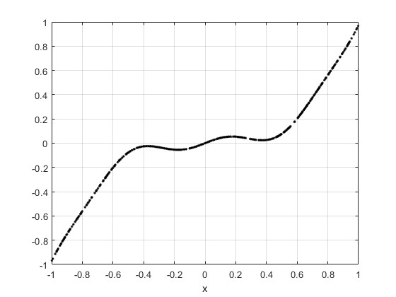
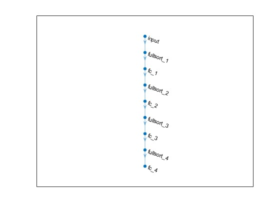
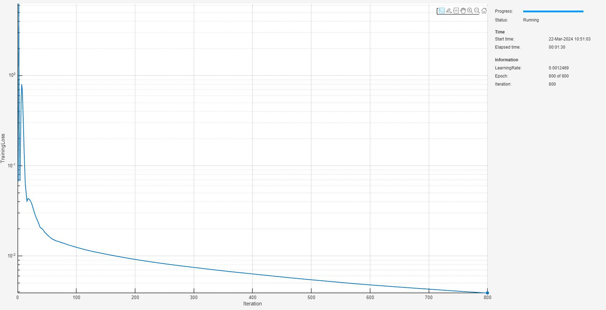
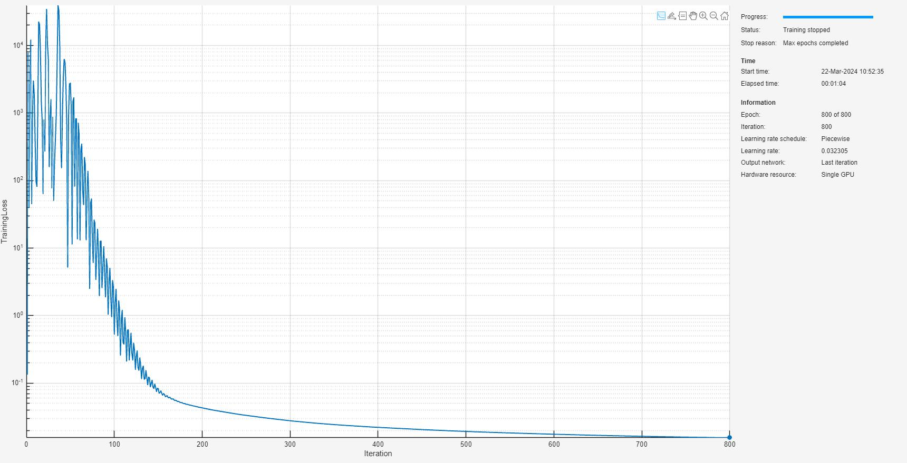
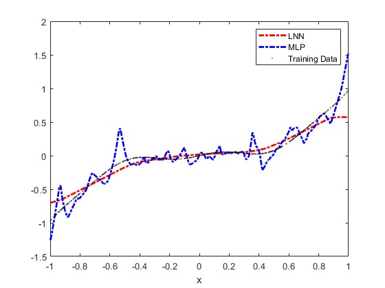
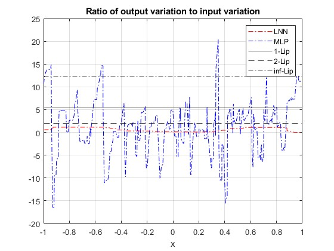

# <span style="color:rgb(213,80,0)">Proof of Concept: 1\-D Lipschitz Neural Networks</span>

This script provides an illustration of the constrained deep learning for 1\-dimensional Lipschitz continuous networks, along with the robustness guarantees discussed for Lipschitz continuous functions. The example will work through these steps:

1.  Generate a dataset with some sinusoidal additive noise contaminating a monotonic function signal.
2. Prepare the dataset for custom training loop.
3. Create a Lipschitz continuous neural network (LNN) architecture.
4. Train the LNN using a custom training loop and apply projected gradient descent to guarantee the Lipschitz bound.
5. Train an MLP network without architectural or weight constraints.
6. Compare the two networks and show robustness is weaker in the unconstrained network and that the Lipschitz bound is met in the LNN.
# Generate Data

First, take the monotonic function <samp>y=x^3</samp> and uniformly randomly sample this over the interval <samp>[-1,1]</samp>. Add sinusoidal noise to create a dataset. You can change the number of random samples if you want to experiment.

```matlab
numSamples = 512;
rng(0);
xTrain = -2*rand(numSamples,1)+1; % [-1 1]
xTrain = sort(xTrain);
tTrain = xTrain.^3 + 0.05*sin(10*xTrain);
```

Visualize the data.

```matlab
figure;
plot(xTrain,tTrain,"k.")
grid on
xlabel("x")
```

<figure>
<p align="center">
    
</p>
</figure>

# Prepare Data

To prepare the data for custom training loops, add the input and response to a <samp>minibatchqueue</samp>. You can do this by creating <samp>arrayDatastore</samp> objects and combining these into a single datastore using the <samp>combine</samp> function. Form the <samp>minibatchqueue</samp> with this combined datastore object.

```matlab
xds = arrayDatastore(xTrain);
tds = arrayDatastore(tTrain);
cds = combine(xds,tds);

mbqTrain = minibatchqueue(cds,2,...
    "MiniBatchSize",numSamples,...
    "OutputAsDlarray",[1 1],...
    "MiniBatchFormat",["BC","BC"]);
```
# Create 1\-D LNN

As discussed in [AI Verification: Lipschitz](../../../../documentation/AI-Verification-Lipschitz.md), Lipschitz continuous neural networks adhere to a specific class of neural network architectures with constraints applied to weights. In this proof of concept example, build a simple LNN using fully connected layers and <samp>fullsort</samp> activations. More expressive Lipschitz continuous networks can be constructed using gradient norm preserving activation functions, such as <samp>fullsort</samp>. For more information on the architectural construction, see [AI Verification: Lipschitz](../../../../documentation/AI-Verification-Lipschitz.md).

```matlab
inputSize = 1;
numHiddenUnits = [32 16 8 1];
lnnet = buildConstrainedNetwork("lipschitz",inputSize,numHiddenUnits,...
    Activation="fullsort")
```

```matlabTextOutput
lnnet = 
  dlnetwork with properties:

         Layers: [9x1 nnet.cnn.layer.Layer]
    Connections: [8x2 table]
     Learnables: [8x3 table]
          State: [0x3 table]
     InputNames: {'input'}
    OutputNames: {'fc_4'}
    Initialized: 1

  View summary with summary.

```

You can view the network architecture in <samp>deepNetworkDesigner</samp> by setting the <samp>viewNetworkDND</samp> flag to <samp>true</samp>. Otherwise, plot the network graph.

```matlab
viewNetworkDND = false;
if viewNetworkDND
    deepNetworkDesigner(lnnet) %#ok<UNRCH>
else
    figure;
    plot(lnnet)
end
```

<figure>
<p align="center">
    
</p>
</figure>

# Train LNN

First, create a custom training options struct. For the <samp>trainLipschitzNetwork</samp> function, you can specify general network training hyperparameters: <samp>maxEpochs</samp>, <samp>initialLearnRate</samp>, <samp>decay</samp>, and <samp>lossMetric</samp>. You can also specify Lipschitz continuous specific hyperparameter options, <samp>UpperBoundLipschitzConstant</samp> and <samp>pNorm</samp>. Select the <samp>pNorm=2</samp> which gives Euclidean distance as the measure on the input and network output variations. Specify an <samp>UpperBoundLipschitzConstant=2</samp> to provides a robustness guarantee on the spikiness of the solution.

```matlab
maxEpochs = 800;
initialLearnRate = 0.5;
decay = 0.5;
lossMetric = "mse";

% Lipschitz continuous training options
upperBoundLipschitzConstant = 2;
pNorm = 2;
```

Train the network with these options.

```matlab
trained_lnnet = trainConstrainedNetwork("lipschitz",lnnet,mbqTrain,...
   MaxEpochs=maxEpochs,...
   InitialLearnRate=initialLearnRate,...
   Decay=decay,...
   LossMetric=lossMetric,...
   UpperBoundLipschitzConstant=upperBoundLipschitzConstant,...
   pNorm=pNorm);
```

<figure>
<p align="center">
    
</p>
</figure>

As the training proceeds, there is a trade\-off between the gradient descent and the constraint on the weights. This can lead to training plots that converge more slowly, with regions of increased loss as the constraint on weights outweighs the reduction in loss made by the gradient descent step. This can lead to constrained network generally requiring more epochs to converge, and more carefully tuned hyperparameter selection.


Evaluate the accuracy on the true underlying cubic function from an independent random sampling from the interval <samp>[-1,1]</samp>.

```matlab
rng(0);
xTest = -2*rand(numSamples,1)+1; % [-1 1]
tTest = xTest.^3;
lossAgainstUnderlyingSignal = computeLoss(trained_lnnet,xTest,tTest,lossMetric)
```

```matlabTextOutput
lossAgainstUnderlyingSignal =

  gpuArray single

    0.0062
```

Compute an upper bound on the Lipschitz constant for the network to verify this is consistent with the specified bound. You find this is less than or equal to the specified upper bound set in the <samp>lipschitzTrainingOptions</samp>.

```matlab
lipschitzUpperBound(trained_lnnet,pNorm)
```

```matlabTextOutput
ans = 
  1x1 single gpuArray dlarray

1.9535

```
# Train Unconstrained MLP

Create a network with the same architecture as the LNN defined previously but train the network without apply the Lipschitz continuity constraints.

```matlab
mlpnet = lnnet;
```

Specify the training options to closely resemble those used for the LNN training and then train the network using the <samp>trainnet</samp> function.

```matlab
options = trainingOptions("adam",...
    Plots="training-progress",...
    MaxEpochs=maxEpochs,...
    InitialLearnRate=initialLearnRate,...
    LearnRateSchedule="piecewise",...
    LearnRateDropPeriod=30,...
    LearnRateDropFactor=0.9,...
    MiniBatchSize=numSamples,...
    Shuffle="never"...
    );
trained_mlpnet = trainnet(mbqTrain,mlpnet,lossMetric,options);
```

```matlabTextOutput
    Iteration    Epoch    TimeElapsed    LearnRate    TrainingLoss
    _________    _____    ___________    _________    ____________
            1        1       00:00:00          0.5         0.13416
           50       50       00:00:05         0.45          2765.5
          100      100       00:00:10       0.3645         0.52926
          150      150       00:00:14      0.32805         0.08331
          200      200       00:00:18      0.26572         0.04308
          250      250       00:00:23      0.21523         0.03339
          300      300       00:00:26      0.19371        0.027781
          350      350       00:00:30      0.15691        0.024379
          400      400       00:00:34      0.12709        0.022189
          450      450       00:00:38      0.11438        0.020562
          500      500       00:00:42     0.092651        0.019302
          550      550       00:00:47     0.075047        0.018336
          600      600       00:00:51     0.067543        0.017547
          650      650       00:00:55     0.054709         0.01688
          700      700       00:00:59     0.044315        0.016341
          750      750       00:01:03     0.039883        0.015906
          800      800       00:01:07     0.032305        0.015564
Training stopped: Max epochs completed
```

<figure>
<p align="center">
    
</p>
</figure>

Evaluate the accuracy on an independent random sampling from the interval <samp>[-1,1]</samp>.

```matlab
lossAgainstUnderlyingSignal = computeLoss(trained_mlpnet,xTest,tTest,lossMetric)
```

```matlabTextOutput
lossAgainstUnderlyingSignal = 0.0166
```

Compute an upper bound on the Lipschitz constant for this unconstrained network. You find this is much larger than the constrained network.

```matlab
lipschitzUpperBound(trained_mlpnet,pNorm)
```

```matlabTextOutput
ans = 
  1x1 single dlarray

1.5334e+03

```
# Network Comparison

Compare the shape of the solution by sampling the training data and plotting this for both networks. You can visibly see the unconstrained solution is not as smooth.

```matlab
lnnPred = predict(trained_lnnet,xTrain);
mlpPred = predict(trained_mlpnet,xTrain);

figure;
plot(xTrain,lnnPred,"r-.",LineWidth=2)
hold on
plot(xTrain,mlpPred,"b-.",LineWidth=2)
plot(xTrain,tTrain,"k.",MarkerSize=0.1)
xlabel("x")
legend("LNN","MLP","Training Data")
```

<figure>
<p align="center">
    
</p>
</figure>

# Guaranteed Robustness for LNN

As discussed in [AI Verification: Lipschitz](../../../../documentation/AI-Verification-Lipschitz.md), Lipschitz continuous neural networks are robust, by definition, in each output with respect to every input. To illustrate the robustness in this example, compute the lower bound for the Lipschitz constant for each network. You will see for the LNN network, this lower bound is always below the specified upper bound, however, for the unconstrained MLP network, there is no such guarantee and the network is evidently less robust against small input perturbations.


In addition, for scalar, 1\-dimensional input and output LNNs, the p\-norm on the inputs and outputs is the absolute value. For these class of networks, you can therefore compute the <samp>1-</samp>, <samp>2-</samp> and <samp>Inf</samp>\-norm Lipschitz constants. The smallest of these is still guaranteed to give an upper bound on variations of the output with respect to variations on the input.

```matlab
oneLipschitzConstant = lipschitzUpperBound(trained_lnnet,1)
```

```matlabTextOutput
oneLipschitzConstant = 
  1x1 single gpuArray dlarray

    5.3927

```

```matlab
twoLipschitzConstant = lipschitzUpperBound(trained_lnnet,2)
```

```matlabTextOutput
twoLipschitzConstant = 
  1x1 single gpuArray dlarray

1.9535

```

```matlab
infLipschitzConstant = lipschitzUpperBound(trained_lnnet,Inf)
```

```matlabTextOutput
infLipschitzConstant = 
  1x1 single gpuArray dlarray

   12.3716

```

```matlab
lnnPred = predict(trained_lnnet,xTrain);
mlpPred = predict(trained_mlpnet,xTrain);

lnnLowerBoundLipschitz = diff(lnnPred)./diff(xTrain);
mlpLowerBoundLipschitz = diff(mlpPred)./diff(xTrain);

figure;
plot(xTrain(1:end-1),lnnLowerBoundLipschitz,"r-.")
hold on
grid on
plot(xTrain(1:end-1),mlpLowerBoundLipschitz,"b-.")
yline(extractdata(oneLipschitzConstant),"k")
yline(extractdata(twoLipschitzConstant),"k--")
yline(extractdata(infLipschitzConstant),"k-.")
xlabel("x")
legend("LNN","MLP","1-Lip","2-Lip","inf-Lip")
title("Ratio of output variation to input variation")
```

<figure>
<p align="center">
    
</p>
</figure>

You see that the lower bound for the Lipschitz constant for the LNN, given by the red curve, is always lower than the computed upper bounds, guaranteeing robustness of the LNN up to the values of the upper bound Lipschitz constants. This is not the case for the unconstrained MLP. In principle, given the loose upper bound on the Lipschitz constant for the MLP, there could be large spikes over the <samp>[-1,1]</samp> interval causing the function to jump for very small changes to the input. You guarantee this is never the case for the LNN since the Lipschitz constant is orders of magnitude smaller, giving this assurance.

# Helper Functions
```matlab
function loss = computeLoss(net,X,T,lossMetric)
Y = predict(net,X);
switch lossMetric
    case "mse"
        loss = mse(Y,T);
    case "mae"
        loss = mean(abs(Y-T));
end
end
```

*Copyright 2024 The MathWorks, Inc.*

