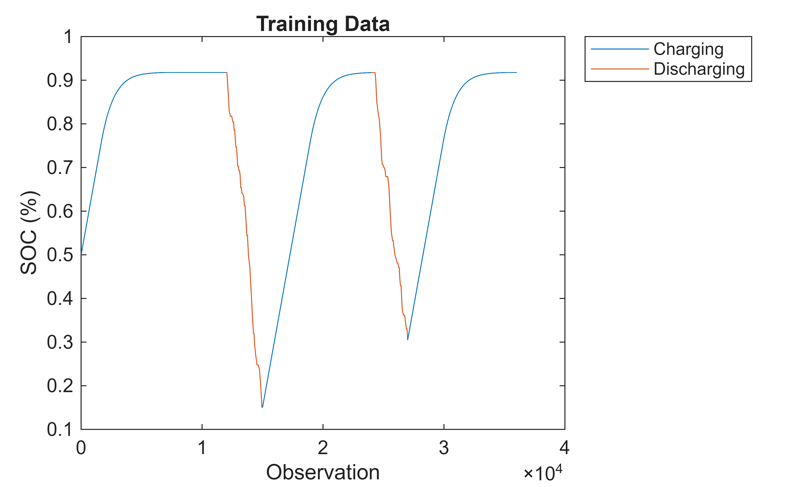
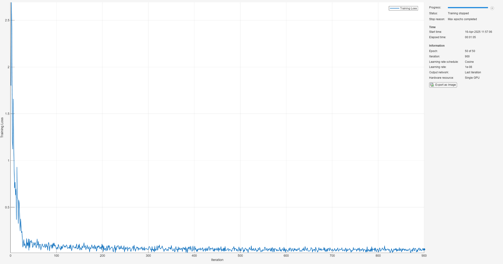
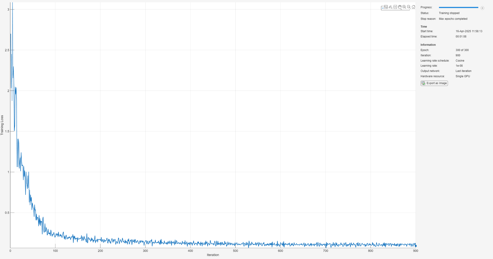
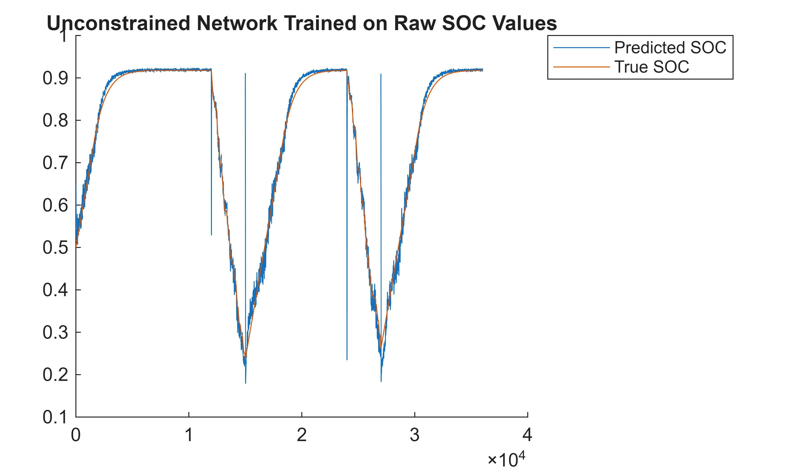
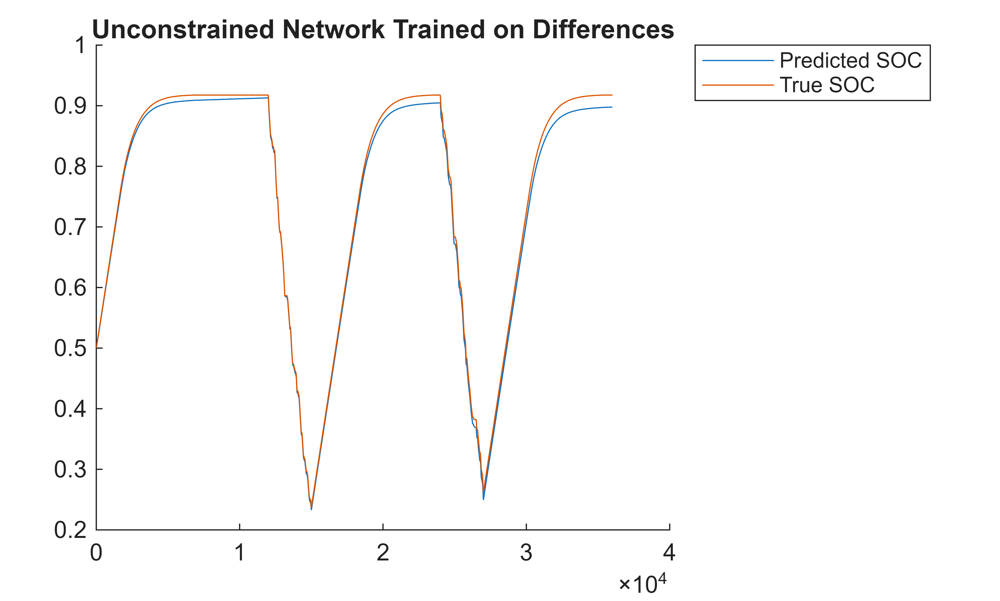
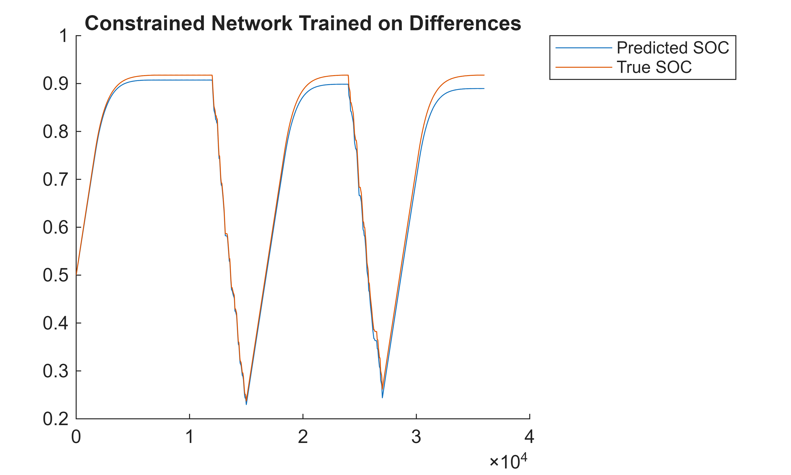
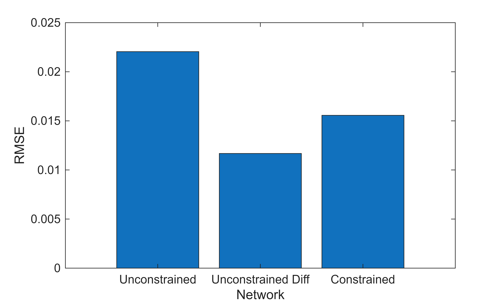
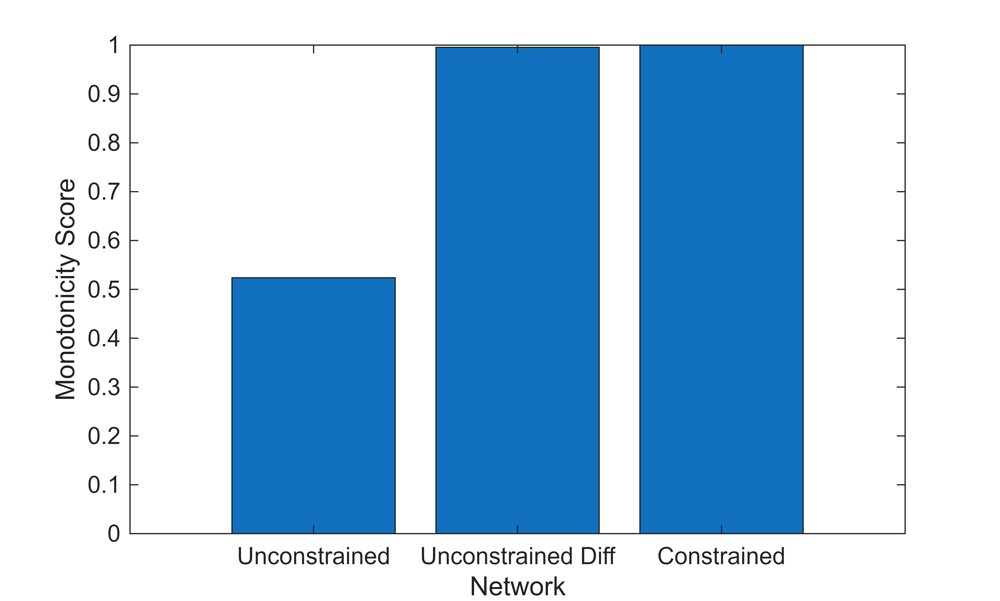
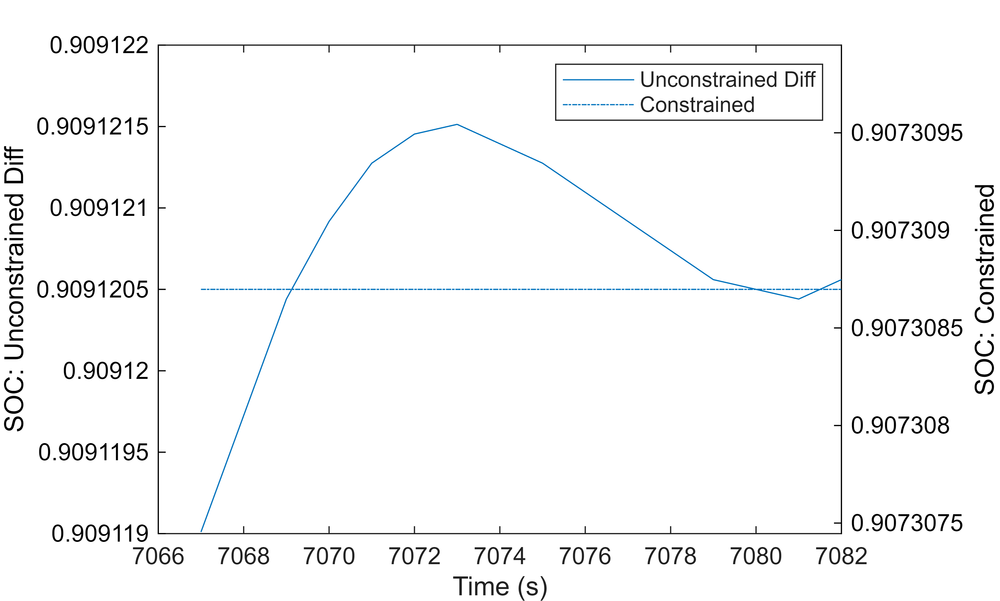

# Battery State of Charge Estimation Using Monotonic Neural Networks

This example shows how to train two monotonic neural networks to estimate the state of charge (SOC) of a battery, one to model the charging behavior, and one to model the discharging behavior. Guaranteeing monotonic behaviour can be crucial in deploynment to safety\-critical systems. For example, in applications in predictive maintenance, violations in the monotonic decrease of the remaining useful life of system component implies that as time passes and the components degrade, their remaining useful life actually increases.


A reasonable requirement on the system is that battery SOC should always be increasing with increasing time in the charging phase and decreasing with increasing time in the discharging phase. This defines a monotonic requirement on the system. This example shows how to create a network architecture that guarantees monotonic output sequences. For an example showing how to model the state of charge of a battery using a traditional deep learning approach, see [Battery State of Charge Estimation Using Deep Learning](https://www.mathworks.com/help/deeplearning/ug/battery-state-of-charge-estimation-using-deep-learning.html).


To guarantee monotonicity, train the networks to predict the rate of change of the state of charge and force the output to be positive or negative for the charging and discharging networks, respectively. This is equivalent to constraining the derivative to be postive or negative. If the rate of change is positive, then the state of charge is monotonically increasing, and vice versa. Forcing the outputs to be positive (or negative) is a simple constraint that still allows for a wide variety of expressive neural networks. Crucially, this constraint on the network architecture guarantees the monotonicity at each training iteration, including initialization of the network. This means that your monotonic requirement can be traced through the entire neural network training phase.

# Preprocess Training Data

The data used in this example was generated from a Simulink model simulating a battery charging and discharging over several hours. The Simulink model is identical to the model in [Battery State\-of\-Charge Estimation](https://www.mathworks.com/help/simscape-battery/ug/battery-state-of-charge-estimation.html), except for the replacement of the Current profile subsystem with two [Cycler](https://www.mathworks.com/help/simscape-battery/ref/cycler.html) blocks to simulate ideal charging and discharging.

-  The input data has three variables: battery temperature (°C), voltage (V), and current (A) .  
-  The output data is the state of charge. 
-  The simulated ambient temperature is 25°C. 
-  The battery charges for 9000 seconds and then discharges for 3000 seconds. This cycle repeats for 10 hours. 
-  The initial state of charge is 0.5. 
## Load Data

Load the training data. The data is attached to this example as supporting files.

```matlab
data = load("BSOC_25_degrees_training.mat");

XTrain = data.X;
YTrain = data.Y';
```
## Split into Charging and Discharging Subsets

Define a `cycleLength` and `chargeRatio` for the signal and split the data into charging and charging subsets using `splitChargingCycles`. Integrated in the full system, the charging state would be determined by other components in the system.

```matlab
cycleLength = 12000;
chargeRatio = 0.75;
[XTrainCharge,XTrainDischarge] = splitChargingCycles(XTrain,cycleLength,chargeRatio);
[YTrainCharge,YTrainDischarge,chargingIdx,dischargingIdx] = splitChargingCycles(YTrain,cycleLength,chargeRatio);
```

Visualize the charging and discharging target data using `plotTrainingData`.

```matlab
plotTrainingData(YTrainCharge,YTrainDischarge,chargingIdx,dischargingIdx)
```


## Chunk Data

Split the data into chunks to prepare it for training. Discard remaining sequences that are too short.

```matlab
function [XChunkedCell, YChunkedCell] = chunkData(XCell,YCell,chunkSize,stride)

XChunkedCell = [];
YChunkedCell = [];

for i=1:numel(XCell)

    X = XCell{i};
    Y = YCell{i};

    numSamples = length(Y);
    numChunks= floor(numSamples/(chunkSize-stride))-1;
    XChunked = cell(numChunks,1);
    YChunked = cell(numChunks,1);

    for j = 1:numChunks
        idxStart = 1+(j-1)*stride;
        idxEnd = idxStart+chunkSize-1;
        XChunked{j} = X(idxStart:idxEnd,:);
        YChunked{j} = Y(idxStart:idxEnd);
    end

    XChunkedCell = [XChunkedCell; XChunked];
    YChunkedCell = [YChunkedCell; YChunked];
end
end

chunkSize = 200;
stride = 100;

[XTrainCharge,YTrainCharge] = chunkData(XTrainCharge,YTrainCharge,chunkSize,stride);
[XTrainDischarge,YTrainDischarge] = chunkData(XTrainDischarge,YTrainDischarge,chunkSize,stride);
```
# Create Constrained Network

The SOC problem can be viewed as a cumulative problem. SOC increases incrementally over time and you can add this increment to previous values to find the new SOC. The voltage, current, and temperature at a given time determine the increase or decrease in SOC during the next time period. Train a network to predict the different between the SOC at consecutive timesteps. You can then enforce monotonically increasing or decreasing SOC by ensuring that the network output is negative or positive, respectively.

 $$ \Delta y\left(t\right)=y\left(t+1\right)-y\left(t\right)=g\left(x\left(t\right)\right)\;\ldotp $$ 

Calculate the SOC at a time `t`.

 $$ y\left(t\right)=y\left(t-1\right)+\Delta y\left(t-1\right)=y\left(t-1\right)+g\left(x\left(t-1\right)\right)=y\left(1\right)+\sum_{k=1}^t g\left(x\left(k-1\right)\right) $$ 
## Data Preprocessing for Constrained Network

To train the new network g(x), preprocess the target data as follows:

1.  Calculate the difference between the SOC at t and t+1.
2. Normalize the differences since they will be much smaller than the weights.

To ensure that applying an inverse normalization to the network outputs cannot cause the output to change sign and break monotonicity, normalize the targets using scaling and no offset.


To preprocess the target data for training on the differences, define the preprocessing function, `preprocessDiffTargets`. The function finds the difference between the target data at two consecutive time steps and applies normalization. To apply an inverse normalization on the network outputs during testing, the function also outputs the calculated normalization statistic `stdDiff`.

```matlab
function [XDiff, YDiff, stdDiff] = preprocessDiffTargets(X,Y)

YDiff = cellfun(@(x) diff(x),Y,UniformOutput=false);

stdDiff = std(cell2mat(YDiff));
YDiff = cellfun(@(x) x/stdDiff,YDiff,UniformOutput=false);

% Remove the final value in the input sequence
XDiff = cellfun(@(x) x(1:end-1,:),X,UniformOutput=false);

end

[XTrainChargingDifference, YTrainChargingDifference, stdDiffCharge] = preprocessDiffTargets(XTrainCharge,YTrainCharge);
[XTrainDischargingDifference, YTrainDischargingDifference, stdDiffDischarge] = preprocessDiffTargets(XTrainDischarge,YTrainDischarge);
```
## Constrain Sign of Network Output

To enforce monotonicity during charging, you can constrain the charging the network output to always be positive by applying a positive activation function, such as `relu`.

 $$ \Delta y\left(t\right)=y\left(t+1\right)-y\left(t\right)=\textrm{ReLU}\left(h_{\textrm{charging}} \left(x\left(t\right)\right)\right) $$ 

For discharging, multiply the output by `-1` before and after applying the `relu` operation.

 $$ \Delta y\left(t\right)=y\left(t+1\right)-y\left(t\right)=-\textrm{ReLU}\left({-h}_{\textrm{discharging}} \left(x\left(t\right)\right)\right) $$ 
## Train Charging Network

The original recurrent neural network architecture (RNN) used for battery state of charge estimation is described in [Battery State of Charge Estimation Using Deep Learning](https://www.mathworks.com/help/deeplearning/ug/battery-state-of-charge-estimation-using-deep-learning.html). This example adapts that network by training two separate networks for the charging and discharging phases. Each network uses an LSTM network architecture with blocks that consist of an LSTM layer followed by a dropout layer. The dropout layers help to avoid overfitting.


Define the network architecture. Create an RNN that consists of two blocks containing an `lstmLayer` followed by a `dropoutLayer`, with decreasing `numHiddenUnits` between the blocks and a dropout probability of 0.2. Since the network predicts the battery state of charge (SOC), add a `fullyConnectedLayer` with an output size of `numRespones`. To ensure the outputs are positive, add a `reluLayer` at the end.

```matlab
numFeatures = size(XTrainCharge{1},2);
numHiddenUnits = 32;
numResponses = size(YTrainCharge{1},2);

layers = [sequenceInputLayer(numFeatures,Normalization="rescale-zero-one")
    lstmLayer(numHiddenUnits)
    dropoutLayer(0.2)
    lstmLayer(numHiddenUnits/2)
    dropoutLayer(0.2)
    fullyConnectedLayer(numResponses)
    reluLayer];
```

Specify the training options for the network. Train for 50 epochs with mini\-batches of size 16 using the Adam optimizer. To decrease the learn rate schedule throughout training, set `LearnRateSchedule` to `cosine`. Specify the learning rate as 0.001. To prevent the gradients from exploding, set the gradient threshold to 1. Since the state is not carried between chunks, set "`Shuffle`" to "`every-epoch`" to ensure batches are not dominated by specific sequences in the charging data. Turn on the training progress plot, and turn off the command window output (`Verbose`).

```matlab
epochs = 50;
miniBatchSize = 16;

chargingOptions = trainingOptions("adam", ...
    MaxEpochs=epochs, ...
    GradientThreshold=1, ...
    InitialLearnRate=0.001, ...
    LearnRateSchedule="cosine", ...
    MiniBatchSize=miniBatchSize, ...
    Verbose=0, ...
    Plots="training-progress", ...
    Shuffle="every-epoch");
```

Train the charging network using `trainnet`.

```matlab
chargingConstrainedNet = trainnet(XTrainChargingDifference,YTrainChargingDifference,layers,"mse",chargingOptions);
```


## Train Discharging Network

To enforce negative outputs for the discharging network, surround the `reluLayer` with two `scalingLayer` objects with scale `-1`.

```matlab
layers = [sequenceInputLayer(numFeatures,Normalization="rescale-zero-one")
    lstmLayer(numHiddenUnits)
    dropoutLayer(0.2)
    lstmLayer(numHiddenUnits/2)
    dropoutLayer(0.2)
    fullyConnectedLayer(numResponses)
    scalingLayer(Scale=-1)
    reluLayer
    scalingLayer(Scale=-1)];
```

Since there are fewer observations for the discharging phase, increase the number of epochs before training the discharging network using `trainnet`.

```matlab
dischargingOptions = chargingOptions;
dischargingOptions.MaxEpochs = epochs * ceil(numel(XTrainCharge)/numel(XTrainDischarge));
dischargingConstrainedNet = trainnet(XTrainDischargingDifference,YTrainDischargingDifference,layers,"mse",dischargingOptions);
```


# Test Networks
## Train Unconstrained Networks

To compare the performance of the network with other unconstrained networks, train four unconstrained networks using the supporting function `trainUnconstrainedNetworks`. `chargingConstrainedNet` and `dischargingUnconstrainedNet` use the raw predictors, not the differences, as the network inputs. `chargingUnconstrainedDiffNet` and `dischargingUnconstrainedDiffNet` are trained on the differences but do not constrain the output to be positive or negative. The rest of the network architecture and the training options are the same as the constrained networks.

```matlab
[chargingUnconstrainedNet,dischargingUnconstrainedNet,chargingUnconstrainedDiffNet,dischargingUnconstrainedDiffNet] = trainUnconstrainedNetworks(XTrainCharge,YTrainCharge, ...
    XTrainDischarge,YTrainDischarge, ...
    XTrainChargingDifference,YTrainChargingDifference, ...
    XTrainDischargingDifference,YTrainDischargingDifference, ...
    chargingOptions, dischargingOptions);
```
## Predict SOC

The test data is several hours of simulated battery charging data at the same temperature as the test data.

```matlab
data = load("BSOC_25_degrees_testing.mat");
XTest = data.X;
YTest = data.Y';
```

To find the SOC for the test input data, split the input data into charging and discharging data and predict the SOC using the corresponding network. Apply inverse normalization to the network output using the normalization statistics calculated by `preprocessDiffTargets.`

```matlab
function YPred = getCombinedNetworkOutputs(XTest,chargingNet,chargeScale,dischargingNet,dischargeScale,cycleLength,chargeRatio)

[XTestCharge, XTestDischarge, chargingIdx, dischargingIdx] = splitChargingCycles(XTest,cycleLength,chargeRatio);

YPredCharge = cell(numel(XTestCharge),1);
YPredDischarge = cell(numel(XTestDischarge),1);

% Predict for charge cycles
for i = 1:numel(XTestCharge)
    [Yout, state] = predict(chargingNet, XTestCharge{i});
    YPredCharge{i} = chargeScale*Yout;
    chargingNet.State = state;
end

% Predict for discharge cycles
for i = 1:numel(XTestDischarge)
    [Yout, state] = predict(dischargingNet, XTestDischarge{i});
    YPredDischarge{i} = dischargeScale*Yout;
    dischargingNet.State = state;
end

% Concatenate predictions
YPred = cell(numel(YPredCharge)+numel(YPredDischarge),1);
YPred(chargingIdx) = YPredCharge;
YPred(dischargingIdx) = YPredDischarge;
YPred = cell2mat(YPred);

end
```

To find the SOC value at each time step of the networks trained on the difference, cumulatively sum the network ouputs.

```matlab
function YPred = getSOCFromDiffOutput(YPredDiff,SOC0)

YPred = SOC0 + [0; cumsum(YPredDiff)];
YPred = YPred(1:end-1);

end
```
## Compare Networks
### Plot Test Data

Find the predicted SOC of the test data for each network and plot the results.

```matlab
YPredUnconstrained = getCombinedNetworkOutputs(XTest,chargingUnconstrainedNet,1,dischargingUnconstrainedNet,1,cycleLength,chargeRatio);

figure
hold on
plot(YPredUnconstrained)
plot(YTest)
legend(["Predicted SOC" "True SOC"],Location="bestoutside")
title("Unconstrained Network Trained on Raw SOC Values")
hold off
```



The unconstrained network trained on the raw SOC values shows an overall good fit to the test data. You can see the noise typical of an RNN and the impact of resetting the state between the two networks.

```matlab
YOutUnconstrainedDiff = getCombinedNetworkOutputs(XTest,chargingUnconstrainedDiffNet,stdDiffCharge,dischargingUnconstrainedDiffNet,stdDiffDischarge,cycleLength,chargeRatio);

YPredUnconstrainedDiff = getSOCFromDiffOutput(YOutUnconstrainedDiff,YTest(1));

figure
hold on
plot(YPredUnconstrainedDiff)
plot(YTest)
legend(["Predicted SOC" "True SOC"],Location="bestoutside")
title("Unconstrained Network Trained on Differences")
hold off
```



The unconstrained network trained on the differences performs significantly better than the original network. It is less noisy and responds well to the random changes in discharge voltage current.

```matlab
YOutConstrained = getCombinedNetworkOutputs(XTest,chargingConstrainedNet,stdDiffCharge,dischargingConstrainedNet,stdDiffDischarge,cycleLength,chargeRatio);

YPredConstrained = getSOCFromDiffOutput(YOutConstrained,YTest(1));

figure
hold on
plot(YPredConstrained)
plot(YTest)
legend(["Predicted SOC" "True SOC"],Location="bestoutside")
title("Constrained Network Trained on Differences")
hold off
```



The monotonic network trained on the differences performs comparably to the unconstrained network trained on the differences.


Save the results in a table:

```matlab
predictions = table(["Unconstrained";"Unconstrained Diff";"Constrained"],[{YPredUnconstrained}; {YPredUnconstrainedDiff}; {YPredConstrained}],VariableNames=["Network","YPred"]);
```
### RMSE

For each network, calculate the RMSE.

```matlab
function rmseValue = findRMSE(YTest,YPred)
rmseValue = sqrt(mean((YPred - YTest).^2));
end

predictions = [predictions rowfun(@(x) findRMSE(YTest,x{:}),predictions(:,"YPred"),OutputVariableNames="RMSE")];
```

Plot the RMSE for each network:

```matlab
figure
bar(predictions.Network,predictions.RMSE)
xlabel("Network")
ylabel("RMSE")
```



The two networks trained on the differences have significantly lower RMSEs than the other network. The constrained network performs slightly worse than the unconstrained network.

### Monotonicity

Monotonicity is guaranteed for the constrained network. You can sample the training or test set to get an idea of violations of monotonicity for the unconstrained networks. A convenient way to assess violation to monotonicity is to define the `monotonicityScore` to measure the degree of monotonicity of a signal. This is the ratio of intervals between two adjacent signals.

 $$
\textrm{monotonicityScore} = \frac{1}{N-1} \sum_{n=1}^{N-1}
\begin{cases}
1 & \text{if } y(n+1) \geq y(n) \\
0 & \text{if } y(n+1) < y(n)
\end{cases}
$$

A fully monotonic increasing signal has a `monotonicityScore` of 1 and a fully monotonic decreasing signal has a `monotonicityScore` of 0.


Define `getMonotonicityScore` to calculate the `monotoncityScore` of the network output. Use the `cycleLength` and `chargeRatio` to determine if the signal should be monotonically increasing or decreasing. The function also outputs the index of SOC values which break monotonicity.

```matlab
function [monotonicityScore, brokenMonotocityIdx] = getMonotonicityScore(YPred,cycleLength,chargeRatio)

[YPredCharge, YPredDischarge, chargingIdx, dischargingIdx] = splitChargingCycles(YPred,cycleLength,chargeRatio);

YPredDiff = cell(numel(YPredCharge)+numel(YPredDischarge),1);

YPredDiffCharge = cellfun(@(x) diff(x),YPredCharge,"UniformOutput",false);
YPredDiffDischarge = cellfun(@(x) -diff(x),YPredDischarge,"UniformOutput",false);

YPredDiff(chargingIdx) = YPredDiffCharge;
YPredDiff(dischargingIdx) = YPredDiffDischarge;

YPredDiff = cell2mat(YPredDiff);

monotonicityScore = sum(YPredDiff>=0)/numel(YPredDiff);

idx = 1:numel(YPredDiff);
brokenMonotocityIdx = {idx(YPredDiff<0)};

end

predictions = [predictions rowfun(@(x) getMonotonicityScore(x{:},cycleLength,chargeRatio),predictions(:,"YPred"),OutputVariableNames=["Monotonicity","BrokenMonotonicityIdx"])];
```

Plot the `monotonicityScore` for the three networks:

```matlab
figure
bar(predictions.Network,predictions.Monotonicity)
xlabel("Network")
ylabel("Monotonicity Score")
```



The unconstrained network trained on the raw SOC data has a `monotonicityScore` of 0.52 meaning that the signal increases nearly as much as it decreases. The unconstrained network trained on the differences is closer to being monotonic that the original network with a score of 0.99, however, this emphasises that 1% of the test set violates monotonicity. The constrained network is monotonic by construction and thus achieves a score of 1.


You can sample a small section of the SOC where monotonicity was violated for the unconstrained network trained on differences. Also plotted in the same region is the monotonic network.

```matlab
figure
brokenIdx1 = predictions{2,"BrokenMonotonicityIdx"}{1}(1);
pltIdx = brokenIdx1-5:brokenIdx1+10;

colororder({'k','k'})
yyaxis left
diffPlot = predictions{2,"YPred"}{1}(pltIdx);
plot(pltIdx,diffPlot,Color="#0072BD")
ylabel("SOC: Unconstrained Diff")

yyaxis right 
monoPlot = predictions{3,"YPred"}{1}(pltIdx);
plot(pltIdx,monoPlot,Color="#0072BD",LineStyle="-.")
ylabel("SOC: Constrained")
diffPlotRange = max(diffPlot)-min(diffPlot);
ylim([median(monoPlot)-diffPlotRange/2 median(monoPlot)+diffPlotRange/2])

legend(["Unconstrained Diff" "Constrained"])

xlabel("Time (s)")
```



The results overall show that training on the differences gives better performance than training directly on the data for this SOC data. Constraining the outputs to be monotonic comes with a small cost in performance however, monotonicity can be guaranteed.

# Helper Functions
## Split Data into Charging Cycles Function

This function splits data into charging and discharging cycles using information about the simulated charging cycle: `cycleLength` and `chargeRatio`.

```matlab
function [chargingData, dischargingData, chargingIdx, dischargingIdx] = splitChargingCycles(data,cycleLength,chargeRatio)

chargeLength = floor(cycleLength*chargeRatio);
dischargeLength = cycleLength-chargeLength;
numCycles = floor(size(data,1)/(cycleLength));

chargingData = cell(numCycles+1,1);
dischargingData = cell(numCycles-1,1);

chargingIdx = zeros(numCycles+1,1);
dischargingIdx = zeros(numCycles-1,1);

p=1;

% Split the test data into charge and discharge cycles
for i = 1:numCycles
    startIdx = (i - 1) * cycleLength + 1;
    endIdx = startIdx + dischargeLength - 1;

    if i>1
        dischargingData{i-1} = data(startIdx:endIdx, :);
        dischargingIdx(i-1) = p;
        p = p + 1;
    else
        chargingData{i} = data(startIdx:endIdx, :);
        chargingIdx(i) = p;
        p = p + 1;
    end

    startIdx = endIdx + 1;

    endIdx = startIdx + chargeLength - 1;
    if i == numCycles
        endIdx = size(data,1);
    end

    chargingData{i+1} = data(startIdx:endIdx, :);
    chargingIdx(i+1) = p;
    p = p + 1;

end

end
```
## Plot Training Data Function

This function plots the training data to visualize the charging/discharging split.

```matlab
function plotTrainingData(YTrainCharge,YTrainDischarge,chargingIdx,dischargingIdx)

YTrainSorted = [YTrainCharge; YTrainDischarge];
isCharging = [ones(numel(chargingIdx),1); zeros(numel(dischargingIdx),1)];
[~,sortIdx] = sort([chargingIdx; dischargingIdx]);
YTrainSorted = YTrainSorted(sortIdx);
isCharging = isCharging(sortIdx);
t = 1;

figure

for i=1:numel(YTrainSorted)

    yPlot = YTrainSorted{i};
    xPlot = t:(t+numel(yPlot)-1);

    if isCharging(i)==1
        c = "#0072BD";
        d = "Charging";
        p=1;
    else
        c = "#D95319";
        d = "Discharging";
        p=2;
    end

    h(p) = plot(xPlot,yPlot,"Color",c,"DisplayName",d);
    hold on

    t = xPlot(end)+1;
end

hold off
title("Training Data")
xlabel("Observation")
ylabel("SOC (%)")
legend([h(1) h(2)],Location="bestoutside")

end
```
