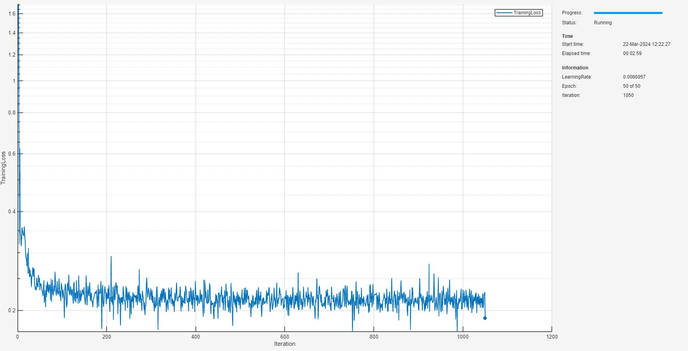

<a name="T_185B709C"></a>

# <span style="color:rgb(213,80,0)">Remaining Useful Life Estimation Using Monotonic Neural Networks</span>

This example is based on [Remaining Useful Life Estimation Using Convolutional Neural Networks](https://uk.mathworks.com/help/predmaint/ug/remaining-useful-life-estimation-using-convolutional-neural-network.html) and uses both partially and fully monotonic neural networks to guarantee monotonically decreasing remaining useful life (RUL) with respect to time. This example will also compare to the non\-constrained approach that fits convolutional neural networks (CNNs) [\[1\]](#98C35430), as in the original version of the example.


The advantage of a monotonic constrained deep learning approach is that you do not need manual feature extraction or feature selection for your model to predict RUL and can guarantee that the behavior of the network produces a monotonically degrading RUL in time. Furthermore, you do not need prior knowledge of machine health prognostics or signal processing to develop a deep learning based RUL prediction model.


Note that to run this example, you require the [Predictive Maintenance Toolbox™](https://www.mathworks.com/help/predictive-maintenance/index.html).

<a name="H_23BBC39D"></a>

# Download Data Set

This example uses the Turbofan Engine Degradation Simulation data set [\[1\]](#98C35430). The data set is in ZIP file format, and contains run\-to\-failure time\-series data for four different sets (namely FD001, FD002, FD003, and FD004) simulated under different combinations of operational conditions and fault modes.


This example uses only the FD001 data set, which is further divided into training and test subsets. The training subset contains simulated time series data for 100 engines. Each engine has several sensors whose values are recorded at a given instance in a continuous process. Hence, the sequence of recorded data varies in length and corresponds to a full run\-to\-failure (RTF) instance. The test subset contains 100 partial sequences and corresponding values of the remaining useful life at the end of each sequence.


Create a directory to store the Turbofan Engine Degradation Simulation data set.

```matlab
dataFolder = "data";
if ~exist(dataFolder,"dir")
    mkdir(dataFolder);
end
```

Download and extract the Turbofan Engine Degradation Simulation data set.

```matlab
filename = matlab.internal.examples.downloadSupportFile("nnet","data/TurbofanEngineDegradationSimulationData.zip");
unzip(filename,dataFolder)
```

The data folder now contains text files with 26 columns of numbers, separated by spaces. Each row is a snapshot of data taken during a single operational cycle, and each column represents a different variable:

-  Column 1 —  Unit number 
-  Column 2 —  Timestamp 
-  Columns 3–5 —  Operational settings 
-  Columns 6–26 —  Sensor measurements 1–21 
# Preprocess Training Data
<a name="H_D65A5232"></a>

Load the data using the function <samp>localLoadData</samp>. The function extracts the data from a data file and returns a table which contains the training predictors and corresponding response (i.e., RUL) sequences. Each row represents a different engine.

```matlab
filenameTrainPredictors = fullfile(dataFolder,"train_FD001.txt");
rawTrain = localLoadData(filenameTrainPredictors);
```

Examine the run\-to\-failure data for one of the engines.

```matlab
head(rawTrain.X{1},8)
```

```matlabTextOutput
    id    timeStamp    op_setting_1    op_setting_2    op_setting_3    sensor_1    sensor_2    sensor_3    sensor_4    sensor_5    sensor_6    sensor_7    sensor_8    sensor_9    sensor_10    sensor_11    sensor_12    sensor_13    sensor_14    sensor_15    sensor_16    sensor_17    sensor_18    sensor_19    sensor_20    sensor_21
    __    _________    ____________    ____________    ____________    ________    ________    ________    ________    ________    ________    ________    ________    ________    _________    _________    _________    _________    _________    _________    _________    _________    _________    _________    _________    _________

    1         1          -0.0007         -0.0004           100          518.67      641.82      1589.7      1400.6      14.62       21.61       554.36      2388.1      9046.2        1.3         47.47       521.66         2388       8138.6       8.4195        0.03          392         2388          100         39.06       23.419  
    1         2           0.0019         -0.0003           100          518.67      642.15      1591.8      1403.1      14.62       21.61       553.75        2388      9044.1        1.3         47.49       522.28       2388.1       8131.5       8.4318        0.03          392         2388          100            39       23.424  
    1         3          -0.0043          0.0003           100          518.67      642.35        1588      1404.2      14.62       21.61       554.26      2388.1      9052.9        1.3         47.27       522.42         2388       8133.2       8.4178        0.03          390         2388          100         38.95       23.344  
    1         4           0.0007               0           100          518.67      642.35      1582.8      1401.9      14.62       21.61       554.45      2388.1      9049.5        1.3         47.13       522.86       2388.1       8133.8       8.3682        0.03          392         2388          100         38.88       23.374  
    1         5          -0.0019         -0.0002           100          518.67      642.37      1582.8      1406.2      14.62       21.61          554      2388.1      9055.1        1.3         47.28       522.19         2388       8133.8       8.4294        0.03          393         2388          100          38.9       23.404  
    1         6          -0.0043         -0.0001           100          518.67       642.1      1584.5      1398.4      14.62       21.61       554.67        2388      9049.7        1.3         47.16       521.68         2388       8132.9       8.4108        0.03          391         2388          100         38.98       23.367  
    1         7            0.001          0.0001           100          518.67      642.48      1592.3      1397.8      14.62       21.61       554.34        2388      9059.1        1.3         47.36       522.32         2388       8132.3       8.3974        0.03          392         2388          100          39.1       23.377  
    1         8          -0.0034          0.0003           100          518.67      642.56        1583        1401      14.62       21.61       553.85        2388      9040.8        1.3         47.24       522.47         2388       8131.1       8.4076        0.03          391         2388          100         38.97       23.311  
```

Examine the response data for one of the engines.

```matlab
rawTrain.Y{1}(1:8)
```

```matlabTextOutput
ans = 8x1    
   191
   190
   189
   188
   187
   186
   185
   184

```

Visualize the time\-series data for some of the predictors.

```matlab
stackedplot(rawTrain.X{1},[3,5,6,7,8,15,16,24],XVariable="timeStamp")
```

<figure>
<p align="center">
    
</p>
</figure>

<a name="H_3395D0FB"></a>

## **Remove Features with Less Variability**

Features that remain constant for all time steps can negatively impact the training. Use the <samp>prognosability</samp> function to measure the variability of features at failure.

```matlab
prog = prognosability(rawTrain.X,"timeStamp");
```

For some features, prognosability is equal to zero or <samp>NaN</samp>. Discard these features. You can remove further features by ranking the remaining prognosability scores. In this example, further prune the features by discarding features with scores below <samp>0.5</samp>.

```matlab
prognosabilityCutoff = 0.5;
idxToRemove = prog.Variables==0 | isnan(prog.Variables) | prog.Variables < prognosabilityCutoff;
featToRetain = prog.Properties.VariableNames(~idxToRemove);
for i = 1:height(rawTrain)
    rawTrain.X{i} = rawTrain.X{i}{:,featToRetain};
end
```
## **Normalize Training Predictors**

Normalize the training predictors to have zero mean and unit variance.

```matlab
[~,Xmu,Xsigma] = zscore(vertcat(rawTrain.X{:}));
preTrain = table();
for i = 1:numel(rawTrain.X)
    preTrain.X{i} = (rawTrain.X{i} - Xmu) ./ Xsigma;
end
```
## **Clip Responses**

The response data represents the RUL value over life for each engine and is based individual engine lifetime. The sequence assumes a linear degradation from the time of the initial measurement to the time of engine failure.


In order for network to focus on the part of the data where engines are more likely to fail (end of the engine's life), clip the responses at the threshold of 150. Clipping the responses causes the network to treat instances with higher RUL values as equal.

```matlab
rulThreshold = 150;
for i = 1:numel(rawTrain.Y)
    preTrain.Y{i} = min(rawTrain.Y{i},rulThreshold);
end
```

This figure shows the first observation and the corresponding response (RUL), which is clipped at the threshold. The green overlay defines the clipping region on both sensor and RUL plots.

<figure>
<p align="center">
    
</p>
</figure>


## **Prepare Data for Padding**

This network supports input data with varying sequence lengths. When passing data through the network, the software pads, truncates, or splits sequences so that all the sequences in each mini\-batch have the specified length.


To minimize the amount of padding added to the mini\-batches, sort the training data by sequence length. Then, choose a mini\-batch size which divides the training data evenly and reduces the amount of padding in the mini\-batches.


Sort the training data by sequence length.

```matlab
for i = 1:size(preTrain,1)
    preTrain.X{i} = preTrain.X{i}';    %Transpose training data to have features in the first dimension
    preTrain.Y{i} = preTrain.Y{i}';    %Transpose responses corresponding to the training data
    sequence = preTrain.X{i};
    sequenceLengths(i) = size(sequence,2); 
end

[sequenceLengths,idx] = sort(sequenceLengths,'descend');
XTrain = preTrain.X(idx);
YTrain = preTrain.Y(idx);
```
# Network Architecture for Unconstrained CNN

The deep convolutional neural network architecture used for RUL estimation is described in [\[1\]](#98C35430). Here, you process and sort the data in a sequence format, with the first dimension representing the number of selected features and the second dimension representing the length of the time sequence. You bundle convolutional layers with batch normalization layer followed by an activation layer (ReLU in this case) and then stack the layers together for feature extraction. The fully connected layers and regression layer are used at the end to get the final RUL value as output.


The selected network architecture applies a 1\-D convolution along the time sequence direction only. Therefore, the order of features does not impact the training and only trends in one feature at a time are considered.


Define the network  architecture. Create a CNN that consists of five consecutive sets of a 1\-D convolution, batch normalization and, a ReLU layer, with increasing <samp>filterSize</samp>  and <samp>numFilters</samp> as the first two input arguments to <samp>convolution1dLayer</samp>, followed by a fully connected layer of size <samp>numHiddenUnits</samp> and a dropout layer with a dropout probability of 0.5. Since the network predicts the remaining useful life (RUL) of the turbofan engine, set <samp>numResponses</samp> to 1 in the second fully connected layer and a regression layer as the last layer of the network. 


To compensate for the varying time\-sequences in the training data, use <samp>Padding="causal"</samp> as the Name\-value pair input argument in <samp>convolution1dLayer</samp>. 

```matlab
numFeatures = size(XTrain{1},1);
numHiddenUnits = 100;
numResponses = 1;

layers = [
    sequenceInputLayer(numFeatures)
    convolution1dLayer(5,32,Padding="causal")
    batchNormalizationLayer()
    reluLayer()
    convolution1dLayer(7,64,Padding="causal")
    batchNormalizationLayer
    reluLayer()
    convolution1dLayer(11,128,Padding="causal")
    batchNormalizationLayer
    reluLayer()
    convolution1dLayer(13,256,Padding="causal")
    batchNormalizationLayer
    reluLayer()
    convolution1dLayer(15,512,Padding="causal")
    batchNormalizationLayer
    reluLayer()
    fullyConnectedLayer(numHiddenUnits)
    reluLayer()
    dropoutLayer(0.5)
    fullyConnectedLayer(numResponses)];

cnnetRUL = dlnetwork(layers);
```
# Train Network

Specify training options. Train for 40 epochs with mini\-batches of size 16 using the Adam optimizer. Set <samp>LearnRateSchedule</samp> to <samp>piecewise</samp>. Specify the learning rate as 0.01. To prevent the gradients from exploding, set the gradient threshold to 1. To keep the sequences sorted by length, set "<samp>Shuffle"</samp> to "<samp>never"</samp>. Turn on the training progress plot, and turn off the command window output (<samp>Verbose</samp>).

```matlab
maxEpochs = 40;
miniBatchSize = 16;

options = trainingOptions("adam",...
    LearnRateSchedule="piecewise",...
    MaxEpochs=maxEpochs,...
    MiniBatchSize=miniBatchSize,...
    InitialLearnRate=0.01,...
    GradientThreshold=1,...
    Shuffle="never",...
    Plots="training-progress",...
    InputDataFormats="CTB",...
    Verbose=0);
```

Train the network using <samp>trainNetwork</samp>. It should take about 1\-2 minutes.

```matlab
cnnetRUL = trainnet(XTrain,YTrain,cnnetRUL,"mse",options);
```

<figure>
<p align="center">
    
</p>
</figure>

# Network Architecture for Monotonic Neural Network

The remaining useful life should always be decreasing with increasing time. This defines a monotonic requirement on the network that is used to predict RUL, i.e., the network must be monotonic with respect to time.


As discussed in [AI Verification: Monotonicity](../../../documentation/AI-Verification-Monotonicity.md), monotonicity of the network relies on constructing a Lipschitz continuous network $g$ and adding a residual connection, that scales the specified inputs that require monotonic dependence, by the Lipschitz constant and add this to the network output.

 $$ f(x)=g(x)+\lambda (I_s \cdot x) $$ 

Here, $\lambda$ is the Lipschitz constant and $I_s$ is an indicator function selecting the inputs for monotonic dependence. This construction implies that

 $$ \frac{df}{dx_i }=\frac{dg}{dx_i }+\lambda \ge 0 $$ 

for $(I_s )_i =1$ . For RUL, as inputs are also functions of time, monotonicity in the time coordinate gives by the chain rule,

 $$ \frac{df}{dt}=\frac{df}{dx_i }\frac{dx_i }{dt}\ge 0. $$ 

This necessities that the inner product of the gradients at every time step is positive. This in general is difficult to guarantee, especially when the inputs are in general unconstrained functions of time. A sufficient condition to achieve this is for both,


 $\frac{df}{dx_i }\ge 0$ and $\frac{dx_i }{dt}\ge 0$ 


for all *i*. The former can be achieved by enforcing a monotonic dependence on all input signals, i.e.,

 $$ f(x(t))=g(x(t))+\lambda \bigg(\sum_i x_i (t)\bigg) $$ 

The latter can be achieved by forcing each input signal to be monotonic in time. This can be achieved by modeling each input signal with a monotonic network. This is the approach taken here. 

1.  Fit each of the sensor signals to a partially input monotonic network (PMNN), where the partial monotonicity is with respect to time only.
2. Freeze these PMNNs and fit a fully monotonic neural network (FMNN) to this set of monotonic signals

There are several ways that the noisy signal data can be preprocessed to best represent the underlying monotonic trends. In this example, explore using a partially monotonic neural network (PMNN) to establish the underlying monotonic trends. For each of the signals, train a PMNN on 2\-inputs:

-  Input 1: The initial value of the signal, i.e., <samp>x(t=0)</samp> 
-  Input 2: The time coordinate (assuming the each timeslice for the signals are equispaced), i.e., <samp>t.</samp> 

The partial monotonic dependence is enforced on input 2, i.e., the time\-coordinate, since from the discussion above, a sufficient condition on a monotonic RUL network is that signal inputs must be monotonic in time.


Note that by inspecting the raw signal data, it carries significant noise. This workflow aims to demonstrate a viable approach for obtaining an overall monotonic RUL network. You can obtain better results if the signal data is preprocessed with denoising, smoothening, or other techniques.


Begin by preparing sensor data for training the PMNN networks. You will train one PMNN for each input signal. To train a monotonic network, you must specify as a hyperparameter whether the monotonic dependency is positive or negative with respect to increasing monotonic dependent inputs. Estimate this trend by sampling the difference in initial value and final value of each signals across all observations. If more than half of the signals display positive trend, set the monotonic behavior of the correspond PMNN as positive, and vice\-versa for negative.

```matlab
numChannels = size(XTrain{1},1); % Number of separate signals (i.e. number of channels)
numBatches = numel(XTrain); % Number of observations for each signal

% Create a cell array to hold the 2-input data sets
XTrainMonotonic = cell(numBatches,1);
TemporalExtents= cell(numBatches,1);

% Create a cell array to populate the monotone behavior of each signal
monotoneBehaviour = ["increasing","decreasing"];
signalTrends = cell(numChannels,1);

for channelIdx = 1:numChannels
    endPointDiffs = 0;
    for batchIdx = 1:numBatches
        % Create 2-input data sets
        XTrainMonotonic{batchIdx} = [XTrain{batchIdx};(1:numel(XTrain{batchIdx}(1,:)))];
        TemporalExtents{batchIdx} = size(XTrain{batchIdx},2);
        endPointDiffs = endPointDiffs + (XTrainMonotonic{batchIdx}(channelIdx,end) - ...
            XTrainMonotonic{batchIdx}(channelIdx,1) >= 0);
    end

    % Assign trend behaviour
    if sum(endPointDiffs)/numBatches > 0.5
        signalTrends{channelIdx} = monotoneBehaviour(1);
    else
        signalTrends{channelIdx} = monotoneBehaviour(2);
    end
end
```

Plot a single observation for each signals, along with the estimated trends.

```matlab
tiledlayout(4,4);
for channelIdx = 1:numChannels
nexttile
plot(XTrainMonotonic{1}(channelIdx,:),"k-.")
title({"Signal Index = " + channelIdx;...
    "Trend = " + signalTrends{channelIdx}})
end
```

<figure>
<p align="center">
    
</p>
</figure>


Prepare to train each PMNN network. Specify training options for the PMNN networks. In this example, use the same training options for each signal.

```matlab
maxEpochs = 50;
initialLearnRate = 0.1;
decay = 0.01;
lossMetric = "mse";
```

Specify the PMNN hyperparameters. Again, use the same network architecture, i.e., size and depth, for each signal.

```matlab
inputSize = 2;
numHiddenUnits = [16 8 4 1];
trained_pmnnetInputs = cell(numChannels,1);
```

To better fit to the data, rescale the time coordinate to bring the input data to a similar order magnitude. Set a scale factor of 400.

```matlab
timeStepNormalization = 400;
```

Loop over each signal to prepare the data as a <samp>minibatchqueue</samp> object, construct the PMNN network and train each network. To view each training plot, check the <samp>showTrainingMonitor</samp> box. When training, you can also shuffle the <samp>minibatchqueue</samp>, by checking the <samp>shuffleMinibatches</samp> box. This resets the data held in <samp>mbq</samp> every epoch and shuffles it into a random order. After shuffling, the next function returns different mini\-batches. This can improve training convergence but could give different results on reruns of the same network training.

```matlab
showTrainingMonitor = true;
shuffleMinibatches = true;
for channelIdx = 1:numChannels
    % Prepare the data
    XSignalTrain = [];
    YSignalTrain = [];
    for batchIdx = 1:numBatches
        XSignalTrain = [XSignalTrain ...
            [ones(1,TemporalExtents{batchIdx})*XTrainMonotonic{batchIdx}(channelIdx,1);... % x(t=0)
            XTrainMonotonic{batchIdx}(end,:)/timeStepNormalization]]; % t/timeStepNormalization
        YSignalTrain = [YSignalTrain XTrainMonotonic{batchIdx}(channelIdx,:)]; % x(t)
    end
    xds = arrayDatastore(XSignalTrain');
    tds = arrayDatastore(YSignalTrain');
    cds = combine(xds,tds);
    mbqTrain = minibatchqueue(cds,2,...
        "MiniBatchSize",1024,...
        "OutputAsDlarray",[1 1],...
        "MiniBatchFcn",@preprocessMiniBatch,...
        "OutputEnvironment","auto",...
        "MiniBatchFormat",["BC","BC"]);

    % Build the network
    rng(0);
    pmnnet = buildConstrainedNetwork("partially-monotonic",inputSize,numHiddenUnits,...
        Activation="fullsort",...
        ResidualScaling=6,...
        MonotonicChannelIdx=2,...
        MonotonicTrend=signalTrends{channelIdx});

    % Train the network
    disp("Training network on signal " + channelIdx)
    trained_pmnnetInputs{channelIdx} = trainConstrainedNetwork(...
        "partially-monotonic",pmnnet,mbqTrain,...
        MaxEpochs=maxEpochs,...
        InitialLearnRate=initialLearnRate,...
        Decay=decay,...
        LossMetric=lossMetric,...
        TrainingMonitor=showTrainingMonitor,...
        ShuffleMinibatches=shuffleMinibatches);
end
```

```matlabTextOutput
Training network on signal 1
```

<figure>
<p align="center">
    
</p>
</figure>


```matlabTextOutput
Training network on signal 2
```

<figure>
<p align="center">
    
</p>
</figure>


```matlabTextOutput
Training network on signal 3
```

<figure>
<p align="center">
    
</p>
</figure>


```matlabTextOutput
Training network on signal 4
```

<figure>
<p align="center">
    
</p>
</figure>


```matlabTextOutput
Training network on signal 5
```

<figure>
<p align="center">
    
</p>
</figure>


```matlabTextOutput
Training network on signal 6
```

<figure>
<p align="center">
    
</p>
</figure>


```matlabTextOutput
Training network on signal 7
```

<figure>
<p align="center">
    
</p>
</figure>


```matlabTextOutput
Training network on signal 8
```

<figure>
<p align="center">
    
</p>
</figure>


```matlabTextOutput
Training network on signal 9
```

<figure>
<p align="center">
    
</p>
</figure>


```matlabTextOutput
Training network on signal 10
```

<figure>
<p align="center">
    
</p>
</figure>


```matlabTextOutput
Training network on signal 11
```

<figure>
<p align="center">
    
</p>
</figure>


```matlabTextOutput
Training network on signal 12
```

<figure>
<p align="center">
    
</p>
</figure>


```matlabTextOutput
Training network on signal 13
```

<figure>
<p align="center">
    
</p>
</figure>


You can examine the fit of each PMNN. Use the interactive sliders below to choose a signal by selecting <samp>channelIdx</samp> and a batch of 16 signals and fits with which to plot. The <samp>batchIdxStart</samp> variable varies the choice of observations to plot. The fits are shown in dashed red lines and the original signals as solid black lines.

```matlab
channelIdx = 1;
batchIdxStart = 29;

tiledlayout(4,4);
for batchIdx = batchIdxStart:batchIdxStart+15
testSignal = [ones(1,TemporalExtents{batchIdx})*XTrainMonotonic{batchIdx}(channelIdx,1);...
            XTrainMonotonic{batchIdx}(end,:)/timeStepNormalization];
testSignal = dlarray(testSignal,"CB");

testPredSignal = predict(trained_pmnnetInputs{channelIdx},testSignal);
testPredSignal = extractdata(testPredSignal);
testTrueSignal = XTrainMonotonic{batchIdx}(channelIdx,:);

nexttile
plot(testPredSignal,"r-.")
hold on
plot(testTrueSignal,"k-.")
title({"Signal Index = " + channelIdx;...
    "Sequence Index = " + batchIdx})
end
```

<figure>
<p align="center">
    
</p>
</figure>


As mentioned previously, this workflow aims to demonstrate a viable approach for obtaining an overall monotonic RUL network. You can obtain better results if the signal data is preprocessed with denoising, smoothening, or other techniques as the quality of the PMNN solution could be inadequate given the noise in the dataset to provide adequately accurate solution.


The FMNN network fitting signal 4 shows particularly poor performance, owing to large discontinuous jumps that cannot be well represented with a monotonic function, network or otherwise. This is removed later on.


Now that the input signals are guaranteed to be monotonic increasing or decreasing in time, construct a fully monotonic neural network (FMNN) that takes these monotonic signals as input. Note that the monotonic dependence on the input must be the same across inputs, i.e., signals that displayed decreasing trend should be multiplied by \-1 to display positive trend for the overall monotonic dependence of the FMNN to be guaranteed. This is incorporated into the training of the network as shown in the code below.


First, create a new training dataset containing the responses of the neural networks trained in the previous section. Multiply by a sign factor of \-1 if the signals show negative trend.

```matlab
monotonicXSignalTrain = cell(numChannels,1);

for channelIdx = 1:numChannels
    % Pre-process the data
    XSignalTrain = [];
    YSignalTrain = [];
    for batchIdx = 1:numBatches
        XSignalTrain = [XSignalTrain ...
            [ones(1,TemporalExtents{batchIdx})*XTrainMonotonic{batchIdx}(channelIdx,1);... % x(t=0)
            XTrainMonotonic{batchIdx}(end,:)/timeStepNormalization]]; % t/timeStepNormalization
        YSignalTrain = [YSignalTrain XTrainMonotonic{batchIdx}(channelIdx,:)]; % x(t)
    end    
    XSignalTrain = dlarray(XSignalTrain,"CB");

    % Predict using the PMNN
    monotonicXSignalTrain{channelIdx} = predict(trained_pmnnetInputs{channelIdx},XSignalTrain);
    
    % Apply sign factor if the PMNN was monotonic decreasing
    if isequal(signalTrends{channelIdx},"decreasing")
        monotonicXSignalTrain{channelIdx} = -1*monotonicXSignalTrain{channelIdx};
    end
end
```

As noted previously, signal 4 presents large discontinuous jumps in the signal that hinder the ability to preserve monotonic dependence of the RUL estimate on the inputs. Remove this signal from the dataset.

```matlab
monotonicXSignalsTrain = cat(1,monotonicXSignalTrain{:});
monotonicXSignalsTrain(4,:) = [];
```

Prepare the RUL response in the same format. As for the time\-steps previously, introduce a constant normalization factor to bring the RUL response to similar orders of magnitude to the signals.

```matlab
rulNormalization = 200;
rulTTrain = cat(2,YTrain{:});
rulTTrain = rulTTrain/rulNormalization;
```

Prepare to train the FMNN network. Specify training options for the FMNN network.

```matlab
maxEpochs = 100;
initialLearnRate = 0.2;
decay = 0.01;
lossMetric = "mse";
```

Specify the FMNN hyperparameters and build the network

```matlab
% Network hyperparameters
inputSize = 12;
numHiddenUnits = [16 8 4 1];

% Build the network
rng(0);
fmnnet = buildConstrainedNetwork("fully-monotonic",inputSize,numHiddenUnits,...
    Activation="fullsort",...
    ResidualScaling=0.5,...
    MonotonicTrend="decreasing",...
    pNorm=1);
```

Create the minibatchqueue and train the network. In practice, it is found that the fully monotonic network trains much better with the <samp>pNorm = 1</samp>, rather than <samp>pNorm = Inf</samp> (default) \- choice of norm discussed in [AI Verification: Monotonicity](../../../documentation/AI-Verification-Monotonicity.md). Note that this still produces a monotonic function.

```matlab
xds = arrayDatastore(extractdata(monotonicXSignalsTrain)');
tds = arrayDatastore(rulTTrain');
cds = combine(xds,tds);

mbqTrain = minibatchqueue(cds,2,...
    "MiniBatchSize",1024,...
    "OutputAsDlarray",[1 1],...
    "MiniBatchFcn",@preprocessMiniBatch,...
    "OutputEnvironment","auto",...
    "MiniBatchFormat",["BC","BC"]);

trained_fmnnet = trainConstrainedNetwork(...
    "fully-monotonic",fmnnet,mbqTrain,...
    MaxEpochs=maxEpochs,...
    InitialLearnRate=initialLearnRate,...
    Decay=decay,...
    LossMetric=lossMetric,...
    TrainingMonitor=true,...
    ShuffleMinibatches=true,...
    pNorm=1);
```

<figure>
<p align="center">
    
</p>
</figure>


Finally, combine the PMNNs and FMNN into a single network architecture that takes the original signals and then performs the following:

1.  Preprocesses the signal data to pass into each PMNN.
2. Apply the scaling by \-1 if the signal was monotonic decreasing.
3. Pass these inputs into the FMNN.
4. Rescale by the <samp>rulNormalization</samp> factor to compare with original target.

First, remove the unwanted signal 4 from the construction.

```matlab
retainedChannels = 1:numChannels;
retainedChannels(4) = [];
numRetainedChannels = numel(retainedChannels);
```

Build the network.

```matlab
tempLayers = [sequenceInputLayer(numChannels)...
    TransformSequenceToFeatureLayer(timeStepNormalization)... % applies the transformation of CT to CB data
    ];
lgraph = layerGraph(tempLayers);
```

Create a custom layer that prepares the input for passing through the monotonic networks.

```matlab
tempLayers = concatenationLayer(1,numRetainedChannels,Name="concat");
lgraph = addLayers(lgraph,tempLayers);
iteration = 0;
for channelIdx = retainedChannels
    iteration = iteration + 1;
    selectChannels = [channelIdx,numChannels+1];

    if isequal(signalTrends{channelIdx},"decreasing")
        tempLayers = [selectChannelLayer("selectC_" + channelIdx,selectChannels)... % selects the relevant signal for the PMNN
            networkLayer(trained_pmnnetInputs{channelIdx},Name="dec_pmnnet_" + channelIdx)... % network layer with the PMNN
            scalingLayer(Name="inc_pmnnet_" + channelIdx,Scale=-1)... % decreasing scaling if needed
            ];
    else
        tempLayers = [selectChannelLayer("selectC_" + channelIdx,selectChannels)... % selects the relevant signal for the PMNN
            networkLayer(trained_pmnnetInputs{channelIdx},Name="inc_pmnnet_" + channelIdx)...  % network layer with the PMNN
            ];
    end

    lgraph = addLayers(lgraph,tempLayers);
    lgraph = connectLayers(lgraph,"seq_channel","selectC_" + channelIdx);
    lgraph = connectLayers(lgraph,"inc_pmnnet_" + channelIdx,"concat/in" + iteration);
end
tempLayers = [networkLayer(trained_fmnnet,Name="fmnnet")...  % network layer with the FMNN
    scalingLayer(Name="rulOutput",Scale=rulNormalization)... % scale up by the rulNormalization factor
    ];
lgraph = addLayers(lgraph,tempLayers);
lgraph = connectLayers(lgraph,"concat","fmnnet");
```

Create the network from the layer graph construction.

```matlab
rulConstrainedNet = dlnetwork(lgraph)
```

```matlabTextOutput
rulConstrainedNet = 
  dlnetwork with properties:

         Layers: [33x1 nnet.cnn.layer.Layer]
    Connections: [43x2 table]
     Learnables: [104x3 table]
          State: [0x3 table]
     InputNames: {'sequenceinput'}
    OutputNames: {'rulOutput'}
    Initialized: 1

  View summary with summary.

```

You can view the network architecture in <samp>deepNetworkDesigner</samp> by setting the <samp>viewNetworkDND</samp> flag to <samp>true</samp>. Otherwise, plot the network graph.

```matlab
viewNetworkDND = false;
if viewNetworkDND
    deepNetworkDesigner(rulConstrainedNet) %#ok<UNRCH>
else
    figure;
    plot(rulConstrainedNet)
end
```

<figure>
<p align="center">
    
</p>
</figure>

<a name="H_333B3886"></a>

# Test CNN and Monotonic RUL Network

The test data contains 100 partial sequences and corresponding values of the remaining useful life at the end of each sequence.

```matlab
filenameTestPredictors = fullfile(dataFolder,"test_FD001.txt");
filenameTestResponses = fullfile(dataFolder,"RUL_FD001.txt");
dataTest = localLoadData(filenameTestPredictors,filenameTestResponses);
```

Prepare the test data set for predictions by performing the same preprocessing steps you use to prepare the training data set. 

```matlab
for i = 1:numel(dataTest.X)
    dataTest.X{i} = dataTest.X{i}{:,featToRetain};
    dataTest.X{i} = (dataTest.X{i} - Xmu) ./ Xsigma;
    dataTest.Y{i} = min(dataTest.Y{i},rulThreshold);
end
```

Create a table for storing the predicted response (<samp>YPred</samp>) along with the true response (<samp>Y</samp>). Make predictions on the test data using <samp>predict</samp>. To prevent the function from adding padding to the test data, specify the mini\-batch size 1.

```matlab
predictions = table(Size=[height(dataTest) 3],VariableTypes=["cell","cell","cell"],VariableNames=["Y","cnnPred","fmnnPred"]);

for i=1:height(dataTest)
    unit = dataTest.X{i}';
    predictions.Y{i} = dataTest.Y{i}';
    % CNN predictions
    predictions.cnnPred{i} = predict(cnnetRUL,dlarray(unit,"CT"));
    predictions.cnnPred{i} = gather(extractdata(predictions.cnnPred{i}));
    % FMNN predictions
    predictions.fmnnPred{i} = predict(rulConstrainedNet,dlarray(unit,"CT"));
    predictions.fmnnPred{i} = gather(extractdata(predictions.fmnnPred{i}));
end
```
## Performance Metrics

Compute the root mean squared error (RMSE) across all time cycles of the test sequences to analyze how well the network performs on the test data.

```matlab
for i = 1:size(predictions,1)
    predictions.RMSE_CNN(i) = sqrt(mean((predictions.Y{i} - predictions.cnnPred{i}).^2));
    predictions.RMSE_FMNN(i) = sqrt(mean((predictions.Y{i} - predictions.fmnnPred{i}).^2));
end
```

Create a histogram to visualize the distribution of RMSE values across all test engines.

```matlab
figure
histogram(predictions.RMSE_CNN,NumBins=10);
title("RMSE CNN ( Mean: " + round(mean(predictions.RMSE_CNN),2) + " , StDev: " + round(std(predictions.RMSE_CNN),2) + " )")
ylabel("Frequency")
xlabel("RMSE CNN")
```

<figure>
<p align="center">
    
</p>
</figure>


```matlab
figure
histogram(predictions.RMSE_FMNN,NumBins=10);
title("RMSE FMNN ( Mean: " + round(mean(predictions.RMSE_FMNN),2) + " , StDev: " + round(std(predictions.RMSE_FMNN),2) + " )")
ylabel("Frequency")
xlabel("RMSE FMNN")
```

<figure>
<p align="center">
    
</p>
</figure>


Additionally, to see how the network predictor performs throughout the given sequence of data in the test engines, use the <samp>localLambdaPlot</samp> function to plot the predicted RUL against the true RUL.

```matlab
figure
localLambdaPlot(predictions,"best");
```

<figure>
<p align="center">
    
</p>
</figure>


The results overall show that the CNN and FMNN perform comparably for estimating RUL of the turbo engine data, but the FMNN network is guaranteed to always provide a monotonically decreasing solution. As discussed previously, this workflow aims to demonstrate a viable approach for obtaining an overall monotonic RUL network. You can obtain better results if the signal data is preprocessed with denoising, smoothening, or other techniques applied. Note that there is no restriction on the FMNN that the networks output should be linear, as seen in [Proof of Concept: nD \- Fully Monotonic Neural Networks](../introductory/PoC_Ex2_nDFMNN.md).

# Helper Functions
## **Load Data Function**

This function loads run\-to\-failure data from the provided text file and groups time\-series data and its corresponding RUL values in a table as predictors and responses.

```matlab
function data = localLoadData(filenamePredictors,varargin)

if isempty(varargin)
    filenameResponses = []; 
else
    filenameResponses = varargin{:};
end

%% Load the text file as a table
rawData = readtable(filenamePredictors);

% Add variable names to the table
VarNames = {...
    'id', 'timeStamp', 'op_setting_1', 'op_setting_2', 'op_setting_3', ...
    'sensor_1', 'sensor_2', 'sensor_3', 'sensor_4', 'sensor_5', ...
    'sensor_6', 'sensor_7', 'sensor_8', 'sensor_9', 'sensor_10', ...
    'sensor_11', 'sensor_12', 'sensor_13', 'sensor_14', 'sensor_15', ...
    'sensor_16', 'sensor_17', 'sensor_18', 'sensor_19', 'sensor_20', ...
    'sensor_21'};
rawData.Properties.VariableNames = VarNames;

if ~isempty(filenameResponses)
    RULTest = readmatrix(filenameResponses);
end

% Split the signals for each unit ID
IDs = rawData{:,1};
nID = unique(IDs);
numObservations = numel(nID);

% Initialize a table for storing data
data = table(Size=[numObservations 2],...
    VariableTypes={'cell','cell'},...
    VariableNames={'X','Y'});

for i=1:numObservations
    idx = IDs == nID(i);
    data.X{i} = rawData(idx,:);
    if isempty(filenameResponses)
        % Calculate RUL from time column for train data
        data.Y{i} = flipud(rawData.timeStamp(idx))-1;
    else
        % Use RUL values from filenameResponses for test data
        sequenceLength = sum(idx);
        endRUL = RULTest(i);
        data.Y{i} = [endRUL+sequenceLength-1:-1:endRUL]'; %#ok<NBRAK> 
    end
end
end
```
## **Lambda Plot Function**

This helper function accepts the <samp>predictions</samp> table and a <samp>lambdaCase</samp> argument, and plots the predicted RUL against the true RUL throughout its sequence (at every timestamp) for a visualization of how the prediction changes with every timestamp. The second argument, <samp>lambdaCase</samp>, can be the test engine number or one of a set of valid strings to find an engine number : "random", "best", "worst", or "average".

```matlab
function localLambdaPlot(predictions,lambdaCase)

if isnumeric(lambdaCase)
    idx = lambdaCase;
else
    switch lambdaCase
        case {"Random","random","r"}
            idx = randperm(height(predictions),1); % Randomly choose a test case to plot
        case {"Best","best","b"}
            idx = find(predictions.RMSE_FMNN == min(predictions.RMSE_FMNN)); % Best case
        case {"Worst","worst","w"}
            idx = find(predictions.RMSE_FMNN == max(predictions.RMSE_FMNN)); % Worst case
        case {"Average","average","a"}
            err = abs(predictions.RMSE_FMNN-mean(predictions.RMSE_FMNN));
            idx = find(err==min(err),1);
    end
end
y = predictions.Y{idx};
ycnnPred = predictions.cnnPred{idx};
yfmnnPred = predictions.fmnnPred{idx};

x = 0:numel(y)-1;
plot(x,y,x,ycnnPred,x,yfmnnPred)
legend("True RUL","Predicted CNN RUL","Predicted FMNN RUL")
xlabel("Time stamp (Test data sequence)")
ylabel("RUL (Cycles)")

title("RUL for Test engine #"+idx+ " ("+lambdaCase+" case)")
end
```
## Mini\-Batch Preprocessing Function

The <samp>preprocessMiniBatch</samp> function preprocesses the data using the following steps:

1.  Extract the data from the incoming cell array and concatenate the data into a numeric array. Concatenating the data over the first dimension stacks batches together, creating a matrix of observations.
2. Extract the target data from the incoming cell array and concatenate along the first dimension, creating a vector of observations.
```matlab
function [X,Y] = preprocessMiniBatch(XCell,YCell)
    % Extract data from the cell array and concatenate over first
    % dimension as batch dimension.
    X = cat(1,XCell{:});

    % Extract data from cell and concatenate.
    Y = cat(1,YCell{:});
end
```
## Select Channels for Processing

Create a network layer that selects a subset of channels to propagate through the network using the <samp>FilterInputLayer</samp> in the conslearn package.

```matlab
function layer = selectChannelLayer(name,selectChannels)
layer = conslearn.layer.FilterInputLayer(selectChannels,name);
end
```

\[1\] Li, Xiang, Qian Ding, and Jian\-Qiao Sun. “Remaining Useful Life Estimation in Prognostics Using Deep Convolution Neural Networks.” Reliability Engineering & System Safety 172 (April 2018): 1–11. [https://doi.org/10.1016/j.ress.2017.11.021](https://doi.org/10.1016/j.ress.2017.11.021).


*Copyright 2024 The MathWorks, Inc.*

