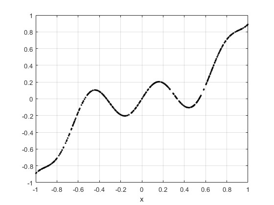
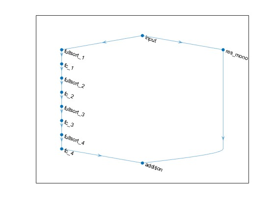
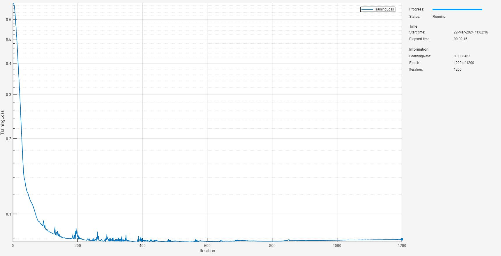
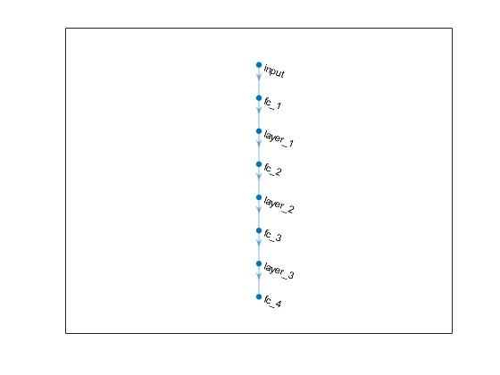
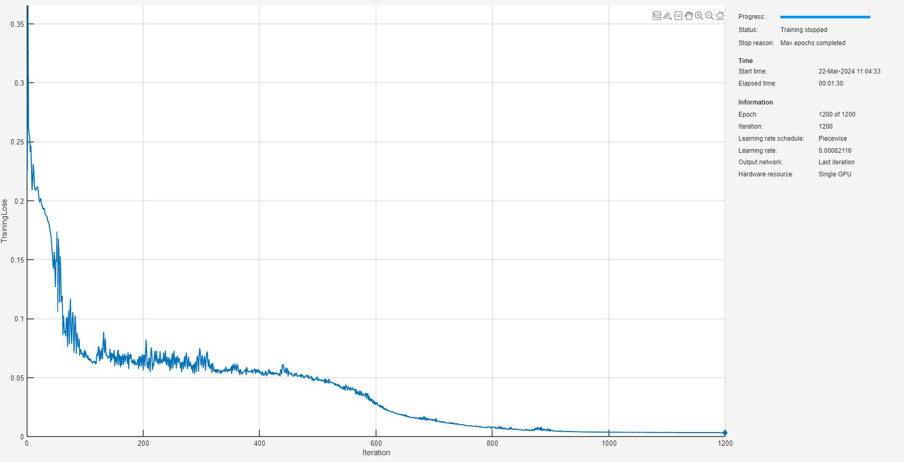
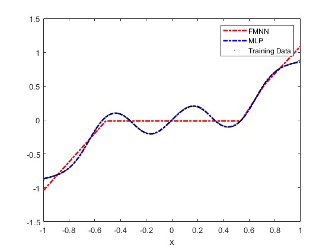
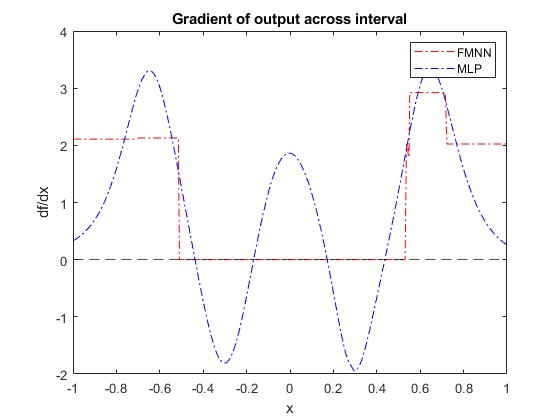

# <span style="color:rgb(213,80,0)">Proof of Concept: 1\-D Fully Monotonic Neural Networks</span>

This script is provides an illustration of the constrained deep learning for 1\-dimensional monotonic networks. The example works through these steps:

1.  Generate a dataset with some sinusoidal additive noise contaminating a monotonic function signal.
2. Prepare the dataset for custom training loop.
3. Create a fully monotonic neural network (FMNN) architecture.
4. Train the FMNN using a custom training loop and apply projected gradient descent to guarantee monotonicity.
5. Train a comparable MLP network without architectural or weight constraints.
6. Compare the two networks and show monotonicity is violated in the unconstrained network.
# Generate Data

Take the monotonic function <samp>y=x^3</samp> and uniformly randomly sample this over the interval <samp>[-1,1]</samp>. Add sinusoidal noise to create a dataset. You can change the number of random samples if you want to experiment.

```matlab
numSamples = 512;
rng(0);
xTrain = -2*rand(numSamples,1)+1; % [-1 1]
xTrain = sort(xTrain);
tTrain = xTrain.^3 + 0.2*sin(10*xTrain);
```

Visualize the data.

```matlab
figure;
plot(xTrain,tTrain,"k.")
grid on
xlabel("x")
```

<figure>
<p align="center">
    
</p>
</figure>

# Prepare Data

To prepare the data for custom training loops, add the input and response to a <samp>minibatchqueue</samp>. You can do this by creating <samp>arrayDatastore</samp> objects and combining these into a single datastore using the <samp>combine</samp> function. Form the <samp>minibatchqueue</samp> with this combined datastore object.

```matlab
xds = arrayDatastore(xTrain);
tds = arrayDatastore(tTrain);
cds = combine(xds,tds);

mbqTrain = minibatchqueue(cds,2,...
    "MiniBatchSize",numSamples,...
    "OutputAsDlarray",[1 1],...
    "MiniBatchFormat",["BC","BC"]);
```
# Create 1\-D FMNN

As discussed in [AI Verification: Monotonicity](../../../documentation/AI-Verification-Monotonicity.md), fully monotonic neural networks adhere to a specific class of neural network architectures with constraints applied to weights. In this proof of concept example, you build a simple FMNN using fully connected layers and <samp>fullsort</samp>, gradient norm preserving activation functions. You specify an <samp>ResidualScaling=2</samp> that balances monotonic growth with smoothness of solution and specify that the <samp>MonotonicTrend</samp> is "increasing". For more information on the architectural construction and hyperparameter selections, see [AI Verification: Monotonicity](../../../documentation/AI-Verification-Monotonicity.md).

```matlab
inputSize = 1;
numHiddenUnits = [16 8 4 1];
fmnnet = buildConstrainedNetwork("fully-monotonic",inputSize,numHiddenUnits,...
    Activation="fullsort",...
    ResidualScaling=2,...
    MonotonicTrend="increasing")
```

```matlabTextOutput
fmnnet = 
  dlnetwork with properties:

         Layers: [11x1 nnet.cnn.layer.Layer]
    Connections: [11x2 table]
     Learnables: [8x3 table]
          State: [0x3 table]
     InputNames: {'input'}
    OutputNames: {'addition'}
    Initialized: 1

  View summary with summary.

```

You can view the network architecture in <samp>deepNetworkDesigner</samp> by setting the <samp>viewNetworkDND</samp> flag to <samp>true</samp>. Otherwise, plot the network graph.

```matlab
viewNetworkDND = false;
if viewNetworkDND
    deepNetworkDesigner(fmnnet) %#ok<UNRCH>
else
    figure;
    plot(fmnnet)
end
```

<figure>
<p align="center">
    
</p>
</figure>

# Train FMNN

First, create a custom training options struct. For the <samp>trainMonotonicNetwork</samp> function, you specify four hyperparameters: <samp>maxEpochs</samp>, <samp>initialLearnRate</samp>, <samp>decay</samp>, and <samp>lossMetric</samp>.

```matlab
maxEpochs = 1200;
initialLearnRate = 0.05;
decay = 0.01;
lossMetric = "mae";
```

Train the network with these options.

```matlab
trained_fmnnet = trainConstrainedNetwork("fully-monotonic",fmnnet,mbqTrain,...
   MaxEpochs=maxEpochs,...
   InitialLearnRate=initialLearnRate,...
   Decay=decay,...
   LossMetric=lossMetric);
```

<figure>
<p align="center">
    
</p>
</figure>

Evaluate the accuracy on the true underlying monotonic function from an independent random sampling from the interval <samp>[-1,1]</samp>.

```matlab
rng(1);
xTest = -2*rand(numSamples,1)+1; % [-1 1]
tTest = xTest.^3;
lossAgainstUnderlyingSignal = computeLoss(trained_fmnnet,xTest,tTest,lossMetric)
```

```matlabTextOutput
lossAgainstUnderlyingSignal =

  gpuArray single

    0.0698
```
# Train Unconstrained MLP

Create a multi\-layer perception as a comparison with the same depth as the FMNN defined previously. Increase the number of activations to give the network capacity to fit the sinusoidal contamination.

```matlab
mlpHiddenUnits = [16 8 4 1];
layers = featureInputLayer(inputSize,Normalization="none");
for ii=1:numel(mlpHiddenUnits)-1
    layers = [layers ...
        fullyConnectedLayer(mlpHiddenUnits(ii)) ...
        tanhLayer ...
        ];
end
% Add a final fully connected layer
layers = [layers ...
    fullyConnectedLayer(mlpHiddenUnits(end)) ...
    ];
```

Initialize the network.

```matlab
rng(0);
mlpnet = dlnetwork(layers);
```

Again, you can view the network architecture in <samp>deepNetworkDesigner</samp> by setting the <samp>viewNetworkDND</samp> flag to <samp>true</samp>. Otherwise, plot the network graph.

```matlab
viewNetworkDND = false;
if viewNetworkDND
    deepNetworkDesigner(mlpnet) %#ok<UNRCH>
else
    figure;
    plot(mlpnet)
end
```

<figure>
<p align="center">
    
</p>
</figure>

Specify the training options and then train the network using the <samp>trainnet</samp> function.

```matlab
options = trainingOptions("adam",...
    Plots="training-progress",...
    MaxEpochs=maxEpochs,...
    InitialLearnRate=initialLearnRate,...
    LearnRateSchedule="piecewise",...
    LearnRateDropFactor=0.9,...
    LearnRateDropPeriod=30,...
    MiniBatchSize=numSamples,...
    Shuffle="never");
trained_mlpnet = trainnet(mbqTrain,mlpnet,lossMetric,options);
```

```matlabTextOutput
    Iteration    Epoch    TimeElapsed    LearnRate    TrainingLoss
    _________    _____    ___________    _________    ____________
            1        1       00:00:00         0.05         0.22547
           50       50       00:00:05        0.045         0.14967
          100      100       00:00:09      0.03645        0.067145
          150      150       00:00:13     0.032805        0.073264
          200      200       00:00:16     0.026572        0.056594
          250      250       00:00:20     0.021523        0.070654
          300      300       00:00:23     0.019371          0.0605
          350      350       00:00:27     0.015691        0.057358
          400      400       00:00:31     0.012709        0.056108
          450      450       00:00:34     0.011438        0.055552
          500      500       00:00:38    0.0092651        0.047468
          550      550       00:00:41    0.0075047        0.041494
          600      600       00:00:45    0.0067543        0.027592
          650      650       00:00:49    0.0054709        0.018344
          700      700       00:00:53    0.0044315        0.014217
          750      750       00:00:56    0.0039883        0.010182
          800      800       00:01:00    0.0032305       0.0080844
          850      850       00:01:04    0.0026167       0.0061224
          900      900       00:01:07    0.0023551       0.0057877
          950      950       00:01:11    0.0019076       0.0042212
         1000     1000       00:01:14    0.0015452       0.0039207
         1050     1050       00:01:18    0.0013906       0.0037627
         1100     1100       00:01:22    0.0011264       0.0036418
         1150     1150       00:01:25    0.0009124       0.0035606
         1200     1200       00:01:29   0.00082116       0.0034911
Training stopped: Max epochs completed
```

<figure>
<p align="center">
    
</p>
</figure>

Evaluate the accuracy on the true underlying monotonic function from an independent random sampling from the interval <samp>[-1,1]</samp>. Observe that the loss against the underlying monotonic signal here is higher as the network has fitted to the sinusoidal contamination.

```matlab
lossAgainstUnderlyingSignal = computeLoss(trained_mlpnet,xTest,tTest,lossMetric)
```

```matlabTextOutput
lossAgainstUnderlyingSignal = 0.1272
```
# Network Comparison

Compare the shape of the solution by sampling the training data and plotting this for both networks.

```matlab
fmnnPred = predict(trained_fmnnet,xTrain);
mlpPred = predict(trained_mlpnet,xTrain);

figure
plot(xTrain,fmnnPred,"r-.",LineWidth=2)
hold on
plot(xTrain,mlpPred,"b-.",LineWidth=2)
plot(xTrain,tTrain,"k.",MarkerSize=0.1)
xlabel("x")
legend("FMNN","MLP","Training Data")
```

<figure>
<p align="center">
    
</p>
</figure>

It is visually evident that the MLP solution is not monotonic over the interval but the FICNN does appear monotonic, which it is, owing to its monotonic construction and constrained learning.

# Guaranteed Monotonicity for FMNN

As discussed in [AI Verification: Monotonicity](../../../documentation/AI-Verification-Monotonicity.md), fully monotonic neural networks are monotonic in each output with respect to every input. To illustrate the monotonicity in this example, sample the network derivative across the interval.

```matlab
[~,dfmnnPred] = dlfeval(@computeFunctionAndDerivativeForScalarOutput,trained_fmnnet,dlarray(xTrain,"BC"));
[~,dmlpPred] = dlfeval(@computeFunctionAndDerivativeForScalarOutput,trained_mlpnet,dlarray(xTrain,"BC"));

figure
plot(xTrain,dfmnnPred,"r-.")
hold on
plot(xTrain,dmlpPred,"b-.")
yline(0,"k--")
xlabel("x")
ylabel("df/dx")
legend("FMNN","MLP")
title("Gradient of output across interval")
```

<figure>
<p align="center">
    
</p>
</figure>

From this sampling, you see violation of monotonicity of the MLP, i.e., the gradient changes sign over the interval. However, the constrained FMNN has a consistent non\-negative gradient (up to precision) a sufficient condition for monotonicity. The architectural and weight constraints applied provide both necessary and sufficient conditions for the network to be monotonic, so the monotonic is guaranteed everywhere.

# Helper Functions
```matlab
function loss = computeLoss(net,X,T,lossMetric)
Y = predict(net,X);
switch lossMetric
    case "mse"
        loss = mse(Y,T);
    case "mae"
        loss = mean(abs(Y-T));
end
end

function [Z,dZ] = computeFunctionAndDerivativeForScalarOutput(net,X)
% Evaluate f
Z = predict(net,X);
% Evaluate df/dx. Since Z_i depends only on X_i, the derivative of d/dX_i sum(Z_i) = d/dX_i Z_i
dZ = dlgradient(sum(Z,2),X);
end
```

*Copyright 2024 The MathWorks, Inc.*

