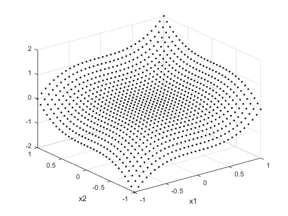
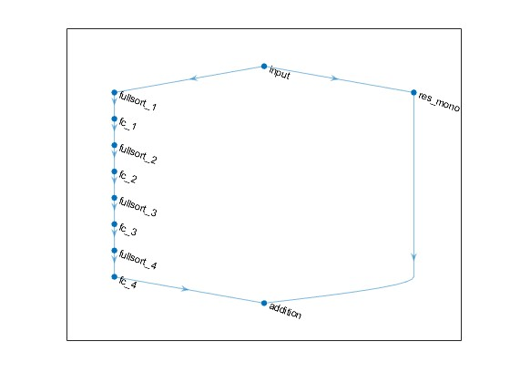
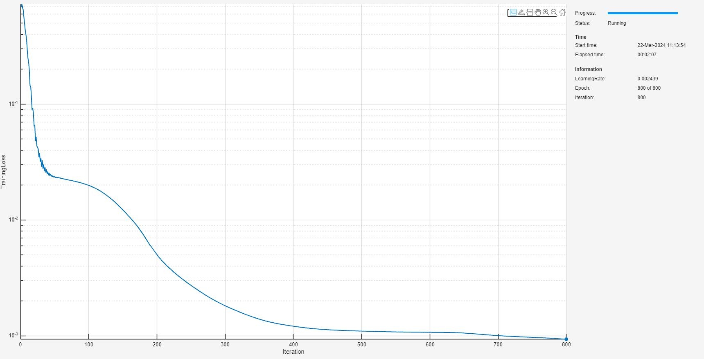
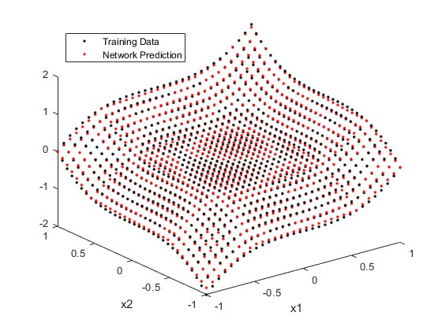
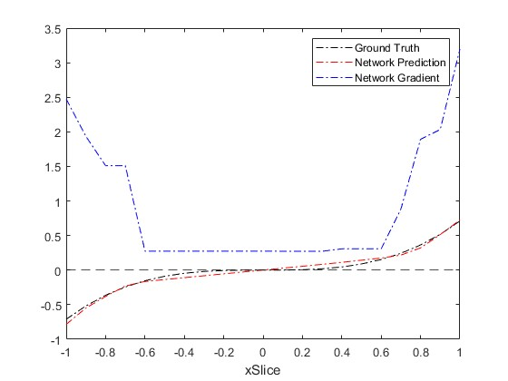

# <span style="color:rgb(213,80,0)">Proof of Concept: n\-D Fully Monotonic Neural Networks</span>

This script provides an illustration of the constrained deep learning for n\-dimensional monotonic networks. The example will work through these steps:

1.  Generate a dataset of a 2\-dimensional monotonic function.
2. Prepare the dataset for custom training loop.
3. Create a fully monotonic neural network (FMNN) architecture.
4. Train the FMNN using a custom training loop and apply projected gradient descent to guarantee monotonicity.
5. Explore 1\-dimensional restrictions through the function to see monotonicity is guaranteed
# Generate Data

First, take the monotonic function <samp>f(x1,x2)=x1^3+x2^3</samp> and uniformly randomly sample this over the square region: <samp>[-1,1]x[-1,1]</samp>. You can change the number of random samples if you want to experiment.

```matlab
numSamples = 1024;
[x1Train,x2Train] = meshgrid(linspace(-1,1,round(sqrt(numSamples))));
xTrain = [x1Train(:),x2Train(:)];
tTrain =xTrain(:,1).^3 + xTrain(:,2).^3;
```

Visualize the data.

```matlab
figure;
plot3(xTrain(:,1),xTrain(:,2),tTrain,"k.")
grid on
xlabel("x1")
ylabel("x2")
```

<figure>
<p align="center">
    
</p>
</figure>

Observe the overall monotonic behaviour in <samp>x2</samp> given <samp>x1</samp>, and in <samp>x1</samp> given <samp>x2</samp>.

# Prepare Data

To prepare the data for custom training loops, add the input and response to a <samp>minibatchqueue</samp>. You can do this by creating <samp>arrayDatastore</samp> objects and combining these into a single datastore using the <samp>combine</samp> function. Form the <samp>minibatchqueue</samp> with this combined datastore object.

```matlab
xds = arrayDatastore(xTrain);
tds = arrayDatastore(tTrain);
cds = combine(xds,tds);

mbqTrain = minibatchqueue(cds,2,...
    "MiniBatchSize",numSamples,...
    "OutputAsDlarray",[1 1],...
    "OutputEnvironment","cpu",...
    "MiniBatchFormat",["BC","BC"]);
```
# Create the 2\-dimensional FMNN

As discussed in [AI Verification: Monotonicity](../../../documentation/AI-Verification-Monotonicity.md), fully monotonic neural networks adhere to a specific class of neural network architectures with constraints applied to weights. In this proof of concept example, you build a simple FMNN using fully connected layers and <samp>fullsort</samp> for the gradient norm preserving activation functions. You specify a <samp>ResidualScaling=2</samp> and  <samp>pNorm=1</samp> that balances monotonic growth with smoothness of solution and specify that the <samp>MonotonicTrend</samp> is "increasing" as it is increasing with respect to all input channels. For more information on the architectural construction and hyperparameter selections, see [AI Verification: Monotonicity](../../../documentation/AI-Verification-Monotonicity.md).

```matlab
inputSize = 2;
numHiddenUnits = [16 8 4 1];
pNorm = 1;
rng(0);
fmnnet = buildConstrainedNetwork("fully-monotonic",inputSize,numHiddenUnits,...
    Activation="fullsort",...
    ResidualScaling=2,...
    MonotonicTrend="increasing",...
    pNorm=pNorm)
```

```matlabTextOutput
fmnnet = 
  dlnetwork with properties:

         Layers: [11x1 nnet.cnn.layer.Layer]
    Connections: [11x2 table]
     Learnables: [8x3 table]
          State: [0x3 table]
     InputNames: {'input'}
    OutputNames: {'addition'}
    Initialized: 1

  View summary with summary.

```

You can view the network architecture in <samp>deepNetworkDesigner</samp> by setting the <samp>viewNetworkDND</samp> flag to <samp>true</samp>. Otherwise, plot the network graph.

```matlab
viewNetworkDND = false;
if viewNetworkDND
    deepNetworkDesigner(fmnnet) %#ok<UNRCH>
else
    figure;
    plot(fmnnet)
end
```

<figure>
<p align="center">
    
</p>
</figure>

# Train the FMNN

First, create a custom training options struct. For the <samp>trainMonotonicNetwork</samp> function, you can specify four hyperparameters: <samp>maxEpochs</samp>, <samp>initialLearnRate</samp>, <samp>decay,</samp> <samp>lossMetric</samp>. Additionally, if you specify a <samp>pNorm</samp> in <samp>buildConstrainedNetwork</samp>, you must also specify the same <samp>pNorm</samp> for training.

```matlab
maxEpochs = 800;
initialLearnRate = 0.1;
decay = 0.05;
lossMetric = "mse";
pNorm = 1;
```

Train the network with these options.

```matlab
trained_fmnnet = trainConstrainedNetwork("fully-monotonic",fmnnet,mbqTrain,...
   MaxEpochs=maxEpochs,...
   InitialLearnRate=initialLearnRate,...
   Decay=decay,...
   LossMetric=lossMetric,...
   pNorm=pNorm);
```

<figure>
<p align="center">
    
</p>
</figure>

# Network Evaluation

Examine the shape of the solution by sampling the training data and network prediction.

```matlab
yPred = predict(trained_fmnnet,xTrain);

figure;
plot3(xTrain(:,1),xTrain(:,2),tTrain,"k.")
hold on
plot3(xTrain(:,1),xTrain(:,2),yPred,"r.")
xlabel("x1")
ylabel("x2")
legend("Training Data","Network Prediction",Location="northwest")
```

<figure>
<p align="center">
    
</p>
</figure>

# Guaranteed Monotonicity for FMNN

As discussed in [AI Verification: Monotonicity](../../../documentation/AI-Verification-Monotonicity.md), fully monotonic neural networks are monotonic in each output with respect to every input. In the n\-dimensional case, you can see monotonicity through any 1\-dimension restriction through the space.


Take lines passing through the origin. Specify the angle line, projected onto the <samp>x1</samp> and <samp>x2</samp> plane, makes with the <samp>x1</samp> axis.

```matlab
thetaDegrees = 42;
```

Sample the network prediction along that line and plot this 1\-dimensional restriction, along with the directional derivative.

```matlab
xInterval = -1:0.1:1;
n = [cosd(thetaDegrees); sind(thetaDegrees)]; % Unit normal
xSample = n.*xInterval;

[fmnnPred,dfmnnPred] = dlfeval(@computeFunctionAndDerivativeForScalarOutput,trained_fmnnet,dlarray(xSample,"CB"));
ddfmnnPred = n'*extractdata(dfmnnPred);

figure;
plot(xInterval,xSample(1,:).^3+xSample(2,:).^3,"k-.")
hold on
plot(xInterval,fmnnPred,"r-.")
plot(xInterval,ddfmnnPred,"b-.")
yline(0,"k--")
xlabel("xSlice")
legend("Ground Truth","Network Prediction","Network Gradient")
```

<figure>
<p align="center">
    
</p>
</figure>

As is evident in the figure, monotonicity is given along any 1\-D restriction through the surface. This is enforced by the networks architecture and constraints on the weights.

# Helper Functions
```matlab
function [Z,dZ] = computeFunctionAndDerivativeForScalarOutput(net,X)
% Evaluate f
Z = predict(net,X);
% Evaluate df/dx. Since Z_i depends only on X_i, the derivative of d/dX_i
% sum(Z_i) = d/dX_i Z_i
dZ = dlgradient(sum(Z,2),X);
end
```

*Copyright 2024 The MathWorks, Inc.*

